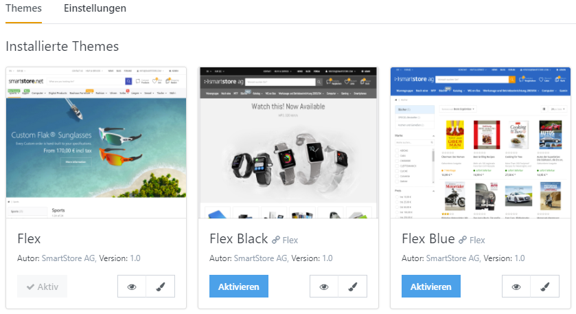
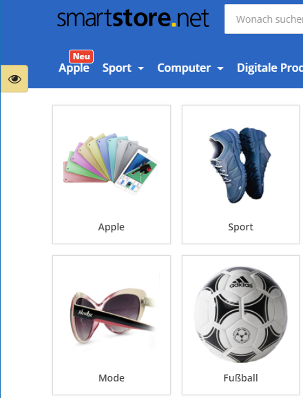

# Vorschau für Designs & Shops

Wenn Sie das Design Ihres Shops verändern wollen, möchten Sie vielleicht das neue Design Ihres Shops in der Vorschau betrachten. Um dies zu tun, gehen Sie zu **Admin > Konfiguration > Themes**, und klicken beim gewünschten Theme auf **Vorschau**. 

Das Frontend Ihres Shops wird nun in der Vorschau angezeigt. Wenn Sie sich in der Vorschau befinden, wird im Browserfenster ein kleines Symbol auf der linken Seite dargestellt. Wenn Sie darauf klicken, können Sie zwischen Themes und Shops in der Vorschau hin und her wechseln.

   