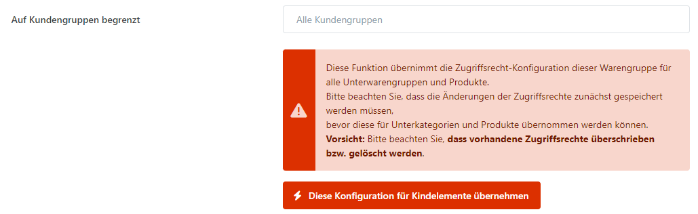

# Zugriffsbeschränkungen (ACL)

**Smartstore** stellt **Access Control Lists (ACL)** zur Verfügung, die den Zugang zu einem System auf autorisierte Nutzer einer Kundengruppe beschränken kann. Zugriffsrechte können für Warengruppen und Produkte konfiguriert werden. Die Zugriffsbeschränkungen für Produkte und Warengruppen legen fest, welche Inhalte für registrierte Kunden im Frontend Ihres Shops angezeigt werden.

## Anwendungsszenario

Stellen Sie sich vor, dass Sie ein Geschäft betreiben, in dem Sie Produkte mit Altersbeschränkung verkaufen, und Ihre Kunden müssen bestätigen, dass sie über 18 sind, indem Sie Ihnen eine Kopie ihres Ausweises zuschicken. Legen Sie zunächst eine Kundengruppe an und geben Sie dieser das Zugriffsrecht auf die Warengruppe, welche die Produkte mit Altersbeschränkung enthält. Nach Empfang der Ausweiskopie können Sie den Kunden nun dieser Kundengruppe zuordnen wodurch die Produkte aus dieser Warengruppe für diesen Kunden einsehbar und bestellbar werden. Auf diese Weise können Sie sicherstellen, dass Besucher Ihres Shops altersbeschränkte Produkte nicht erreichen können, bis bestätigt ist, dass sie über 18 sind.

## Wie Sie Zugriffsbeschränkungen konfigurieren

Sie können den Zugriff auf Warengruppen und Produkte zu beschränken und somit festlegen, welche Kundegruppen spezifische Zugangsrechte zu den jeweiligen Warengruppen und Produkten im Frontend Ihres Shops erhalten. Die Vergabe von  Zugriffsrechten zu einer Warengruppe oder einem Produkts ist identisch. Navigieren Sie einfach zu der Registerkarte **Zugriffsbeschränkung** der jeweiligen Warengruppe oder des jeweiligen Produkts und fügen Sie dort die Kundengruppen zu, denen der Zugang erlaubt ist.

> [!INFO]
> ### Diese Konfiguration für Kindelemente übernehmen
> Diese Funktion übernimmt die Zugriffsrecht-Konfiguration dieser Warengruppe für alle Unterwarengruppen und Produkte.  
> Bitte beachten Sie, dass die Änderungen der Zugriffsrechte zunächst gespeichert werden müssen, bevor diese für Unterkategorien und Produkte übernommen werden können.  
> **Vorsicht**: Bitte beachten Sie, dass vorhandene **Zugriffsrechte überschrieben bzw. gelöscht werden**.