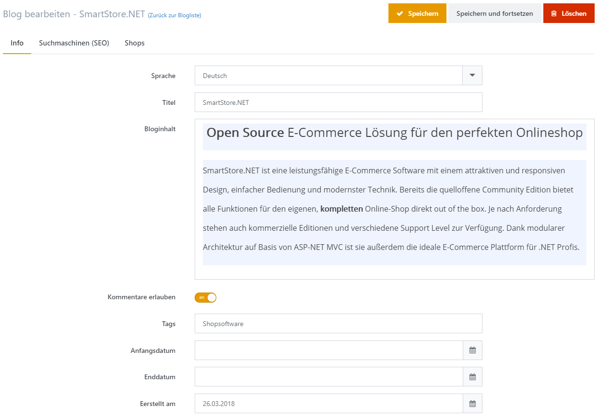

# Blogs verwalten

*Content is King* ist eine häufig verwendete Losung, wenn es um Suchmaschinenoptimierung geht – und das mit gutem Grund. Google mag neue Inhalte und verleiht Seiten, die häufig neue Textinhalte schaffen, ein besseres Ranking. Smartstore enthält ein System, um Ihren eigenen Blog zu verwalten und ermöglicht es Shop-Betreibern somit, regelmäßig neue Inhalte zu erstellen.

## Blogeinträge erstellen

### Info

| **Eingabefeld** | **Beschreibung** |
| --- | --- |
| Sprache | Die Sprache dieses Blogeintrags. Ein Kunde sieht nur Einträge in der von ihm gewählten Sprache. |
| Titel | Der Titel des Blogeintrags. |
| Bloginhalt | Der Inhalt des Blogeintrags. |
| Kommentare erlauben | Legt fest, ob Kommentare zum Blogeintrag erlaubt sind. |
| Tags | Tags sind Suchwörter, an denen der Blogeintrag ebenfalls erkannt werden kann. Geben Sie eine mit Kommata getrennte Liste mit Tags ein, die mit diesem Blogeintrag in Verbindung stehen. |
| Erstellt am | Erlaubt Ihnen die Eingabe eines Datums, an welchem der Blogeintrag erstellt wurde. Mit diesem Feld lässt sich die Anzeigenreihenfolge Ihrer Blogeinträge festlegen. |
| Anfangsdatum | Legt fest, ab wann der Blogeintrag angezeigt werden soll (optional). |
| Enddatum | Legt fest, bis wann der Blogeintrag sichtbar sein soll (optional). |

### Suchmaschinen (SEO)

In dieser Registerkarte können Sie spezifische SEO-Werte für einen Blogeintrag festlegen, z. B. **Meta Title**, **Meta Suchwörter** oder einen SEO-freundlichen **URL Alias**. Für weitere Informationen zu den Feldern in der Registerkarte **Suchmaschinen**, lesen Sie bitte [SEO](../../benutzer-handbuch/allgemeine-konzepte/seo.md).

### Shops

In dieser Registerkarte können Sie festlegen, in welchem / welchen Shop(s) der Blogeintrag veröffentlicht werden soll.  Für weitere Informationen zu mehreren Shops lesen Sie bitte [Mit mehreren Shops arbeiten](../../benutzer-handbuch/allgemeine-konzepte/mit-mehreren-shops-arbeiten.md).

## Neue Kommentare verwalten

Wenn Sie für Ihre Kunden die Kommentarfunktion bei Blogeinträgen freigeschaltet haben, müssen Sie die Kommentare überprüfen und gegebenenfalls löschen.  Sie können die Kommentare zu Ihren Blogeinträgen verwalten, indem Sie zu **CMS > News > Kommentare**. gehen. In diesem Bereich erhalten Sie einen Überblick über alle Kommentare, darüber hinaus sehen Sie zusätzliche Informationen wie den Namen des Kunden, der den Kommentar erstellt hat, seine IP-Adresse und das Datum, an dem der Kommentar erstellt wurde. Hier können Sie die Kommentare auch löschen.