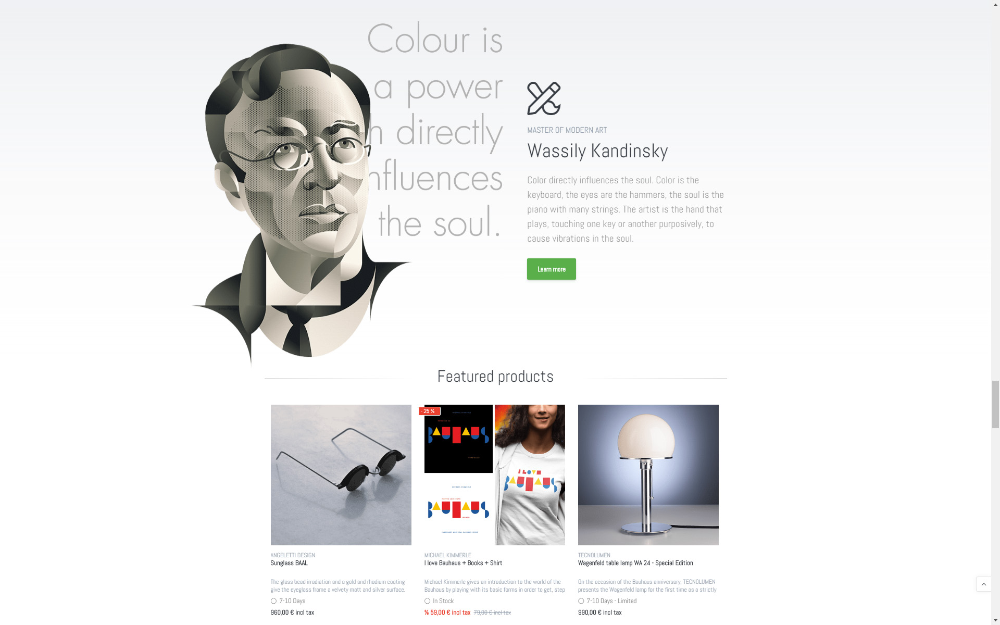
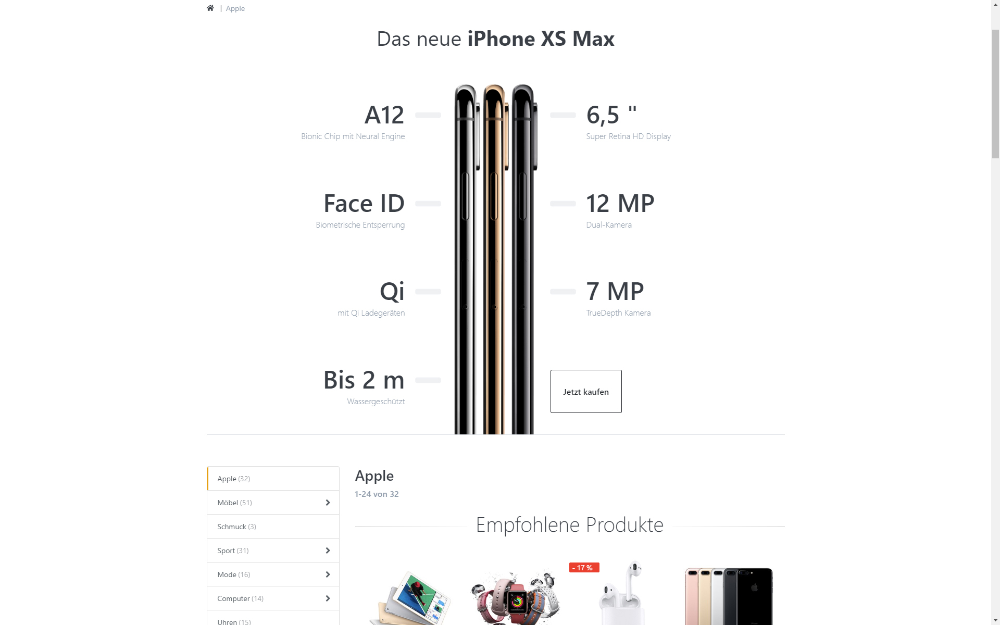
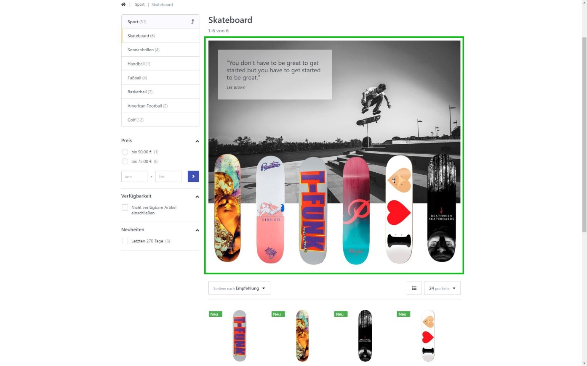
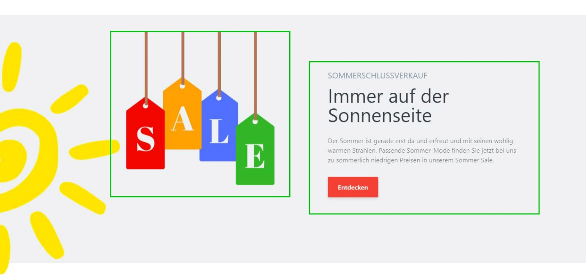

# Smartstore Page Builder

# Was ist der Page Builder?

Der Smartstore Page Builder ist ein Content Management Werkzeug, mit dem Sie schnell und einfach beeindruckende Einkaufswelten gestalten können, und zwar ganz ohne Fachkenntnisse in HTML, CSS oder Webdesign. Auf Knopfdruck lassen sich Zielseiten und Positionierungen bestimmen, und somit ganze Seiten mit faszinierendem Inhalt und umfangreichen Individualisierungs- und Präsentationsmöglichkeiten komplett geräteunabhängig gestalten. Nutzen Sie den Page Builder, um Ihre Produkte mit Blickfang zu platzieren. Dadurch können Sie beispielsweise bestimmte Produkte abverkaufen oder Rabattaktionen bewerben. 

## Was ist eine Story?

Inhalte werden im Smartstore Page Builder in sogenannten [*Stories*](./smartstore-page-builder/story.md) zusammengefasst. Stories können sich von einem kleinen Widget mit wenigen Blöcken bis hin zu ganzen Seiten mit umfangreichen und ansprechenden Inhalten erstrecken. Eine Story kann sich aus Text, Bildern, Videos, Formen und Farben, sowie Effekten und Produktlisten zusammensetzen. 

# Was sind Blöcke?

[*Blöcke*](./smartstore-page-builder/blocke.md) sind atomare Elemente einer Story, welche als Container für sämtliche Inhalte dienen. Mithilfe von Blöcken ist es möglich, Inhalte leicht einzufügen, zu modifizieren und zu positionieren. Eine Vielzahl von unterschiedlichen Blocktypen stehen für unterschiedliche Inhalte wie Texte, Bilder oder Videos zur Verfügung.

Im obigen Bild sehen Sie zwei markierte Blöcke. Der Block auf der linken Seite ist ein Bild-, und der auf der rechten Seite ein Text-Block. Mehr zu den verschiedenen Blöcken erfahren Sie unter [*Blöcke Übersicht*](./smartstore-page-builder/blocke.md).

# Einstieg

Den Page Builder finden Sie nach der Installation unter **Admin > CMS > Page Builder**.  
Wenn Sie das erste Mal mit dem Page Builder arbeiten, benutzen Sie eine der zahlreichen [*Vorlagen*](./smartstore-page-builder/story.md) und ersetzten Sie den Inhalt der Blöcke einfach durch eigene Texte und Bilder. Wählen Sie dafür den gewünschten Block an und rufen Sie die [*Block-Einstellungen*](./smartstore-page-builder/blocke/blockspezifische-einstellungen.md) über das Zahnrad-Icon oder über das Dropdownmenü im [*Block-Manager*](./smartstore-page-builder/benutzeroberflache/block-manager.md) auf.