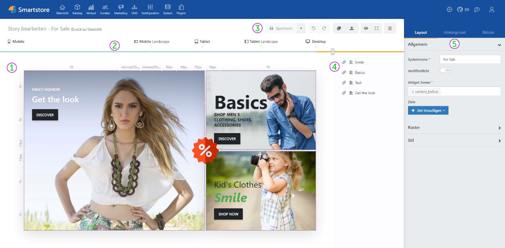
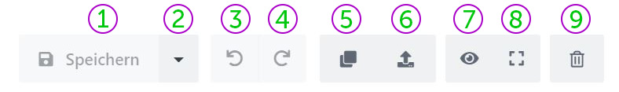

# Benutzeroberfläche

**① Raster:** Im Raster wird die Story komponiert. Hier können Sie Layout und Inhalte bearbeiten. Zudem sehen Sie direkt, wie Ihre Story dargestellt wird. (Siehe [*Das Raster*](./benutzeroberflache/das-raster.md))

**② Device-Slider:** Die Position des Sliders bestimmt die aktuell ausgewählte Auflösungseinstellung. Die Story-Vorschau passt sich direkt auf die Veränderung der Schieberposition an. (Siehe [*Responsive Darstellung - Device Slider*](../smartstore-page-builder/story/responsive-darstellung.md))

**③ Allgemeine Steuerelemente:** Diese Buttons bieten grundlegende Funktionalitäten wie u.a. *Story speichern*, *Änderung rückgängig machen*, *Story löschen* usw.

**④** **Block-Manager:** Hier sehen Sie alle Blöcke, die in einer Story Verwendung finden. Die Reihenfolge in der Liste bestimmt, in welcher Reihenfolge die Blöcke dargestellt werden. (Siehe [*Block-Manager*](./benutzeroberflache/block-manager.md))

**⑤ Toolbox:** Die Toolbox bietet Zugriff auf essenzielle Story-Features und -Inhalte. Sie können die Darstellung und Veröffentlichung der Story konfigurieren und haben über die Toolbox Zugriff auf die Blöcke-Bibliothek. Wenn ein Block selektiert ist, werden an dieser Stelle blockbezogene Einstellungen angezeigt. (Siehe [*Toolbox*](./benutzeroberflache/toolbox.md))

### Allgemeine Steuerelemente

**①** **Speichern:** (*STRG + S*) Speichert die Story.

**②** **Speicher unter:** Über das Dropdownmenü können Sie die Story als Vorlage speichern.

**③ Rückgängig:** (*STRG+Z*) Macht die letzte Änderung rückgängig.

**④ Wiederherstellen:** (*STRG+Y*) Stellt die vorherige Änderung wieder her.

**⑤ Duplizieren:** Erstellt eine exakte Kopie der aktuellen Story.

**⑥ Exportieren:** Exportiert die Story als Vorlage.

**⑦** **Vorschaumodus:** (*STRG+ALT+P*) Zeigt eine Vorschau der Story. Die Vorschau zeigt Ihre Story wie diese nach Veröffentlichung auf der Seite dargestellt werden wird, ohne Raster und mit Effekten, Video und Audio.

**⑧ Vollbildmodus:** (*STRG + F11*) Zeigt den Page Builder im Vollbild.

**⑨ Löschen:** Löscht die aktuelle Story permanent.