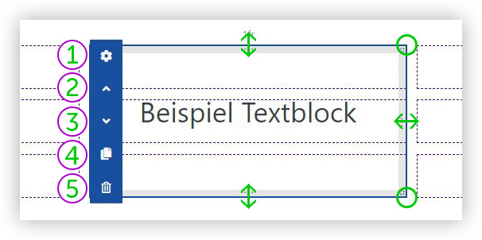
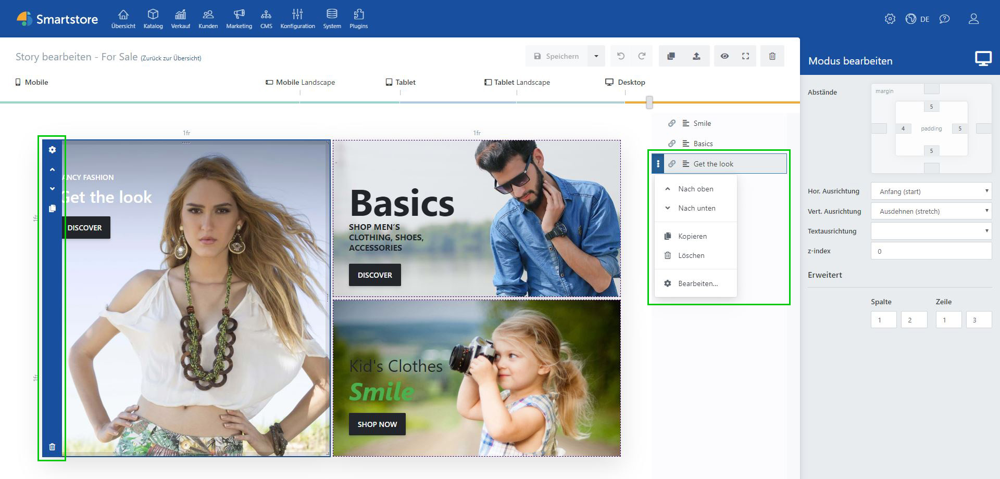

# Blöcke

# Blöcke Übersicht

Blöcke sind ein essenzieller Bestandteil des Page Builders. Sämtliche Inhalte werden mithilfe von Blöcken dargestellt. Je nach gewünschtem Inhalt stehen Ihnen verschiedene Blöcke zur Verfügung.

**① Text:** Stellt Text formatiert dar. Des Weiteren kann der Text-Block Schaltflächen, Icons Hintergründe, sowie Effekte u.v.m. darstellen.

**② Bild:** Stellt ein einzelnes Bild dar. Der Bild-Block eignet sich am besten, wenn ein Bild ohne Text dargestellt werden soll.

**③ Produktliste:** Präsentiert Produkte in einer Liste, einem Raster oder als Slider. Durch eine manuelle Produktauswahl oder durch eine warengruppenbezogene Auswahl werden die anzuzeigenden Produkte bestimmt.

**④ Warengruppen:** Ähnlich wie bei der Produktliste werden bei diesem Block Warengruppen gelistet.

**⑤ Herstellerliste:** Ähnlich wie bei der Produktliste werden bei diesem Block Hersteller gelistet.

**⑥ IFrame:** Zeigt externe Seiten innerhalb eines IFrames an.

**⑦ Galerie:** Präsentiert Bilder in einer Liste, einem Raster oder als Slider.

**⑧ Video:** Zeigt ein Video an. Hierbei sollte das MP4-Format hinterlegt werden, da dieses Format von nahezu allen Browsern unterstützt wird.

**⑨ YouTube:** Bindet YouTube-Videos durch das Hinterlegen einer YouTube-ID oder -URL ein.

**⑩ SoundCloud:** Bindet SoundCloud Audio-Streams ein.

**⑪ Google Maps:** Zeigt einen Standort mit Google Maps an.

**⑫ Blog**: Zeigt Einträge ihres Blogs an.

**⑬ News**: Zeigt Eintäge ihrer News an.

**⑭ Newsletter:** Bietet Kunden die Option ihren Newsletter zu abonnieren.

**⑮ Umfrage:** Mit diesem Block können Sie kurze Umfragen erstellen.

**⑯ Code:** Dient zum Einbinden von eigenem JavaScript, HTML oder CSS-Code. IntelliSense (Autovervollständigung) unterstützt dabei das Arbeiten.

**⑰ ViewComponent:** Dieser Block ist für Entwickler gedacht. Mithilfe des ViewComponent-Blocks können Sie eigene Module einbinden.

**⑱ Story:** Fügt bereits existierende Stories als atomaren Block ein. Auf diese Art können Sie einfach und schnell sehr umfangreiche und große Stories gestalten, welche aus mehreren kleineren Stories zusammengesetzt werden.

All diese Blöcke verfügen über die gleichen Basiseinstellungen, wie z.B. Hintergrund und Effekte. Sie erfahren mehr zu den Basiseinstellungen unter [*Block-Basiseinstellungen*](./blocke/block-basiseinstellungen.md). Des Weiteren können Sie unter [*blockspezifische Einstellungen*](./blocke/blockspezifische-einstellungen.md) mehr zu den einzelnen Blöcken erfahren.

**Hinweis:** Denken Sie daran, dass manche Blöcke wie Video oder Google Maps, sowie Blockeffekte, keinen Inhalt im *Bearbeitungsmodus* anzeigen. Wechseln Sie, um alle Inhalte anzuzeigen in den *Vorschaumodus*.

Ein Video über die Blöcke in der Übersicht finden Sie unter: [https://www.youtube.com/watch?v=j43k8nUgKUs&list=PLog4smYIQ2NSZ5gfInsPxi-qGxMKCOf-s&index=3](https://www.youtube.com/watch?v=j43k8nUgKUs&list=PLog4smYIQ2NSZ5gfInsPxi-qGxMKCOf-s&index=3)

# Block bearbeiten

Sie können Ihrer Story einen Block hinzufügen, indem Sie den gewünschten Block einfach per Drag&Drop aus dem Blöcke-Tab in eine Zelle innerhalb [*des Rasters*](../smartstore-page-builder/benutzeroberflache/das-raster.md) ziehen. Um die Größe des Blockes zu modifizieren, wählen Sie diesen an. Nun können Sie durch Klicken und Ziehen am oberen, unteren oder rechten Rand die Größe des Blockes bestimmen. Alternativ können Sie auch, um die Größe zu ändern, an einer der beiden rechten Ecken des Blockes ziehen. Um den Block in Ihre gewünschte Position zu bringen, ziehen Sie den Block einfach per Drag&Drop, wie beim Einfügen, in die gewünschte Zelle. Die Größe einer Zelle wird durch die Zeilen- und Spaltenangaben bestimmt. Wenn diese auf [*auto*](../smartstore-page-builder/sonstiges/glossar.md) beziehungsweise auf [*min/max-content*](../smartstore-page-builder/sonstiges/glossar.md) eingestellt sind, wird die Zellengröße durch den Blockinhalt bestimmt.

Um einen Block zu modifizieren, rufen Sie die Block-Aktionen auf, indem Sie den gewünschten Block auswählen. Alternativ können Sie auf die Block-Aktionen auch über den [*Block-Manager*](../smartstore-page-builder/benutzeroberflache/block-manager.md) zugreifen. Klicken Sie dafür einfach den gewünschten Block im Block-Manager an.

**① Konfigurieren:** Öffnet den Block-Editor. Je nach Block-Typ öffnet sich ein anderer Editor. Hier können Sie den Inhalt des Blockes anpassen.

**② Nach oben:** Erhöht den [*z-index*](./blocke/toolbox-block-optionen.md) Wert des Blockes.

**③ Nach unten:** Verringert den z-index Wert des Blockes. Der z-index kann nicht unter 0 fallen.

**④ Duplizieren:** Erstellt eine exakte Kopie des Blockes und fügt diesen in der nächsten freien Spalte/Zeile ein.

**⑤ Löschen:** Löscht den Block permanent aus der Story.

Ein Video zur Anordnung von Blöcken finden Sie unter: [https://www.youtube.com/watch?v=\_XqRv4of\_4M&list=PLog4smYIQ2NSZ5gfInsPxi-qGxMKCOf-s&index=6](https://www.youtube.com/watch?v=_XqRv4of_4M&list=PLog4smYIQ2NSZ5gfInsPxi-qGxMKCOf-s&index=6)

# Block-Aktionen

Um die Block-Aktionen anzeigen zu lassen, fahren Sie mit der Maus über den gewünschten Block im Block-Manager. Die nun angezeigten Block-Aktionen stimmen exakt mit den Steuerelementen überein, die am linken Rand des Blocks angezeigt werden, wenn dieser ausgewählt wurde.

Hier können Sie auf verschiedene Block-Aktionen zugreifen, wie zum Beispiel auf den Bearbeitungsmodus des Blockes, um den Inhalt anzupassen. Mit den Pfeilen können Sie den z-index des Blockes erhöhen oder verringern, wodurch die Block-Reihenfolge angepasst werden kann.

In dem nachfolgenden Beispiel wird die Block-Reihenfolge innerhalb der Story leicht abgeändert, da der Block *Get the look* den höchsten z-index zugewiesen bekommt.

Beachten Sie die Reihenfolge der Blöcke im Block-Manager und wie der Block *Get the look* nun das *%*\-Bild innerhalb der Story überdeckt.

Blöcke werden absteigend nach dem z-index in der Story angezeigt. Dementsprechend werden auch alle Blöcke einer Story im Block-Manager aufgelistet. Da der Block *Get the look* über einen höheren z-index verfügt als andere Blöcke in der Story, wird dieser als oberstes Element im Block-Manager und innerhalb der Story angezeigt.