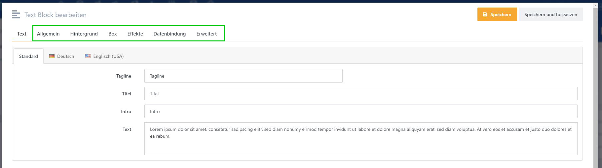
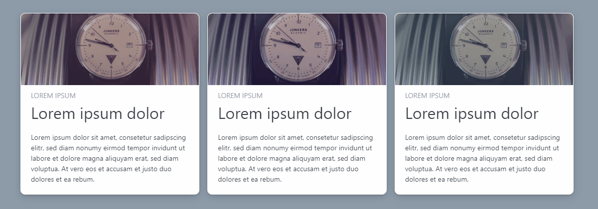
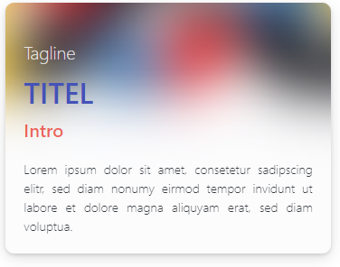
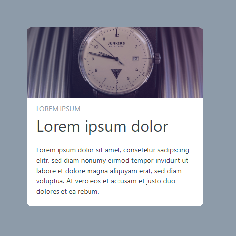
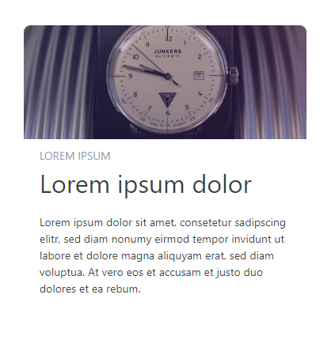
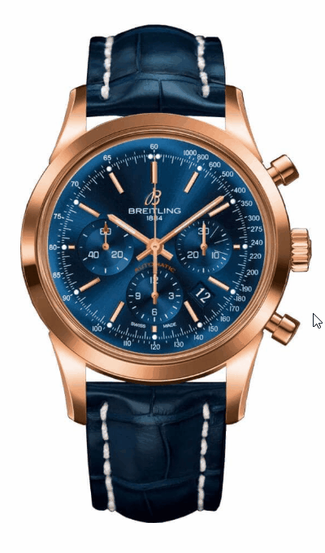
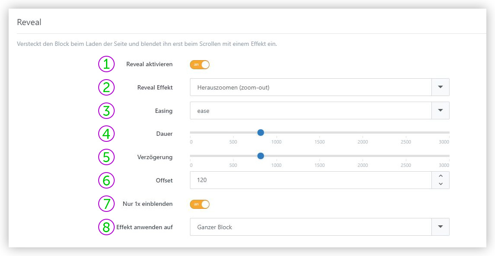

# Block-Basiseinstellungen

Blöcke verfügen über gemeinsame Basiseinstellungen. Diese sind in der oberen Leiste in den Block-Aktionen zu finden: *Allgemein*, *Hintergrund*, *Box*, *Effekte* und *Erweitert*.

# Allgemein

**Invertieren:** Invertiert die Text- und Ausblendeffektfarbe, wirkt sich allerdings nur auf diesen Block aus. Diese Option sollte bei einem dunklen Block-Hintergrund aktiviert werden.

**Link:** Fügt dem gesamten Block einen Link hinzu. Tragen Sie die *Ziel-URL* ein oder wählen Sie eine der möglichen *Linkziele* aus. So ist es zum Beispiel möglich, Produkte oder Warengruppen einfach mit wenigen Klicks direkt zu verlinken.

**Mindesthöhe:** Bestimmt die Mindesthöhe des Block-Containers, unabhängig von Inhalt. Wird erst ab der Tablet-Landscape Auflösung angewendet. Einstellungen sind *Mittel* (400px) und *Hoch* (700px).

**CSS Klasse:** Extra CSS-Klassen für den äußeren Block-Container.

**CSS Style:** Inline CSS für den äußeren Block-Container.

**Content CSS Klasse:** Extra CSS-Klassen für den inneren Block-Container.

**Content CSS Style:** Inline CSS für den inneren Block-Container.

**Template:** *(Nur für erfahrene Anwender)* Razor-Template-Name. Wenn kein Template eingetragen ist, wird das Standard-Template *Public* auf den Block angewendet. Die Templates für die Blöcke finden Sie jeweils unter:

**\[Plugin\] > Views > Story > BlockTemplates > \[BlockType\] > \[Template\].cshtml**

Bspw. finden Sie das Standard-Template für den Bild-Block unter:

**SmartStore.PageBuilder > Views > Story > BlockTemplates > Picture > Public.cshtml**

Wenn Sie nun ein benutzerdefiniertes Template einbinden möchten, müssen Sie Ihr Template in dem entsprechenden Block-Verzeichnis speichern und den Template-Namen eintragen.

**HTML ID:** Legt die HTML ID des Blockes fest.

# Hintergrund

In diesem Tab können Sie den Hintergrund des Blockes bearbeiten. Diese Funktionsweise stimmt mit den Story-Hintergrund-Overlays überein. Sie können hier also auch Hintergrundebenen additiv aufeinander anwenden, um attraktive Hintergründe zu erstellen.  
Weitere Informationen zu Hintergründen finden sie unter [*Hintergrund*](https://smartstore.atlassian.net/wiki/spaces/SDDE60/pages/2510950298/Hintergrund).

# Box

**Boxbild:** Beachten Sie, dass ein Boxbild Raum beansprucht. Das bedeutet, dass die Bildgröße Einfluss auf die Blockgröße haben kann. Zusätzlich ist es möglich, die Position des Boxbildes zu bestimmen und so hinter, unter, neben oder über den Blockinhalten anzuordnen. So können Sie visuell anschauliche Blöcke mit integriertem Bild erstellen.

Neben Größeneinstellungen stehen Ihnen Bildeffekte wie Vergrößerung/Verkleinerung bei Hover , sowie Graustufeneffekte und Unschärfe zur Verfügung.

**Rahmen & Schatten:** Definiert Rahmen und Schatten für den Block. Durch einen Schatten lassen sich Blöcke besser vom Hintergrund abheben. Durch den Rahmen bekommen die Blöcke eine bessere Kontur.

**Box-Bild 1**

Ursprungsbild

**Box-Bild 2**

Mit abgerundeten Ecken

**Box-Bild 3**

Mit Rahmen

**Box-Bild 4**

Mit Rahmen, abgerundeten Ecken und Schattierung

**Box-Bild im Vergleich**

ohne Schatten

mit Schatten

**Flat:** Mithilfe des Flat-Effektes werden sämtliche Hintergründe, Rahmen und Schatten des Blockes ausgeblendet und erst bei Maus-Hover angezeigt.

**Mega:** Vergrößert einen Block so, dass dieser weitere Blöcke überlagert oder aus dem Bildschirm hinausragt. Je nach Einstellung können sich Blöcke über den linken, den rechten oder über beide Ränder hinaus erstrecken. So können Sie anschauliche Layouts mit Blickfang kreieren, die strikte Design Layouts durch Abweichungen und Unregelmäßigkeiten auflockern und Ihre Seite modern erscheinen lassen. 

# Effekte

**Hover:** Bestimmt den Effekt, der angewendet wird, wenn die Maus über das Element fährt. Hierbei kann man zwischen *Erhöhen (rise)* und *Leicht heranzoomen (scale)* wählen. Beim *Erhöhen*\-Effekt wird das Element leicht nach oben versetzt. Beim Effekt *Leicht heranzoomen* hingegen wird das Bild größer. Effekte, die auf Mausinteraktionen ausgerichtet sind, eignen sich hervorragend dafür, Verlinkungen von Bildern oder Ähnlichem eindeutig für den Kunden hervorzuheben.

| **Leicht heranzooomen** | **Erhöhen** |
| --- | --- |
|  |  |

**Parallax:** Mit diesem Effekt können Sie einen Block beim Scrollen der Seite mit bewegen. Mit dem Parallax-Effekt ist es möglich, Räumlichkeit zu simulieren. Dafür brauchen Sie Blöcke, die sich beim Scrollen unabhängig voneinander und von der Seite bewegen. Elemente, die sich dabei im Hintergrund befinden sollen, müssen sich in Relation zu Elementen im Vordergrund langsamer bewegen. So können Sie räumliche Tiefeneffekte erzeugen. Im Gegensatz zum Hintergrund-Parallax, können Sie bestimmen, in welche Richtung das Bild scrollen soll und ob nur Inhalt oder der gesamte Block davon betroffen sind. Oftmals macht der Parallax Effekt auf kleinen Auflösungen wenig Sinn, daher können Sie einen Filter definieren, der den Effekt je nach Auflösung unterdrückt. Geben Sie bei dem Filter die Auflösungsstufe sowie einen Operator an, der bestimmt, wann der Effekt angewendet wird.

  

Auflösungsstufen sind folgendermaßen definiert:

**xs:** extra-small (Mobile)

**sm:** small (Mobile Landscape)

**md:** medium (Tablet)

**lg:** large (Tablet Landscape)

**xl:** extra-large (Desktop)

Mögliche Operatoren sind:

**<** kleiner als

**\>** größer als

**<=** kleiner gleich

**\>=** größer gleich

Eine Definition von "*\>=md"* würde bedeuten, dass die Auflösung mindestens Tablet-Maßen (medium) entsprechen muss, damit der Effekt angewendet wird.

Parallax-Effekte auf der Startsteite von [https://shop.bauhaus-movement.com/](https://shop.bauhaus-movement.com/)

Parallax-Effekt mit fixiertem Hintergundbild

**Reveal:** Mithilfe des Reveal-Effektes können Sie Blöcke durch einen Effekt einblenden lassen. Dadurch kann bspw. die Aufmerksamkeit der Besucher auf einen bestimmte Blockinhalt gelenkt werden. Reveal-Effekte werden gestartet, sobald die Story bzw. der Block im Bildausschnitt zu sehen ist. Dabei stehen einige Einstellungsmöglichkeiten parat, um den Effekt nach Belieben anzupassen. Neben der Art des Einblendeffektes können Sie die Animationskurve, -dauer und -verzögerung, sowie den initialen Versatz des Blockes bestimmen.

**① Reveal aktivieren:** Bestimmt, ob der Effekt aktiviert ist. Weitere Optionen erscheinen erst bei Aktivierung.

**② Reveal Effekt:** Bestimmt den Effekt, der zum Einblenden des Blockes verwendet wird. Diverse Effekt-Typen wie Fade (Einblenden), Flip (Drehen), Slide (Gleiten) oder Zoom (Vergrößern/Verkleinern) stehen zur Verfügung.

**③ Easing:** Bestimmt die Geschwindigkeitskurve der Einblendung . Neben einem linearen Verlauf steht auch eine Auswahl an elastischen Kurven zur Verfügung.

**④ Dauer:** Die Dauer der Animation in Millisekunden.

**⑤ Verzögerung:** Die Verzögerung bis zum Beginn der Animation in Millisekunden.

**⑥ Offset:** Bestimmt die Distanz zwischen der Position des Blocks bei Beginn der Animation und der Position bei Ende der Animation. Die Animation beginnt bei der Originalposition versetzt um diesen Wert.

**⑦ Nur 1x einblenden:** Bestimmt, ob der Effekt jedes Mal auf den Block angewendet wird, wenn dieser in Erscheinung tritt.

**⑧ Effekt anwenden auf:** Definiert die Elemente, die von der Animation betroffen sind. Sie können den Effekt entweder auf den kompletten Block oder nur auf den Blockinhalt anwenden.

**Tint:** Mit dem Tint-Effekt wird die Transparenz des Hintergrunds bei Maus-Hover verändert. Hierbei ist zu beachten, dass der Block-[*Hintergrund*](https://smartstore.atlassian.net/wiki/spaces/SDDE60/pages/2510950298/Hintergrund) über Transparenz verfügen muss, damit der Effekt angewendet werden kann.

**Hinweis:** Einige Effekte werden in der *Bearbeitungsansicht* nicht angewandt. Wechseln Sie zum Testen in den *Vorschaumodus*.

# Datenbindung

Siehe [*Datenbindung*](../blocke/datenbindung.md).

# Erweitert

In diesem Tab ist die Layout-Konfiguration als JSON-Objekt angegeben. Hier können Sie für jede Auflösungsstufe Abstände, Zeilen und Spalten, sowie Ausrichtungen bestimmen. Eine direkte Modifizierung dieser Werte ist nur für erfahrene Anwender gedacht.