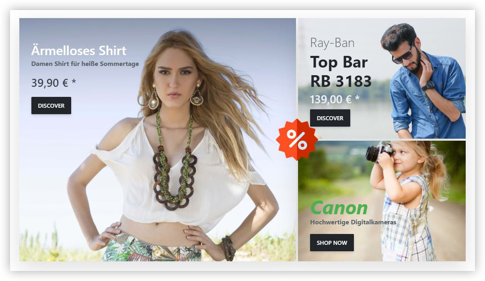

# Datenbindung

Ermöglicht es, Produkte, Warengruppen und Hersteller an einen Block zu binden. Dadurch können aktuelle Daten dieser Shop-Entitäten wie Produktname, Preis oder Beschreibung mithilfe von Platzhaltern innerhalb eines Blockes angezeigt werden. Zudem ist es möglich, den Block mit der gewünschten Shopseite zu verlinken.

Zwei Block-Typen unterstützen die Datenbindung:

• Text

• Bild

Wenn Sie also einen dieser beiden Blocktypen einbinden, werden Sie im Unterschied zu anderen Blöcken den Tab Datenbindung in der Konfigurationsansicht des Blockes sehen.

Auf diese Weise können Sie ganz einfach Stories erstellen, welche einzelne Produkte oder eine Produktauswahl von Herstellern oder Warengruppen direkt bewerben. Sollten Änderungen an einem der Produkte vorgenommen werden, sind automatisch alle Daten innerhalb der Story auf dem aktuellen Stand.

# Einstellungen

Ermöglicht es, Produkte, Warengruppen & Hersteller an einen Block zu binden. Um einen Block mit bspw. einem Produkt zu verknüpfen, müssen Sie lediglich innerhalb des Block-Editors unter dem Tab Datenbindung die gewünschte Entität auswählen . Wenn dem Block ein Element zugewiesen wurde, können Platzhalter per Knopfdruck in Eingabefelder wie Titel, Tagline, Text oder URL eingefügt werden. Diese Platzhalter sorgen dafür, dass produktbezogene Informationen direkt in der Story angezeigt werden.

Folgende Platzhalter & Konstrukte stehen zur Verfügung:

Name / Titel: **{{ Name }}**

Hersteller / Tagline: **{{ TagLine }}**

Kurzbeschreibung / Intro: **{{ Description }}**

Preis: **{{ Price }}**

Alter Preis: **{{ Regular Price }}**

Link: **{{ Url }}**

Abfrage auf Inhalt: **** Dann….. ****

In manchen Fällen macht es Sinn, einen Platzhalter auf einen bestimmten Inhalt zu überprüfen. Als Beispiel könnten Sie überprüfen, ob dem Artikel ein *RegularPrice* (alter Preis) zugewiesen wurde. Wenn dies der Fall ist, soll spezieller Text ausgegeben werden, um den Kunden darauf aufmerksam zu machen. Eine solche Funktionalität könnte wie folgt aussehen:

 Sonderangebot! Anstatt {{ RegularPrice }} bezahlen Sie  nur {{ Price }}

Mit einer solchen Abfrage könnte Ihr Text so aussehen:

Mit Wert: “Sonderangebot! Anstatt 69,90€ bezahlen Sie nur 29,90€

Ohne Wert: „nur 29,90€“

Mit dieser Methodik ist es möglich, dynamische, ansprechende, sowie immer aktuelle produktbezogene Stories zu kreieren.

Für einen genaueren Einblick in dieses Thema, schauen Sie sich unser Video zur Datenbindung an: [https://www.youtube.com/watch?v=gs52tRjfqyA&list=PLog4smYIQ2NSZ5gfInsPxi-qGxMKCOf-s&index=6&t=1s](https://www.youtube.com/watch?v=gs52tRjfqyA&list=PLog4smYIQ2NSZ5gfInsPxi-qGxMKCOf-s&index=6&t=1s)

**Hinweis:** Die Datenbindung wird nur beim Text- und Bild-Block unterstützt.