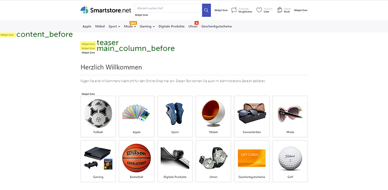

# Widget Zonen

Widget Zonen sind Platzhalter, die in großer Zahl auf sämtlichen Smartstore-Seiten definiert sind. Mithilfe von Widget Zonen werden Stories, Widgets und Seiteninhalte platziert und dargestellt. Um herauszufinden, wo überall Widget Zonen positioniert sind, aktivieren Sie die Widget Zonen-Darstellung unter **Admin > Plugins > Developer Tools**.

Wenn diese Option aktiviert ist, werden Widget Zonen angezeigt. Wenn Sie wissen wollen, wie eine Widget Zone heißt, fahren Sie mit der Maus über den Text *"Widget Zone"*, und der Name wird in einem Popup dargestellt. Widget Zonen sind nur für User mit Administratorrechten sichtbar. Ihre Kunden können diese zu keinem Zeitpunkt sehen.

Die wichtigsten Widget Zonen sind:

**content\_before:** Vor dem Seiteninhalt, erste Widget Zone auf der Seite (nach Header, Navbar & Slideshow)

**content\_after:** Nach dem Seiteninhalt, vor dem Footer

**teaser:** Nach content\_before, vor Homepage Produkten

**main\_column\_before:** Nach teaser und vor Hompage Produkten

**main\_column\_after:** Vor content\_after

Diese Widget Zonen sind auf allen Seiten zu finden.

....

