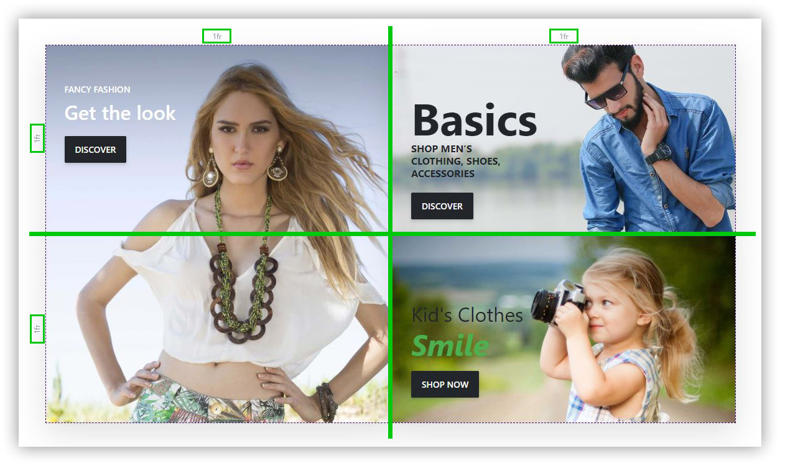

# Layout erstellen

Wenn Sie eine eigene Vorlage oder eine neue Story erstellen wollen, können Sie mit einer komplett leeren Story beginnen. Wenn Sie Ihre neue Story erstellt haben, geben Sie dieser zunächst einen [*Systemnamen*](../story/toolbox-story-optionen.md) an und speichern Sie ab. Nun können Sie für das Raster der Story ein Layout erstellen.

# Ein einfaches Layout erstellen

Damit Ihre Story ein anschauliches und [*responsives Layout*](../story/responsive-darstellung.md) erhält, müssen Sie Ihr Raster entsprechend definieren. Als Beispiel nehmen wir hier einmal die Story-Vorlage *For Sale*, allerdings mit etwas vereinfachtem Layout, da an dieser Stelle auf das Prozentzeichen in der Mitte verzichtet wird.

Die fertige Story soll wie folgt dargestellt werden:

Bei dieser Story finden 3 Blöcke Verwendung. Diese sollen innerhalb eines Rasters mit den Dimensionen 2x2 (also jeweils 2 Spalten und Zeilen) als Kacheln angeordnet werden. Die Anordnung der Bilder ändert sich zwar bei Mobile- bzw. Desktopauflösungen, allerdings ist das 2x2 Raster für diese Funktionalität ausreichend. Oftmals müssen Sie Ihr Raster erweitern bzw. anpassen, wenn Sie eine Abweichung der Darstellung zwischen den Auflösungen haben möchten.

Um das Layout wie gewünscht zu definieren, müssen Sie mithilfe der [*Rasterwerkzeuge*](../../smartstore-page-builder/benutzeroberflache/das-raster.md) Spalten und Zeilen löschen beziehungsweise neue hinzufügen. 

# Ein erweitertes Layout erstellen

Dadurch, dass der Text-Block bei der Vorlage Fashion in der Desktopansicht ¾ vom ersten Bild und ¼ vom Zweiten überlagert, muss das Raster auch darauf ausgelegt werden. Damit der Text-Block die gewünschte Überlagerung der Bilder erzielen kann, müssen die Spalten der Bilder jeweils 4 geteilt werden. So ist es möglich, dass der Text-Block ¾ des ersten Bildes und ¼ vom zweiten Bild überlagert, sozusagen drei von vier Spalten des ersten Bildes, plus eine der Nächsten. Das sieht wie folgt aus:

Die Zeilen sind mit der Einheit *auto* versehen, wodurch die Mindesthöhe der Zellen durch den Inhalt bestimmt wird. In dieser Konfiguration ist der Text-Block mindestens so hoch, dass der Inhalt (mit Abständen) in die Zelle passt. Die beiden anderen Zeilen sind ebenfalls auf auto eingestellt, dadurch passen sich diese dynamisch auf den Platzbedarf der mittleren Zeile an. Eine Auflistung aller verfügbaren Maßeinheiten finden Sie unter [*Größeneinheiten*](../../smartstore-page-builder/sonstiges/glossar.md).

Ein Video zur Erstellung einer einfachen Story finden Sie unter: [https://www.youtube.com/watch?v=gCHPlywtAZI&list=PLog4smYIQ2NSZ5gfInsPxi-qGxMKCOf-s&index=1](https://www.youtube.com/watch?v=gCHPlywtAZI&list=PLog4smYIQ2NSZ5gfInsPxi-qGxMKCOf-s&index=1)