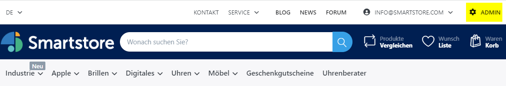
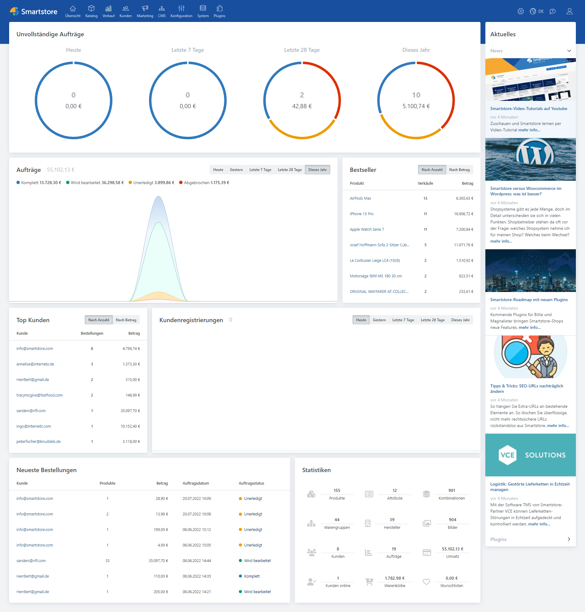

# Das Backend entdecken

Das **Smartstore** Backend stellt Ihnen eine Benutzeroberfläche zur Verfügung, die Ihnen dabei hilft, Ihren Shop und Ihren Produktkatalog einfach zu verwalten. Um zur Backend-Benutzeroberfläche zu gelangen, loggen Sie sich bitte ein. Sobald Sie als Shop Administrator eingeloggt sind, finden Sie einen Link in der Hauptnavigationsleiste des Shops wie auch im Verwaltungsmenü für Ihren Account.

1. Verwaltungsmenü für den Account
2. Verwaltungslink

Die **Smartstore** Backend Benutzeroberfläche wird angezeigt.

Die Benutzeroberfläche besteht aus den folgenden Einzelteilen:

- Übersicht / Dashboard
- Links rechts oben
- Arbeitsbereich
- Newsbereich

## Hauptnavigationsleiste

Die **Hauptnavigationsleiste** gibt Ihnen Zugang zu den Kernmodulen von **Smartstore**, dazu gehören **Übersicht/Dashboard, Katalog, Verkauf, Kunden, Marketing, CMS, Konfiguration, System** und **Plugins** **.**

Die **Hauptnavigationsleiste** gibt Ihnen Zugang zu den folgenden wichtigen Modulen. Wenn Sie weitere Informationen benötigen, folgen Sie einfach den jeweiligen Links.

- [**Übersicht**](../benutzer-handbuch/die-ubersicht.md)  - Hier finden Sie die Statistiken für Ihren Shop, dazu gehören Auftragssummen, Bestseller nach Menge, Bestseller nach Betrag, registrierte Kunden und unvollständige Aufträge.
- [**Katalog**](../benutzer-handbuch/katalog.md) \- Erlaubt die Erstellung und Verwaltung von Warengruppen und Produkten. Sie können hier auch Hersteller, Produkt Rezensionen, Tags und Attribute bearbeiten.
- [**Verkauf**](../benutzer-handbuch/verkauf.md) \- Erlaubt die Verwaltung von Aufträgen, Sendungen, wiederkehrenden Zahlungen, Retourenwünsche, Geschenkgutscheine, Warenkörben, Wunschzetteln, Bestseller und unverkäufliche Produkte.
- [**Kunden**](../benutzer-handbuch/kunden.md) \- Erlaubt das Hinzufügen, Bearbeiten, Entfernen und die Verwaltung aller Kunden. Sie können auch Kundengruppen, Bestellungen, Bonuspunkte, Warenkörbe und Wunschlisten verwalten.
- [**Marketing**](../benutzer-handbuch/marketing-promotion.md)  - Erlaubt das Hinzufügen, Bearbeiten und Verwalten von Rabatten, Partnerprogrammen, Newsletter Abonnenten und Kampagnen.
- [**CMS**](../benutzer-handbuch/content-management.md) \- Erlaubt die Verwaltung von Inhalten, die mit Ihrem Shop in Verbindung stehen, dazu gehören Seiten und Inhalte, News, Blogs, Foren, Umfragen und Widgets. Hier können Sie auch Nachrichtenvorlagen bearbeiten.
- [**Konfiguration**](../benutzer-handbuch/konfiguration.md)  - Erlaubt die Konfiguration des Kernsystems  und regionale Einstellungen. Sie können hier Shops, Zahlungsarten, Listen, E-Mail-Konten, Zugriffsrechte, ACL und Themes konfigurieren.
- [**System**](../benutzer-handbuch/system-wartung.md) \- Erlaubt Ihnen, Systeminformationen,  die E-Mail-Verwaltung, SEO Namen, Warnungen und geplante Aufgaben einzusehen.
- [**Plugins**](../benutzer-handbuch/plugins-designs.md) \- Erlaubt die Installation und Aktualisierung von Plugins. Sie können hier auch SMS-Anbieter und Developer Tools verwalten.

## Links rechts oben

Die **Links rechts oben** erlauben Ihnen Ihre Accounteinstellungen zu konfigurieren, den Shop anzusehen, eine Sprache auszuwählen, den Hilfebereich aufzurufen und sich aus **Smartstore** auszuloggen.

| **Option** | **Beschreibung** |
| --- | --- |
|  | Zeigt Ihnen eine Drop Down Liste mit Möglichkeiten, Ihren Shop anzusehen, den Cache zu reinigen und die Anwendung neu zu starten. |
|  | Erlaubt die Sprachauswahl für die Anwendung. |
|  | Hier erreichen Sie die Online-Hilfe. |
|  | Hier können Sie Ihre Accounteinstellungen konfigurieren und sich ausloggen. |

## Übersicht

In der **Übersicht** können Sie alle Module in **Smartstore** aufrufen und bearbeiten.  

