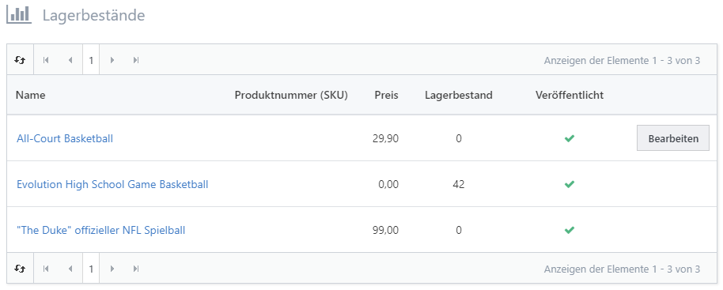

# Lagerbestände ansehen

Das Produktmanagement von Smartstore verfügt über Funktionen, mit denen Sie den Lagerbestand Ihrer Produkte im Auge behalten können. Das System kann so konfiguriert werden, dass der Bestand automatisch angepasst wird, sobald ein Kunde Artikel in Ihrem Shop kauft. Als Shopadministrator können Sie aus einer oder mehreren Aktionen wählen, die eintreten, wenn der Lagerbestand unter einen von Ihnen festgelegten Wert fällt (z. B. Deaktivierung des Kauf-Buttons). Natürlich müssen Sie Produkte mit niedrigem Lagerbestand neu bestellen (vorausgesetzt, sie sind bei Ihrem Hersteller weiterhin verfügbar), damit Sie mit dem Verkauf fortfahren können. Sie werden also häufig vor die Aufgabe gestellt, zu bestimmen welche Produkte nachbestellt werden müssen. Smartstore stellt Ihnen automatisch eine Liste von Produkten mit niedrigem Lagerbestand zur Verfügung.

Sie können alle Produkte mit niedrigem Lagerbestand auf einem Blick sehen, wenn Sie zu **Katalog > Lagerbestände** navigieren. Hier werden alle Produkte dargestellt, bei denen **Lagerbestand führen** aktiviert ist und der **Mindestlagerbestand** unter dem gegenwärtigen **Lagerbestand** liegt. Diese Einstellungen können in der Registerkarte [Inventar](../katalog/produkte-verwalten/lagerbestand-fuhren.md) für das jeweilige Produkt konfiguriert werden.

