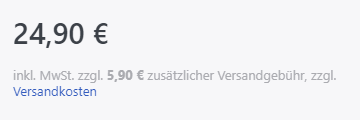
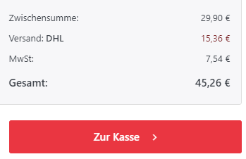
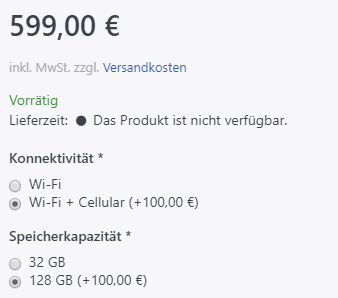
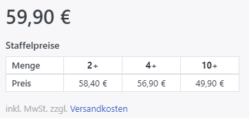

# Preisregeln verstehen

In Smartstore können Sie mehrere Handlungen durchführen, die den Produktpreis, den Sie auf der Registerkarte [Preis](../produkte-verwalten/produktpreis-festlegen.md) festgelegt haben, beeinflussen. 

## Preis

Der Preis, der im Frontend angezeigt wird, ist der **Preis**, den Sie unter [Produktdetails](../produkte-verwalten/produktpreis-festlegen.md) in der Registerkarte **Preis** festgelegt haben.

In dem gleichen Bereich können Sie einen **Alten Preis** angeben, der unter dem eigentlichen **Preis**. durchgestrichen angezeigt wird.

## Aktionspreis

Der **Aktionspreis,** für den Sie eine Gültigkeitsperiode angeben können, wird anstelle des eigentlichen Preises angezeigt.

## Transportzuschlag

Der **Transportzuschlag** kann im Bereich [Produktdetails](../produkte-verwalten/produkte-erstellen-und-bearbeiten.md) in der Registerkarte **Allgemein** angegeben werden und wird den Versandkosten auf der Seite für die Versandauswahl und der Auftragszusammenfassung des Warenkorbs hinzugefügt.

  

       

  

## Produktattribute

Der nächste Preis, den Sie in der Preiskette konfigurieren können, ist der Preis für einen Produktattribut-Wert, für den Sie eine positive oder negative **Preisanpassung (Mehr-/Minderpreis)** vornehmen können, die dem aktuellen Preis hinzugefügt oder abgezogen wird.

    
Sie können auch einen Fixpreis für Attributkombinationen angeben, der den ursprünglichen Preis überschreibt, der aber nicht angewendet wird, wenn eine **Preisanpassung** für Attributwerte definiert wurde.

## Staffelpreise

Das nächste Element in der Preiskette sind **Staffelpreise** . Mit Staffelpreisen können Sie Ihre Kunden dazu motivieren, größere Mengen Ihrer Produkte zu kaufen, indem Sie Ihnen einen Rabatt anbieten, der steigt, je größer die Bestellmenge wird. Der angewendete Staffelpreis wird den ursprünglichen Preis überschreiben. Für weitere Informationen darüber, wie man Staffelpreise erstellt, lesen Sie bitte  [Produktpreis festlegen](../produkte-verwalten/produktpreis-festlegen.md) .

 

## Rabatte

Als nächstes Element in der Preisberechnung werden **Rabatte** berücksichtigt. Rabatte werden auf den aktuellen Preis, der durch die oben beschriebene Preiskette entstanden ist, angewendet. Für weitere Informationen zu Rabatten lesen Sie bitte [Rabatte verwalten](../../../benutzer-handbuch/marketing-promotion/rabatte-verwalten.md). 

## Steuern

Ein weiteres Element, das den angezeigten Preis beeinflusst, sind die Einstellungen, die Sie für die Behandlung von Steuern ausgewählt haben. Für weitere Informationen über Steuereinstellungen lesen Sie bitte [Steuerberechnung einrichten](../../../benutzer-handbuch/konfiguration/steuerberechnung-einrichten.md).

## Grundpreis gemäß PAnGV berechnen

Der Grundpreis gemäß PAngV hat keinerlei Einfluss auf die Preiskalkulation. Er dient lediglich der Information der Kunden über den Grundpreis pro Verpackungseinheit, in der Sie Ihr Produkt verkaufen. Für weitere Informationen über die Berechnung des Grundpreises lesen Sie bitte [Produktpreis festlegen](../produkte-verwalten/produktpreis-festlegen.md).

## PAngV und Omnibus Richtlinie

Seit Mai 2022 sieht die erweiterte PAngV (Preisabgabenverordnung) u.A. vor, dass bei der Darstellung von Streichpreisen der niedrigste Verkaufspreis der letzten 30 Tage herangezogen werden muss. Zusätzlich gibt es neue Regeln für Produktrezensionen.  
Smartstore setzt diese neuen Regeln seit der 5.x Version um.