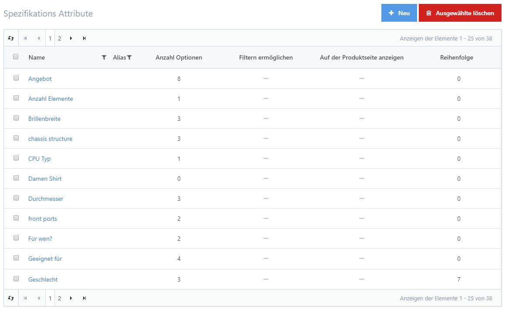
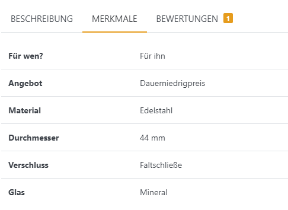
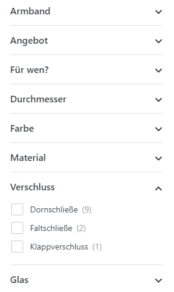

# Spezifikationsattribute verwalten

Mit Spezifikationsattributen können Sie detailliertere Informationen über Ihre Produkte anbieten und Ihren Käufern dabei helfen, diese leichter zu vergleichen. Sie können auch Ihren Kataloginhalt präzisieren, während Sie browsen und suchen. Mit Spezifikationsattributen zu arbeiten, bringt folgende Vorteile:

- Spezifikationsattribute werden als Tabellendaten auf der Produktdetailseite in Form eines **Datenblatts** dargestellt, das die Eigenschaften Ihres Produkts im Detail anzeigt.
- Wenn Käufer in Ihrem Shop **Produkte vergleichen**, zeigt die Vergleichstabelle nicht nur Bilder, Namen und Preise, sondern auch die Schnittmenge aller Spezifikationsattribute, die mit den zu vergleichenden Produkten verbunden sind.
- Jedes Attribut kann für die Darstellung im **Filter Sidebar Widget** aktiviert werden, welches auf allen Übersichtsseiten für Warengruppen sichtbar ist. Dieses Widget ermöglicht es Ihren Käufern, Produkte über ihre Merkmale zu finden, statt sich durch die statisch aufgebaute Baumansicht hangeln zu müssen. Für weitere Informationen über das Sidebar Filter Widget lesen Sie bitte [Mit dem Filter Sidebar Widget arbeiten](../katalog/produkte-verwalten/mit-dem-filter-sidebar-widget-arbeiten.md).

## Anwendungsszenario

Stellen Sie sich vor, Sie betreiben einen Shop für Drucker. Dann dürften Käufer erwarten, dass Sie sie über die folgenden Spezifikationen eines Druckers informieren:

- **Die Technologie des Druckers:** Inkjet, Laser
- **Internetverbindung:** Wireless, Memory Card, USB
- **Ausdruck:** S/W, Farbe
- **Doppelseitiger Druck:** Ja, Nein
- **Auflösung:** 600 dpi, 1200 dpi, ...
- **Unterstützte Papierformate:** A3, A4, A5, B5, Umschläge, ...

Sie könnten die oben aufgeführten Informationen in einer langen Produktbeschreibung unterbringen, aber Sie würden die Möglichkeit verlieren, diese Merkmale im Filter Widget in der in den Produktvergleichen unterzubringen. Wenn Sie außerdem den Namen oder den Wert eines Attributs überall verändern möchten, müssten Sie immer noch alle Produkteinträge manuell aktualisieren, was eine mühevolle und beschwerliche Aufgabe ist. Es ist daher viel besser, diese Art von Daten als globale Spezifikationsattribute Ihrem Shop hinzuzufügen und diese später mit Ihren Produkten zu verknüpfen.

|     |     |
| --- | --- |
| **Alle Spezifikationsattribute**   | **Attribute mit einem Produkt verknüpfen**   |
| **Datenblatt in der Produktdetailansicht**   | **Filter Sidebar Widget**   |

## Spezifikationsattribute hinzufügen

Sie können neue Spezifikationsattribute hinzufügen, indem Sie zu **Katalog > Spezifikations Attribute**. navigieren. Die Attribute, die Sie hinzufügen, sind systemweit in Ihrem Shop verfügbar und können **jedem** Produkt in der Produktdetailansicht in der Registerkarte Spezifikationsattribute verliehen werden. Wenn Sie Spezifikationsattribute erstellen, können Sie den **Anzeigenamen** für jede Sprache, die Sie in Ihrem Shop angelegt haben, festlegen. Gleiches gilt für die Anzeigereihenfolge, der Attribute im Frontend. Sobald Sie ein Spezifikationsattribut erstellt haben, können Sie die Optionen hinzufügen, die verfügbar werden, wenn man die Spezifikation eines Produkts konfiguriert. Gehen Sie dafür auf die Registerkarte **Optionen** und klicken Sie auf **Option hinzufügen**. Hier können Sie lokalisierte **Optionsnamen** und **Reihenfolge** festlegen.

> [!INFO]
> ### Tip
> Wenn Sie mehrere Werte auf einmal hinzufügen möchten, trennen Sie diese durch ein Semikolon und klicken Sie auf das Kästchen **Mehrere, durch Semikolon (;) getrennte Optionsnamen eingeben**. Wenn Sie Ihre Optionen speichern, wird eine Option für jeden durch Semikolon getrennten Wert erstellt.

## Spezifikationsattribute Produkten zuordnen

Nachdem Sie die Spezifikationsattribute eingerichtet haben, können Sie diese Ihren Produkten zuordnen. Die Zuordnung kann in der Registerkarte **Spezifikations Attribute** in der Produktdetailkonfiguration vorgenommen werden.

### **Fields Reference**

| **Felder** | **Beschreibung** |
| --- | --- |
| **Attribut** | Wählen Sie das Spezifikationsattribut, das Sie dem Produkt zuweisen möchten, z. B. *Drucktechnologie.* |
| **Attributsoption** | Wählen Sie eine der Optionen, die Sie für das jeweilige Attribut angegeben haben, z. B. *Inkjet.* |
| **Filtern zulassen** | Klicken Sie diese Box an, wenn Sie das Filtern nach diesem Produktattribut erlauben möchten, (funktioniert nur, wenn das *Filter Sidebar Widget* aktiviert ist). |
| **Auf Produktseite zeigen** | Klicken Sie diese Box an, um das Produktionsattribut auf der öffentlichen Produktdetailansicht anzuzeigen. |
| **Reihenfolge** | Anzeigenreihenfolge des Spezifikationsattributs. 1 bedeutet den ersten Platz in der Liste. |

Klicken Sie auf **Speichern** , um die Verknüpfung in der Datenbank zu speichern. Um mit einer weiteren Verknüpfung fortzufahren, ändern Sie einfach den Wert im Feld und klicken den Button erneut.

### Mehrfache Wert-Zuweisung 

Wenn Sie sich in der Bearbeitungsansicht eines Spezifikationsattribut befinden **Katalog > Spezifikations Attribute >** ***Attribute*** *, können S*ie die Werte dieses Attributs mit nur einem Klick für alle Produkte bearbeiten denen dieses Attribut zugewiesen ist. So müssen Sie nicht jedes Produkt einzeln öffnen, verändern und abspeichern, wenn Sie beschließen das Attribut global anders zu konfigurieren. 

| **Mehrfache Wert-Zuweisung** | **Beschreibung** |
| --- | --- |
| Auf der Produktseite anzeigen    | Legt fest, ob das Attribut auf der Produktdetailseite angezeigt werden soll. |
| Filtern ermöglichen | Legt fest, ob Suchergebnisse nach diesem Attribut gefiltert werden können. Diese Einstellung ist nur unter Verwendung des 'MegaSearchPlus' Plugins wirksam. Änderungen werden nach der nächsten Aktualisierung des Suchindex wirksam. |
| Darstellung der Suchfilter | Legt die Darstellung der Suchfilter fest. Diese Einstellung ist nur unter Verwendung des 'MegaSearchPlus' Plugins wirksam. Änderungen werden nach der nächsten Aktualisierung des Suchindex wirksam. |
| Sortierung der Suchfilter    | Legt die Sortierung der Suchfilter fest. Diese Einstellung ist nur unter Verwendung des 'MegaSearchPlus' Plugins wirksam. Änderungen werden nach der nächsten Aktualisierung des Suchindex wirksam. |
| Optionsnamen indexieren | Legt fest, ob Optionsnamen mit in den Suchindex aufgenommen werden sollen, damit Produkte über sie gefunden werden können. Diese Einstellung ist nur unter Verwendung des 'MegaSearchPlus' Plugins wirksam. Änderungen werden nach der nächsten Aktualisierung des Suchindex wirksam. |