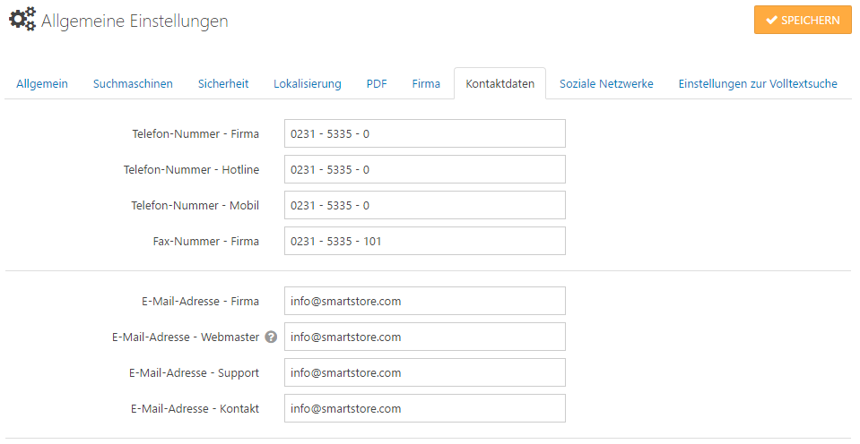

# Allgemeine Einstellungen

Im Bereich **Allgemeine Einstellungen** können Sie globale Einstellungen für verschiedene Bereiche vornehmen. Es gibt nicht für jede Einstellung eine Erklärung, da einige selbsterklärend sind. Wenn die Einstellung, die Sie suchen nicht dokumentiert ist, fahren Sie bitte mit dem Mauszeiger über den Platz zwischen Titel und Eingabefeld der Einstellung. Es taucht dann ein Fragezeichen auf, das Ihnen einen Hinweis zur Benutzung dieser Einstellung gibt.

## Allgemein

|     |     |
| --- | --- |
| Shop geschlossen | Mit dieser Einstellung können Sie den Shop für Wartungsarbeiten schließen. |
| Administrator kann geschlossenen Shop sehen | Der Administrator kann den Shop ansehen, auch wenn er geschlossen ist. |

## Suchmaschinen

|     |     |
| --- | --- |
| Titel-Trennzeichen | Legt das Seiten-Titel-Trennzeichen fest. |
| Seiten-Titel-Anpassung | SEO-relevante Seitentitel Anpassung vornehmen. Der erzeugte Seitentitel könnte z. B. statt [MEINSHOP.DE](http://Yourstore.com)\|SEITE NAME \| SEITE NAME \|[MEINSHOP.DE](http://Yourstore.com) lauten. |
| Standard-Titel | Legt den Standard-Titel für Seiten im Shop fest. |
| Standard-Meta-Keywords | Legt die Standard-Meta-Keywords für alle Seiten fest. Für Warengruppen, Produkte und Hersteller können diese individuell angegeben werden. |
| Standard-Meta-Beschreibung | Legt die Standard-Meta-Beschreibung (description) fest. Diese kann für Warengruppen, Produkte und Hersteller nochmal individuell angepasst werden. |
| Nicht-westliche-Zeichensätze konvertieren | Konvertiert Buchstaben mit Akzentzeichen aus SEO-relevanten Namen zu Buchstaben ohne Akzentzeichen. |
| Kanonische Urls aktivieren | Aktiviert kanonische Urls. |
| Regel für kanonischen Domänennamen | Erzwingt die permanente Umleitung zu einem einzelnen Domänennamen für ein besseres Seitenranking (z. B. meinshop.de > [www.meinshop.de](http://www.meinshop.de) oder umgekehrt). |
| Extra Disallows für robots.txt    | Geben Sie hier zusätzliche Pfade an, die als Disallow-Einträge zur robots.txt hinzugefügt werden sollen. Jeder Eintrag muss in einer neuen Zeile erfolgen. |

## Sicherheit

|     |     |
| --- | --- |
| Sicherheitsschlüssel (private key) | Der Sicherheitsschlüssel wird benutzt, um sensible Daten zu verschlüsseln. |
| Für den Adminbereich erlaubte IP | Der Zugriff auf den Adminbereich kann nur noch über diese IP-Adresse erfolgen. Lassen Sie dieses Feld leer, wenn Sie den Zugang zum Backend nicht beschränken möchten. Nutzen Sie Kommata, um mehrere IPs einzugeben. |
| Menü in Abhängigkeit der Berechtigungen anzeigen | Administrator-Menüeinträge werden entsprechend den Berechtigungen in der Zugriffsliste angezeigt. |
| Honeypot aktivieren | Honeypot ist eine simple aber zuverlässige Bot-Erkennungsmethode, die ganz ohne Captcha auskommt. Wenn aktiv, werden Registrierungs- und Kontaktformular vor Bots und Angreifern geschützt. |
| Captcha aktivieren | Aktiviert die Benutzung von Captcha.  CAPTCHAs werden verwendet, damit man entscheiden kann, ob das Gegenüber ein Mensch oder eine Maschine ist. In der Regel macht man dies, um zu prüfen, ob Eingaben in Internetformulare über Menschen oder Maschinen (Roboter, kurz Bot) erfolgt sind, weil Roboter hier oft missbräuchlich eingesetzt werden. CAPTCHAs dienen also der Sicherheit. reCaptcha Konten können über [http://www.google.com/recaptcha](http://www.google.com/recaptcha) angelegt werden. Bevor Sie also CAPTCHA nutzen können, um Ihre Formulare zu sichern, müssen Sie Ihre Seite zunächst für den Google-Service registrieren. Nachdem Sie dies getan haben, wird Ihnen Google einen öffentlichen und einen privaten Key senden, den Sie in die Felder **reCAPTCHA public key** und **reCAPTCHA private** **key** eingeben.       > [!INFO] > ### Achtung > Es gibt zwei unterschiedliche Versionen vom reCaptcha.   > Version "2" und Version "3" (unsichtbar).   > "Unsichtbaren reCAPTCHA verwenden" nur aktivieren, wenn bei Google die Version 3 erstellt wurde.   > Zur Vorsicht das Captcha zuerst nur für die Kontaktseite und nicht für die Anmeldeseiten aktivieren. |
| Auf Seiten anzeigen | Wenn Sie CAPTCHA aktiviert haben, erhalten Sie Optionen für mehrere Seiten, auf denen Kunden in Ihrem Shop Formulare ausfüllen können. Mit diesen Optionen können Sie nun Captcha für jedes einzelne Formular ein- oder ausstellen. |

## Lokalisierung

|     |     |
| --- | --- |
| Sprachressourcen zwischenspeichern | Legt fest, ob alle Sprachressourcen beim Anwendungsstart global zwischengespeichert werden sollen. Dadurch verzögert sich zwar der Anwendungsstart, aber Seiten werden u. U. deutlich schneller aufgebaut. |
| Suchmaschinenfreundliche URLs | Wenn aktiviert, werden suchmaschinenfreundliche URLs generiert. |
| Verhalten bei Standardsprache | Legt das Redirect-Verhalten fest, wenn eine Seite in der Standardsprache angefordert wird (die Standardsprache ist die erste aktive Sprache eines Shops). |
| Verhalten bei ungültiger Sprache | Legt das Redirect-Verhalten fest, wenn eine Seite mit einem ungültigen bzw. inaktiven SEO-Code (Sprachkürzel) angefordert wird. |
| Bilder zur Sprachauswahl verwenden | Aktivieren, wenn Sie Bilder zur Sprachauswahl verwenden möchten. |
| Browsersprache erkennen | Legt fest, ob beim Erstbesuch die Browsersprache des Besuchers automatisch erkannt und zugewiesen werden soll (wenn inaktiv, wird die Standardsprache des Shops zugewiesen). |

## PDF

|     |     |
| --- | --- |
| PDFs aktivieren | Aktiviert PDFs, Bestellbestätigungen können als PDF heruntergeladen werden. |
| US-Letter-Format benutzen | Legt fest, ob das amerikanische Letter-Format benutzt werden soll. Sonst wird das DIN A4-Format benutzt (Standard). |
| PDF Logo | Legt das Logo für die PDF-Rechnung fest. Eine kleine Größe wird empfohlen. |

## Firma und Kontaktdaten

Hier können Sie alle unternehmensbezogenen Daten eingeben (z. B. Unternehmensadresse, E-Mails, Telefonnummer, Kontonummer, u.s.w.). Diese Daten werden an unterschiedlichen Stellen (im Footer, in der Auftragsbestätigung, PDFs, u.s.w.) angezeigt.

## Soziale Netzwerke

In der Registerkarte *Soziale Netzwerke* können Sie festlegen, ob Ihre Auftritte in sozialen Netzwerken angezeigt werden. Wenn Sie die Option aktivieren, können Sie all Ihre sozialen Netzwerkkanäle eingeben. Wenn Sie eines oder mehrere der sozialen Netzwerke nicht anzeigen möchten, lassen Sie das entsprechende Feld einfach leer. Die Logos und Links zu Netzwerken die nicht von Ihnen angegeben wurden, werden auch nicht im Frontend Ihres Shop dargestellt .