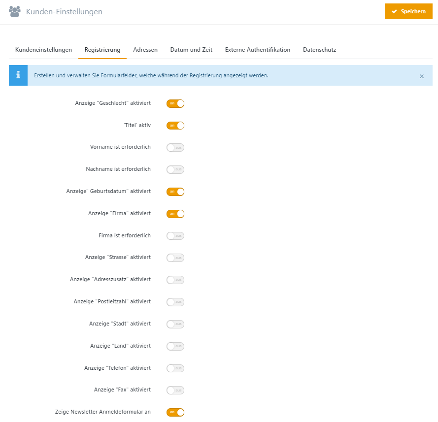

# Kunden-Einstellungen

Einstellungen rund um die Kunden, die Ihren Shop besuchen können Sie unter  **Konfiguration > Einstellungen > Kunden-Einstellungen** vornehmen.

|     |     |
| --- | --- |
| "Benutzernamen" aktiviert | Benutzernamen statt der E-Mail-Adresse für die Anmeldung verwenden (Sollte im Echtbetrieb nicht verändert werden). |
| Kunden können Benutzernamen ändern | Kunden können ihren Benutzernamen ändern. |
| Kunden erlauben, die Verfügbarkeit von Benutzernamen zu überprüfen | Legt fest, ob Kunden bei der Registrierung oder beim Ändern des Benutzernamens, die Verfügbarkeit von Benutzernamen prüfen können. |
| Registrierungstyp | Registrierungsmethode für Benutzer. Standard-Methode. Registrierung ohne Bestätigung möglich. E-Mail-Bestätigungsmethode. Benutzer müssen auf eine Überprüfungs-E-Mail antworten, bevor ihr Konto aktiviert wird. Admin-Bestätigungs-Methode. Kunden können sich registrieren. Das Konto wird aber erst nach Betätigung des Administrators aktiviert. Disabled-Methode: Registrierung ist deaktiviert. |
| Kunden können Avatare hochladen | Kunden können Avatare hochladen. |
| Standard-Avatar aktiviert | Legt fest, ob der Standard-Avatar angezeigt wird. |
| Anzeige der Herkunft eines Kunden aktiviert | Legt fest, ob die Herkunft (Stadt, Land) des Kunden angezeigt werden soll. |
| Anzeige des Registrierungsdatums eines Kunden | Legt fest, ob das Registrierungsdatum des Kunden angezeigt werden soll. |
| Benutzerprofile können eingesehen werden | Legt fest, ob Kunden Benutzerprofile von anderen Kunden einsehen dürfen. |
| Benachrichtigung bei neuer Registrierung | Benachrichtigt den Administrator, wenn sich ein neuer Benutzer registriert hat. |
| Verberge Produkte-für-den-Download-Schaltfläche | Deaktiviert herunterladbare Produkte. |
| "Benachrichtigung bei Lieferfähigkeit" verbergen | Legt fest, ob die Funktion "Benachrichtigung bei Lieferfähigkeit" in 'Mein Konto' angezeigt werden soll. |
| Angezeigter Benutzername | Legt fest, welche Daten als Benutzername festgelegt werden. |
| Maximale Länge des Benutzernamens | Legt die maximale Länge des angezeigten Benutzernamens fest. |
| Verberge Newsletter Anmeldeformular | Verbirgt das Newsletter Anmeldeformular. Newsletter Anmeldungen sind nicht möglich. |
| URL der zuletzt aufgerufenen Seite speichern | Legt fest, ob die URL der zuletzt aufgerufenen Seite im Kundendatensatz gespeichert werden soll. Das Deaktivieren kann u. U. zu schnellerem Seitenaufbau führen. |
| Standard-Passwort-Format | Legt das Standard Passwort-Format fest (Änderung ist nur für neue Benutzer gültig.) |

## Registrierung

|     |     |
| --- | --- |
| Anzeige "Geschlecht" aktiviert | Legt fest, ob das Eingabefeld "Geschlecht" während der Registrierung aktiviert ist. |
| Anzeige "Titel" aktiviert | Legt fest, ob das Feld 'Titel' aktiv ist. |
| Anzeige "Vorname ist erforderlich" | Legt fest, ob die Angabe des Vornamens erforderlich ist. |
| Anzeige "Nachname ist erforderlich" | Legt fest, ob die Angabe des Nachnamens erforderlich ist. |
| Anzeige "Geburtsdatum" aktiviert | Legt fest, ob das Eingabefeld "Geburtsdatum" während der Registrierung aktiviert ist. |
| Anzeige "Firma" aktiviert | Legt fest, ob das Eingabefeld "Firma" während der Registrierung aktiviert ist. |
| Firma ist erforderlich | Legt fest, ob die Eingabe von "Firma" erforderlich ist. |
| Anzeige "Strasse" aktiviert | Legt fest, ob das Eingabefeld "Strasse" während der Registrierung aktiviert ist. |
| Anzeige "Adresszusatz" aktiviert | Legt fest, ob das Eingabefeld "Adresszusatz" während der Registrierung angezeigt werden soll. |
| Anzeige "Postleitzahl" aktiviert | Legt fest, ob das Eingabefeld "Postleitzahl" während der Registrierung aktiviert ist. |
| Postleitzahl erforderlich | Legt fest, ob Angabe der Postleitzahl erforderlich ist. |
| Anzeige "Stadt" aktiviert | Legt fest, ob das Eingabefeld "Stadt" während der Registrierung aktiviert ist. |
| Die Stadt ist erforderlich | Legt fest, ob die Eingabe von "Stadt" während der Registrierung erforderlich ist. |
| Anzeige "Land" aktiviert | Legt fest, ob das Eingabefeld "Land" während der Registrierung aktiviert ist. |
| Anzeige "Bundesland" aktiviert | Legt fest, ob das Eingabefeld "Bundesland" während der Registrierung angezeigt werden soll. |
| Anzeige "Telefon" aktiviert | Legt fest, ob das Eingabefeld "Telefon" während der Registrierung aktiviert ist. |
| Telefon-Nummer ist erforderlich | Legt fest, ob die Eingabe der Telefonnummer erforderlich ist. |
| Anzeige "Fax" aktiviert | Legt fest, ob das Eingabefeld "Fax" während der Registrierung aktiviert ist. |
| Fax-Nummer ist erforderlich | Legt fest, ob die Eingabe einer Fax-Nummer erforderlich ist. |
| Zeige Newsletter Anmeldeformular an | Zeigt das Newsletter Anmeldeformular. Newsletter Anmeldungen sind möglich. |

## Adressen

|     |     |
| --- | --- |
| Prüfung der Kunden-Email-Adresse | Bestimmt ob die Email-Adresse des Kunden im Checkout validiert wird. |
| 'Anrede' aktiv    | Legt fest, ob das Feld 'Anrede' aktiv ist. |
| Anreden | Komma getrennte Liste (z.B. Herr, Frau). Bestimmen Sie die Einträge für die Auswahl der Anrede, bei der Adresserfassung. |
| 'Titel' aktiv | Legt fest, ob das Feld 'Titel' aktiv ist. |
| 'Firma' aktiv | Legt fest, ob das Feld 'Firma' aktiv ist |
| Die Eingabe von 'Firma' ist erforderlich. | Legt fest, ob die Eingabe von 'Firma' erforderlich ist. |
| 'Straße' aktiv | Legt fest, ob das Feld 'Straße' aktiv ist |
| Die Eingabe von 'Straße' ist erforderlich. | Legt fest, ob die Eingabe von 'Straße' erforderlich ist. |
| 'Adresszusatz' aktiv | Legt fest, ob das Feld 'Adresszusatz' aktiv ist. |
| Die Eingabe von 'Adresszusatz' erforderlich.    | Legt fest, ob die Eingabe von 'Adresszusatz' erforderlich ist. |
| 'PLZ' aktiv | Legt fest, ob das Feld 'PLZ' aktiv ist |
| Die Eingabe von 'PLZ' ist erforderlich | Legt fest, ob die Eingabe von 'PLZ' erforderlich ist. |
| 'Stadt' aktiv | Legt fest, ob das Feld 'Stadt' aktiv ist |
| 'Stadt' erforderlich | Legt fest, ob die Eingabe von 'Stadt' erforderlich ist. |
| 'Land' aktiv | Legt fest, ob das Feld 'Land' aktiv ist |
| Die Eingabe eines Landes ist erforderlich    | Legt fest, ob die Eingabe eines Landes erforderlich ist. |
| 'Bundesland' aktiv | Legt fest, ob das Feld 'Bundesland' aktiv ist |
| Die Eingabe eines Bundeslandes ist erforderlich | Legt fest, ob die Eingabe eines Bundeslandes erforderlich ist. |
| 'Telefon' aktiv | Legt fest, ob das Feld 'Telefon' aktiv ist |
| Die Eingabe von 'Telefon' ist erforderlich. | Legt fest, ob die Eingabe einer Telefonnummer erforderlich ist. |
| 'Fax' aktiv | Legt fest, ob das Feld 'Fax' aktiv ist |
| Die Eingabe von 'Fax' ist erforderlich. | Legt fest, ob die Eingabe einer Fax-Nummer erforderlich ist. |

## Datum und Zeit

|     |     |
| --- | --- |
| Kunden können die Zeitzone einstellen | Kunden können die Zeitzone einstellen. |
| Standard-Zeitzone | Legt die Standard-Zeitzone für den Shop fest. |

## Externe Authentifikation 

|     |     |
| --- | --- |
| Automatische Registrierung aktiviert | Aktiviert die automatische Registrierung, falls externe Authentifikation verwendet wird. Mehr unter [Externe Authentifikation einrichten](../../../benutzer-handbuch/kunden/externe-authentifikation-einrichten.md). |

## Datenschutz

|     |     |
| --- | --- |
| Cookie-Hinweis aktivieren | Legt fest, ob ein Element für die Zustimmung zur Nutzung von Cookies im Frontend angezeigt wird. Weitere Infos finden Sie unter [Datenschutz/DSGVO](../../../benutzer-handbuch/plugins-designs/dsgvo.md). |
| Cookie-Hinweistext | Bestimmt den Text, der Ihren Kunden beim Besuch der Seite angezeigt wird, sofern Sie ihre Zustimmung zur Nutzung von Cookies noch nicht gegeben haben. |
| IP-Adresse speichern | Legt fest, ob die IP-Adresse im Kundendatensatz gespeichert werden soll. |
| Einwilligungserklärung in Formularen fordern | Bestimmt ob in Formularen eine Checkbox angezeigt wird, die den Benutzer auffordert der Verarbeitung seiner Daten zuzustimmen. |
| Name im Kontaktformular ist erforderlich | Legt fest, ob die Angabe des Namens im Kontaktformular erforderlich ist. |
| Name im Produktanfrage-Formular ist erforderlich | Legt fest, ob die Angabe des Namens im Produktanfrage-Formular erforderlich ist. |