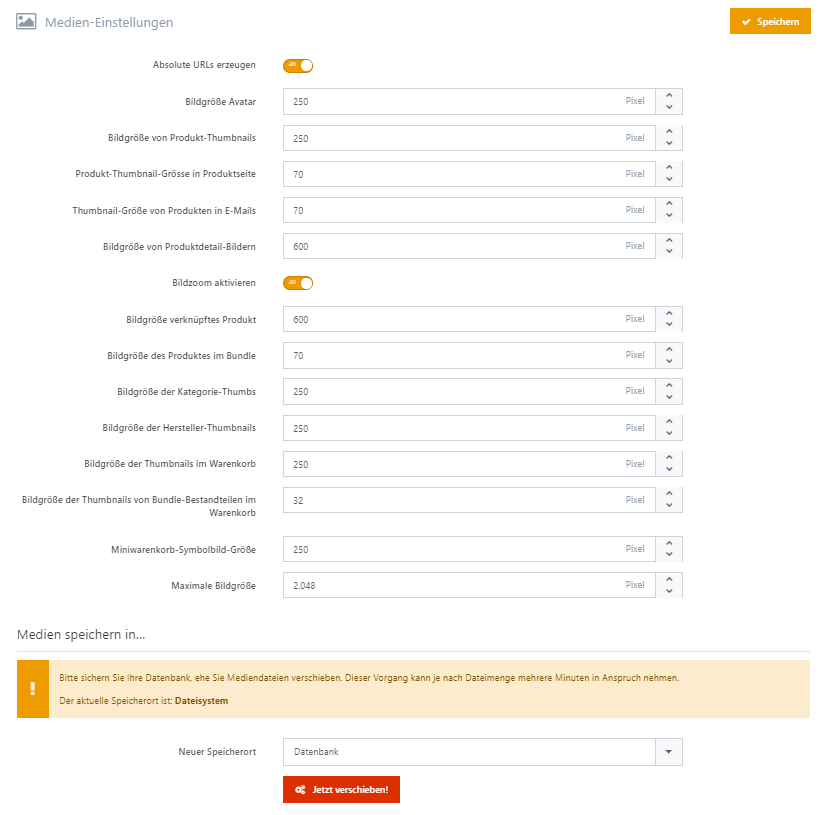

# Medien-Einstellungen

|     |     |
| --- | --- |
| Absolute URLs erzeugen    | Erzeugt absolute URLs für Mediendateien, indem der aktuelle Hostname vorangestellt wird (z.B. [http://meinshop.de/media/image/1.jpg](http://meinshop.de/media/image/1.jpg) statt /media/image/1.jpg). Hat keine Auswirkung, wenn für den Store eine CDN-URL eingerichtet wurde. |
| Bilddaten speichern in... | Legt fest, ob Bilder in der Datenbank oder im Ordnerverzeichnis gespeichert werden. |
| Bildgröße Avatar | Standardgröße in Pixeln für den Avatar. |
| Bildgröße von Produkt-Thumbnails | Standardgröße in Pixeln für Produktthumbnails |
| Produkt-Thumbnail-Größe in Produktseite | A comma-separated list of actions a customer will be able to choose when submitting a return request. |
| Bildgröße von Produktdetail-Bildern | Standardgröße in Pixeln für die Produktdetailbilder. |
| Bildzoom aktivieren | Legt fest, ob der Bildzoom aktiviert wird. |
| Zoomtyp | Wählen Sie die Anzeigeform des Zooms fest. |
| Bildgröße verknüpftes Produkt | Die Standardbildgröße (in Pixel) von mit einem Gruppenprodukt verknüpften Produkten |
| Bildgröße des Produktes im Bundle | Die Standardbildgröße (in Pixel) von Produkten im Bundle. |
| Bildgröße der Kategorie-Thumbs | Standardgröße der Produktthumbnails auf den Warengruppenseiten. |
| Bildgröße der Hersteller-Thumbnails | Standardgröße der Produktthumbnails auf den Herstellerseiten |
| Bildgröße der Thumbnails im Warenkorb | Standardgröße in Pixeln für Produktthumbnails im Warenkorb und auf dem Wunschzettel. |
| Bildgröße der Thumbnails von Bundle-Bestandteilen im Warenkorb | Standardgröße in Pixeln der Produktthumbnails von Bundle-Bestandteilen im Warenkorb und auf dem Wunschzettel. |
| Miniwarenkorb-Symbolbild-Größe | Legt die Miniwarenkorb-Symbolbild-Größe in Pixeln fest. |
| Maximale Bildgröße | Legt die maximal erlaubte Größe (längste Seite) für Bilduploads fest. |