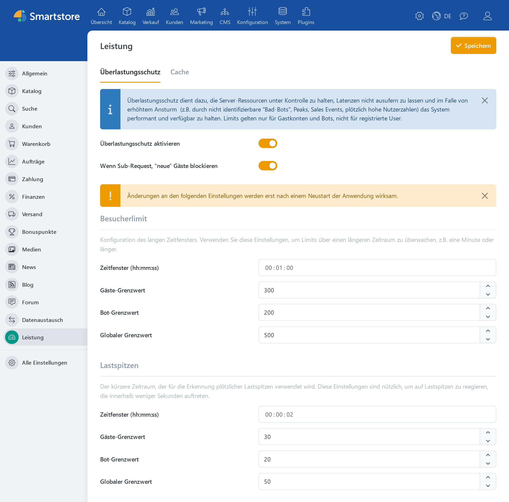

# Überlastungsschutz

Der Überlastungsschutz ist seit Smartstore v6 verfügbar und befindet sich in den Einstellungen unter dem Tab **Leistung**.

Es handelt sich dabei um eine leistungsstarke Funktion, die die Stabilität und Leistung des Systems auch unter hoher Belastung sicherstellt. Es schützt vor einer Überlastung der Serverressourcen, verhindert ein starkes Ansteigen der Latenzzeiten und hält die Plattform auch bei plötzlichen Lastspitzen wie Werbeaktionen, unerwarteten Besucheranstiegen oder Bot-Attacken funktionsfähig. Dabei konzentriert sich der Überlastungsschutz auf die Verwaltung und Beschränkung des Zugriffs von Gastbenutzern und Bots, während registrierte Benutzer von den Einschränkungen ausgenommen bleiben. Mit flexibel einstellbaren Zeitfenstern und Grenzwerten für unterschiedliche Nutzergruppen können sowohl längerfristige Besucherströme als auch kurzfristige Lastspitzen effektiv gesteuert werden. Das Feature bietet somit eine maßgeschneiderte Möglichkeit, das Nutzererlebnis zu verbessern und die Verfügbarkeit der Plattform zu gewährleisten.

Typische Anwendungsfälle:

- Abwehr von „Bad-Bots“
- Management von plötzlichen Nutzeranstiegen (z.B. durch Verkaufsveranstaltungen)
- Schutz vor Performance-Einbußen durch unerwartet hohen Traffic

Ein zentrales Problem, das durch den Überlastungsschutz adressiert wird, ist die massenhafte Generierung von Gastkonten durch nicht identifizierbare „Bad-Bots“. Diese Bots umgehen häufig herkömmliche Erkennungsmechanismen, indem sie Cookies nicht akzeptieren und bei jeder Anfrage neue Sessions erzeugen. Der Überlastungsschutz kann diese Aktivität zwar nicht vollständig verhindern, aber durch die Begrenzung der Anzahl neuer Gastkonten pro Zeitfenster und die Reduzierung unnötiger Systembelastung wirksam abfedern. Insbesondere das Blockieren neuer Gäste für sekundäre Anfragen wie AJAX-Anfragen oder Skriptaufrufe verhindert, dass Bots das System überlasten.

## Allgemeine Einstellungen

| **Option** | **Beschreibung** |
| --- | --- |
| **Überlastungsschutz aktivieren** | Wendet die definierten Richtlinien an. Wenn diese Option deaktiviert ist, werden keine Beschränkungen angewendet. |
| **Wenn Sub-Request, "neue" Gäste blockieren** | Blockiert neue Gastbenutzer für untergeordnete Anfragen (z. B. AJAX, POST, Skripte, Mediendateien). Diese Einstellung verhindert, dass "Bad Bots", die keine Cookies akzeptieren und sich durch wechselnde IP-Adressen oder User-Agent-Strings tarnen, neue Gastsitzungen für untergeordnete Anfragen erzeugen. |

> [!WARNING]
> Änderungen an den Einstellungen für **Besucherlimit** und **Lastspitzen** werden erst nach einem Neustart der Anwendung wirksam.

## Besucherlimit (Langzeitüberwachung)

Mit diesen Einstellungen können Grenzwerte über einen längeren Zeitraum (z. B. eine Minute oder länger) konfiguriert werden.

| **Option** | **Beschreibung** |
| --- | --- |
| **Zeitfenster** | Dauer des Zeitfensters (hh:mm:ss), in dem der anhaltende Traffic gemessen wird. |
| **Gäste-Grenzwert** | Maximale Anzahl von Gastbenutzern innerhalb des festgelegten Zeitfensters. Ein leerer Wert bedeutet: keine Begrenzung. |
| **Bot-Grenzwert** | Maximale Anzahl von Bots innerhalb des festgelegten Zeitfensters. Ein leerer Wert bedeutet: keine Begrenzung. |
| **Globaler Grenzwert** | Kombiniertes Limit für Gäste und Bots. Wenn die kumulierten Anfragen beider Typen dieses Limit überschreiten, werden weitere Anfragen abgewiesen. Ein leerer Wert bedeutet: kein Limit. |

## Lastspitzen (Kurzzeitüberwachung)

Diese Einstellungen werden bei plötzlichen Traffic-Spitzen über einen sehr kurzen Zeitraum (z.B. einige Sekunden) wirksam.

| **Option** | **Beschreibung** |
| --- | --- |
| **Zeitfenster** | Dauer des Zeitfensters (hh:mm:ss), in dem Lastspitzen erkannt werden. |
| **Gäste-Grenzwert** | Maximale Anzahl von Gastbenutzern innerhalb des festgelegten Zeitfensters. Ein leerer Wert bedeutet: keine Begrenzung. |
| **Bot-Grenzwert** | Maximale Anzahl von Bots innerhalb des festgelegten Zeitfensters. Ein leerer Wert bedeutet: keine Begrenzung. |
| **Globaler Grenzwert** | Kombiniertes Limit für Gäste und Bots. Wenn die kumulierten Anfragen beider Typen dieses Limit überschreiten, werden weitere Anfragen abgewiesen. Ein leerer Wert bedeutet: kein Limit. |

> [!INFO]
> **Globaler Grenzwert**: Dieses Limit gilt unabhängig von den separaten Limits für Gäste und Bots.
> Sobald dieses Limit erreicht ist, blockiert das System weitere Anfragen, auch wenn die anderen Limits nicht überschritten sind.