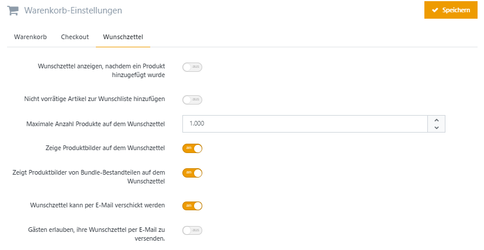

# Warenkorb-Einstellungen

|     |     |
| --- | --- |
| Warenkorb anzeigen, wenn ein Produkt hinzugefügt wird | Falls aktiviert, wird der Kunde zum Warenkorb weitergeleitet, wenn er ein Produkt hinzufügt. Ansonsten findet keine Weiterleitung statt. |
| Maximale Anzahl Produkte im Warenkorb | Legt die maximale Anzahl Produkte im Warenkorb fest. |
| Anzeige der Produktbilder im Warenkorb | Zeigt Produktbilder im Warenkorb an. |
| Anzeige der Produktbilder von Bundle-Bestandteilen im Warenkorb | Legt fest, ob Produktbilder von Bundle-Bestandteilen angezeigt werden sollen. |
| Zeige die Rabattbox im Warenkorb | Zeigt die Rabattbox im Warenkorb an. |
| Zeige die Geschenkgutschein-Box im Warenkorb | Zeigt die Geschenkgutschein-Box im Warenkorb an. |
| Anzahl der angezeigten Cross-Selling-Artikel | Legt die Anzahl der angezeigten Cross-Selling-Produkte fest. Die Eingabe von 0 (Null) blendet Cross-Selling aus. |
| Mini-Warenkorb aktiviert | Aktiviert den Mini-Warenkorb. |
| Maximale Anzahl angezeigter Produkte im Mini-Warenkorb | Legt die maximale Anzahl an Produkten im Mini-Warenkorb fest. |
| Produktbilder im Mini-Warenkorb anzeigen | Zeigt Produktbilder im Mini-Warenkorb an. |
| Rechtliche Hinweise in der Warenkorbübersicht anzeigen | Legt fest, ob rechtliche Hinweise in der Warenkorbübersicht auf der Bestellabschlussseite angezeigt werden. Dieser Text kann in den Sprachressourcen geändert werden. |
| Lieferzeiten anzeigen | Legt fest, ob Lieferzeiten im Warenkorb angezeigt werden. |
| Zeige Kurzbeschreibung der Produkte | Legt fest, ob die Kurzbeschreibungen der Produkte im Warenkorb angezeigt werden sollen. |
| Grundpreis anzeigen | Legt fest, ob der Grundpreis im Warenkorb angezeigt werden soll. |
| Zeige Produktgewicht im Warenkorb | Legt fest, ob das Produktgewicht im Warenkorb angezeigt wird. |
| Menge verknüpfter Produkte anzeigen | Legt fest, ob bei Werten von Variantenattributen die Menge von verknüpften Produkten angezeigt werden soll. |
| Kommentarbox anzeigen | Legt fest, ob der Kunde auf der Bestellabschlussseite einen Kommentar zu seiner Bestellung hinterlegen kann. |
| Preise bei der Berechnung runden | Legt fest, ob der Shop bei Berechnungen gerundete Werte der Preise benutzt (empfohlen für B2B). |

## Checkout

|     |     |
| --- | --- |
| Kommentarbox anzeigen | Legt fest, ob der Kunde auf der Bestellabschlussseite einen Kommentar zu seiner Bestellung hinterlegen kann. |
| Abonnieren von Newslettern | Legt fest, ob Kunden bei einer Bestellung Newsletter abonnieren können und ob die Checkbox standardmäßig aktiviert ist. |
| Rechtliche Hinweise in der Warenkorbübersicht anzeigen | Legt fest, ob rechtliche Hinweise in der Warenkorbübersicht auf der Bestellabschlussseite angezeigt werden. Dieser Text kann in den Sprachressourcen geändert werden. |
| Widerrufsverzichtbox für elektronische Leistungen anzeigen | Legt fest, ob der Kunde auf der Bestellabschlussseite einem Widerrufsverzicht für elektronische Leistungen zustimmen muss. |
| Produkte in einzelnen Positionen in den Warenkorb legen | Aktivieren Sie diese Option, wenn Produkte mit verschiedenen Mengenangaben als Einzelpositionen in den Warenkorb gelegt werden sollen. |
| Zustimmung zur E-Mail Weitergabe an Dritte | Legt fest, ob Kunden bei einer Bestellung der Weitergabe ihrer E-Mail Adresse an Dritte zustimmen können und ob die Checkbox dafür standardmäßig aktiviert ist. Bitte beachten Sie, dass die Option 'Aktiviert anzeigen' im Rahmen der DSVGO nicht rechtskonform ist. |

## Wunschzettel

|     |     |
| --- | --- |
| Wunschzettel anzeigen, nachdem ein Produkt hinzugefügt wurde | Falls aktiviert, wird der Kunde auf die Wunschzettelseite weitergeleitet, nachdem er ein Produkt hinzugefügt hat. |
| Nicht vorrätige Artikel zur Wunschliste hinzufügen | Legt fest, ob nicht vorrätige Produkte zur Wunschliste hinzugefügt werden können. |
| Maximale Anzahl Produkte auf dem Wunschzettel | Legt die maximale Anzahl Produkte auf dem Wunschzettel fest. |
| Zeige Produktbilder auf dem Wunschzettel | Zeigt Produktbilder auf dem Wunschzettel an. |
| Zeigt Produktbilder von Bundle-Bestandteilen auf dem Wunschzettel | Zeigt Produktbilder von Bundle-Bestandteilen auf dem Wunschzettel an. |
| Wunschzettel kann per E-Mail verschickt werden | Legt fest, ob der Wunschzettel per E-Mail verschickt werden kann. |
| Gästen erlauben, ihre Wunschzettel per E-Mail zu versenden. | Legt fest, ob Gäste ihre Wunschzettel per E-Mail versenden dürfen. |