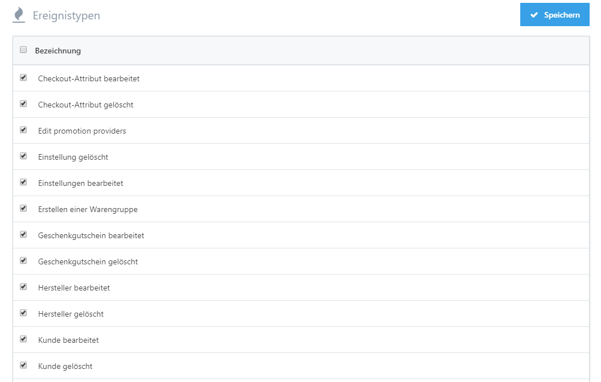

# Ereignistypen einrichten

In einem Shop gibt es Vorgänge, die jeden Tag mehrfach auftreten. Smartstore loggt diese im **Aktivitätslog**, den Sie erreichen, indem Sie zu **Kunden > Aktivitätslog** gehen. Es gibt unterschiedliche Ereignistypen, die bei der Installation von Smartstore angelegt werden. Sie können aber selbst entscheiden, welche Aktivitäten für Sie am wichtigsten sind und daher mitgeloggt werden sollen. So können Sie Aktivitäten von der Aufzeichnung ausnehmen, indem Sie zu **Konfiguration > Ereignistypen** gehen. Dort können Sie das Loggen bestimmter Ereignisse aktivieren oder deaktivieren, indem Sie in der Tabelle einen Haken bei **Aktiviert**  setzen oder entfernen und dann auf **Speichern** klicken.

## Einige interessante Ereignistypen

|     |     |
| --- | --- |
| Öffentlicher Shop. Produktrezension hinzugefügt | Fügt ein Ereignis zum Log hinzu, sobald eine Produktrezension zu einem Ihrer Produkte geschrieben wurde. |
| Öffentlicher Shop. Foren-Beitrag erstellt | Fügt ein Ereignis zum Log hinzu, sobald ein Beitrag im Forum geschrieben wurde. |
| Öffentlicher Shop. Produkt zur Wunschliste hinzugefügt | Fügt ein Ereignis zum Log hinzu, sobald ein Produkt auf die Wunschliste eines Ihrer Kunden gesetzt wurde. |

