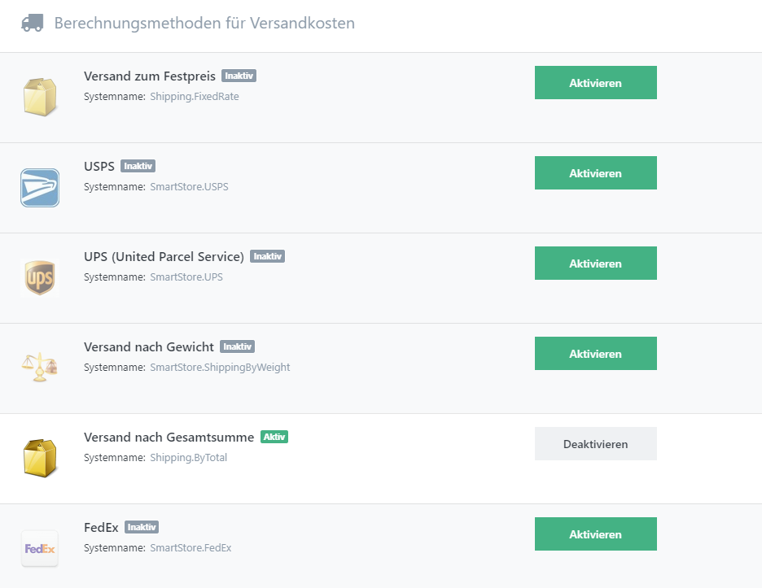

# Versandarten einrichten

Wenn Sie einen Shop betreiben, müssen Sie Versandarten anbieten, aus denen Ihre Kunden die von ihnen bevorzugten auswählen können. Sie können Versandarten einrichten, indem Sie zu **Konfiguration > Regionale Einstellungen> Versandarten** navigieren.

Hier können Sie festlegen, welche Versandarten in Ihrem Shop angeboten werden, indem Sie Namen und Beschreibungen der von Ihnen angebotenen Versandarten angeben. Wenn Sie die Option **Keine zusätzlichen Kosten** aktivieren, werden die zusätzlichen Kosten, die auf Produktebene hinterlegt wurden, bei der Kalkulation der Versandkosten ignoriert. Mit der Reihenfolge legen Sie die Anzeigereihenfolge der Versandarten im Frontend fest. Die Preise für die einzelnen Versandarten werden nicht hier, sondern in den Berechnungsmethoden für Versandkosten festgelegt, die weiter unten erklärt werden.

## Versandarten Einschränkungen

Versandarten können eingeschränkt werden, so dass sie beim Abschluss des Bestellvorgangs nicht zur Verfügung stehen. Gehen Sie zu **Konfiguration > Regionale Einstellungen > Versandarten** , und klicken Sie auf den Namen Ihrer gewünschten Versandart. In der Registerkarte  **Einschränkungen** wählen Sie die Kriterien, bei deren Auftreten die Versandart *nicht* am Checkout auftauchen soll (Ausschlussverfahren). Sie können die Versandarten mit folgenden Kriterien einschränken:

- Kundengruppen
- Länder (unterschieden zwischen Rechnungs- und Lieferadresse des Kunden)

## Berechnungsmethoden für Versandkosten

Mit **Berechnungsmethoden für Versandkosten** legen Sie die Preise der von Ihnen angebotenen Versandarten fest. Die Anzahl der angebotenen **Berechnungsmethoden für Versandkosten** hängt von den Plugins ab, die in Ihrem Shop aktiv sind. Sie können die Berechnungsmethoden verwalten, indem Sie zu **Konfiguration > Regionale Einstellungen > Berechnungsmethoden für Versandkosten** gehen. Dort können Sie die Berechnungsmethoden aktivieren oder deaktivieren, indem Sie den jeweiligen Button drücken. Sie können auch die Anzeigenreihenfolge der Versandarten im Frontend Ihres Shops durch *Drag & Drop* einstellen. Sie werden an dieser Stelle vielleicht bemerken, dass Sie bereits eine Anzeigenreihenfolge für Versandarten definiert haben. Die Berechnungsmethoden für Versandkosten erstellen Optionen und berechnen Versandkosten für alle aktiven Versandarten und stellen sie in Ihrem Frontend für Ihre Kunden zur Auswahl zur Verfügung. Sie sollten sich daher für eine der Offline-Berechnungsmethoden entscheiden. Offline-Berechnungsmethoden sind *Versand nach Gewicht*, *Versand zum Festpreis* und *Versand nach Gesamtsumme*. Sie finden unten weitere Informationen zu diesen Methoden. Bei Online-Berechnungsmethoden (wie UPS und Fedex) werden die festgelegten Versandarten vollständig ignoriert. Statt Versandkosten für diese errechnen, senden Online-Berechnungsmethoden einige Informationen (wie das Land der Lieferadresse, das Gewicht der Sendung u.s.w.) an den Server des Versandunternehmens und stellen die verfügbaren zurückgelieferten Versandoptionen für Ihre Kunden zur Auswahl zur Verfügung. 

## Berechnungsmethoden offline 

|     |     |
| --- | --- |
| Versand zum Festpreis | Ermöglicht die Angabe eines Festpreises für jede der festgelegten Versandarten. |
| Versand nach Gewicht | Berechnet die Versandkosten abhängig vom Gewicht der Sendung. |
| Versand nach Gesamtsumme | Berechnet die Versandkosten abhängig vom Gesamtwert des Auftrags. |

### Versand zum Festpreis

Der Berechnungsmethode **Versand zum Festpreis** ist die einfachste Variante der Versandkostenberechnung. Sie können einen festen Preis für jede aktive Versandart in Ihrem Shop festlegen. Ein Anwendungsszenario dafür wäre eine Versandart, die auf ein Land beschränkt ist und bei der die Versandkosten unabhängig von Gewicht und Gesamtsumme des Auftrags gleich bleiben. 

### Versand nach Gewicht

Die Berechnungsmethode **Versand nach Gewicht** nimmt die Berechnung der Versandkosten nach dem Gesamtgewicht der im Auftrag bestellten Artikel vor.

|     |     |
| --- | --- |
| Shop | Wählen Sie einen Shop, für den diese Versandbedingung gelten soll. Wird das Sternchen ausgewählt, so wird die Rate auf alle Shops angewandt. |
| Land | Das Bestimmungsland. Wählen Sie Stern \*, wenn das Land des Kunden bei der Auswertung keine Rolle spielen soll. |
| PLZ-(Bereich) | PLZ-(Bereich) des Kunden, entweder als spezifische Werte (getrennt durch Komma) oder als Muster (z. B. 4000-4999 für das PLZ-Gebiet 4). In einem Muster lassichen sich auch Wildcards verwenden, wie Stern \* oder Fragezeichen ?. Sie können auch mehrere Wildcards angeben (durch Komma getrennt). Lassen Sie das Feld leer, wenn die Gebühr unabhängig von PLZ für alle Kunden im definierten (Bundes)land gelten soll.  > [!INFO] > ### Führende Nullen im Zahlenbereich > ANMERKUNG: Der geringste wie der höchste Wert MUSS die gleiche Anzahl führender Nullen ("0100-0999" funktioniert, "0010-0999" hingegen funktioniert nicht) aufweisen. |
| Versandart | Die Versandart, bei der diese Berechnungsmethode angewandt werden soll. |
| Warengewicht von | Die Bedingung trifft zu, wenn das Gesamtgewicht aller Positionen im Warenkorb mindestens diesen Wert aufweist. |
| Warengewicht bis | Die Bedingung trifft zu, wenn das Gesamtgewicht aller Positionen im Warenkorb kleiner als dieser Wert ist. Lassen Sie das Feld leer, wenn Sie keine Obergrenze festlegen möchten. |
| Prozentual | Legt fest, ob die Versandgebühr prozentual vom Warenwert (NICHT Gewicht) berechnet werden soll. |
| Gebühr | Die Versandgebühr als absoluter Betrag ODER Berechnungsfaktor, sofern die entspr. Option aktiviert wurde. |
| Mindermengenzuschlag | Bestimmt den Wert des Mindermengenzuschlags. |
| Mindermenge bis Bestellwert | Warenwert, bis zu dem ein Mindermengenzuschlag erhoben werden soll. Der Zuschlag wird ignoriert, wenn keine Versandkosten anfallen. Verwenden Sie "0", wenn kein Zuschlag erhoben werden soll. |

   

| **250px\|Optionen** | **Beschreibung** |
| --- | --- |
| Gebühr mit Gewicht multiplizieren | Legt fest, ob die Gebühr mit dem Gesamt-Warengewicht multipliziert werden soll. Diese Option wird ignoriert, wenn eine prozentuale Gebühr erhoben wird. |
| Kein 'Fallback' anbieten | Dem Kunden wird während des Checkouts kostenloser Versand als Fallback angeboten, wenn keine der festgelegten Bedingungen zutreffen. Aktivieren Sie diese Option, wenn das nicht gewünscht ist. |
| Gewicht versandkostenbefreiter Produkte berücksichtigen | Legt fest, ob das Gewicht von versandkostenbefreiten Produkten bei der Berechnung berücksichtigt werden soll. |

  

## Versand nach Gesamtsumme

Die Berechnungsmethode **Versand nach Gesamtsumme** gibt Ihnen die Möglichkeit, die Berechnung der Versandkosten von der Auftragssumme abhängig zu machen.

| **250px\|Neue Versandbedingung hinzufügen** | **Beschreibung** |
| --- | --- |
| Shop | Wird das Sternchen ausgewählt, so wird die Rate auf alle Shops angewandt. |
| Land | Das Bestimmungsland. Wählen Sie Stern \*, wenn das Land des Kunden bei der Auswertung keine Rolle spielen soll. |
| Region | Bundesland / Region / Kanton des Kunden. Wählen Sie Stern \*, wenn die Gebühr unabhängig von Region für alle Kunden im definierten Land gelten soll. |
| PLZ-(Bereich) | PLZ-(Bereich) des Kunden, entweder als spezifische Werte (getrennt durch Komma) oder als Muster (z. B. 4000-49999) für das PLZ-Gebiet 4). In einem Muster lassen sich auch Wildcards verwenden , wie Stern \* oder Fragezeichen ?. Sie können auch mehrere Wildcards angeben (durch Komma getrennt). Lassen Sie das Feld leer, wenn die Gebühr unabhängig von PLZ für alle Kunden im definierten (Bundes)land gelten soll. |
| Versandart | Die Versandart, bei der diese Berechnungsmethode angewandt werden soll. |
| Bestellwert von | Die Bedingung trifft zu, wenn der Bestellwert mind. diesen Wert aufweist. |
| Bestellwert bis | Die Bedingung trifft zu, wenn der Bestellwert im Warenkorb kleiner als dieser Wert ist. Lassen Sie das Feld leer, wenn Sie keine Obergrenze festlegen möchten. |
| Prozentual | Legt fest, ob die Versandgebühr prozentual vom Bestellwert berechnet werden soll. |
| Gebühr | Die Versandgebühr als absoluter Betrag. |

| **250px\|Optionen** | **Description** |
| --- | --- |
| Mindermenge bis Bestellwert | Warenwert, bis zu dem ein Mindermengenzuschlag erhoben werden soll. Der Zuschlag wird ignoriert, wenn keine Versandkosten anfallen. Verwenden Sie "0", wenn kein Zuschlag erhoben werden soll. |
| Mindermengenzuschlag | Mindermengenzuschlag. |
| Kein 'Fallback' anbieten | Dem Kunden wird während des Checkouts kostenloser Versand als Fallback angeboten, wenn keine der festgelegten Bedingungen zutreffen. Aktivieren Sie diese Option, wenn das nicht gewünscht ist. |

## Weitere Informationen

Lesen Sie bitte auch das Thema [Versand-Einstellungen](../konfiguration/einstellungen/versand-einstellungen.md).

Versandkosten können für einzelne Kundengruppen deaktiviert werden. Wenn Sie mehr über diese Möglichkeit erfahren möchten, lesen Sie bitte [Kundengruppen verwalten](../../benutzer-handbuch/kunden/kundengruppen-verwalten.md).

Zusätzliche Versandkosten, die auf Produktebene definiert werden können, werden zu den Versandkosten, die Sie in den Berechnungsmethoden festgelegt haben, hinzugefügt. Weitere Informationen über diese Einstellung finden Sie unter [Produkte erstellen und bearbeiten](../../benutzer-handbuch/katalog/produkte-verwalten/produkte-erstellen-und-bearbeiten.md).

Bei einem Produkt, für das kostenloser Versand eingerichtet wurde, werden die oben genannten Sätze ignoriert, solange kein Produkt ohne diese Option im Warenkorb des Auftrags ist. Weitere Informationen über diese Einstellung finden Sie unter [Produkte erstellen und bearbeiten](../../benutzer-handbuch/katalog/produkte-verwalten/produkte-erstellen-und-bearbeiten.md).