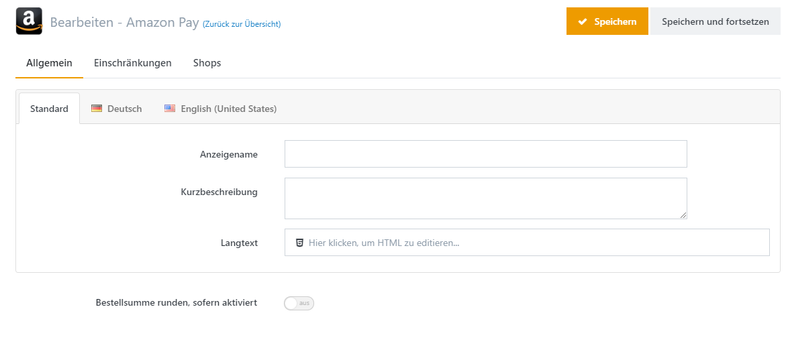
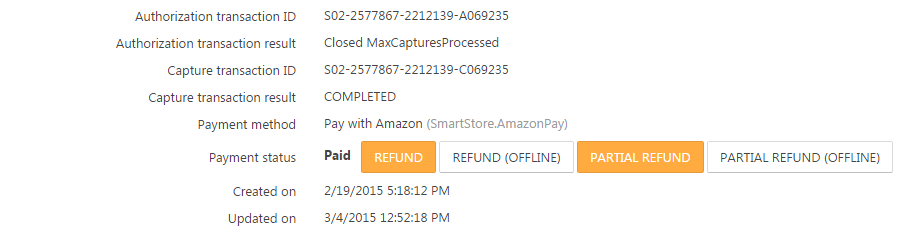

# Zahlungsarten einrichten

Einer wichtigsten Bereiche beim Einrichten eines Onlineshops ist die Konfiguration der Zahlungsarten. Die Auswahl der Zahlungsarten wird auf jeden Fall einen Einfluss auf die Kaufentscheidung in Ihrem Shop haben. Zahlungsvorgänge werden in Smartstore von so genannten Zahlart-Plugins abgewickelt. Abhängig von der Anzahl der installierten Zahlart-Plugins werden Ihren Kunden unterschiedliche Optionen für die Bezahlung zur Auswahl angeboten.

## Wie Sie die Zahlungsarten konfigurieren

Sie können Ihre Zahlungsarten einrichten indem Sie im Administrationsbereich zu **Konfiguration > Zahlungsarten** navigieren. In diesem Bereich können Sie die Zahlungsarten Ihrer aktivierten Zahlart-Plugins **aktivieren** oder **deaktivieren**, indem Sie die den zugehörigen Button drücken. Sie können direkt in die Konfigurationsansicht eines jeden Zahlart-Plugins wechseln, indem Sie den Button **Konfigurieren** auswählen.  
In der Konfigurationsansicht werden Ihnen weitere hilfreiche Tipps zur Einrichtung der Zahlarten angezeigt. Hier werden auch die erforderlichen Zugangsdaten für die entsprechenden Konten der Zahlungsanbieter eingetragen.

In der Zahlartenübersicht können Sie auch die Anzeigenreihenfolge durch *Drag & Drop* auf der Zahlartauswahlseite, die Ihren Kunden beim Checkout angezeigt wird, auswählen. Um die Anzeigenreihenfolge zu verändern, fahren Sie über die Zahlungsart, und klicken Sie auf das Grip-Element. Nun können Sie die Zahlungsart auf die gewünschte Position ziehen und dort ablegen. 

Wenn Sie innerhalb eines Zahlart-Plugins auf **Bearbeiten** klicken, erscheint ein Dialogfeld, in dem Sie Namen und Beschreibung der Zahlungsart, die Ihrem Kunden auf der Auswahlseite für die Zahlungsarten beim Checkout angezeigt werden, eingeben können. Sie können hier auch unterschiedliche Beschreibungen für die in Ihren Shop konfigurierten Sprachen eingeben.

## Funktionen von Zahlart-Plugins

In der Übersicht der Zahlungsarten finden Sie die unterschiedlichen Funktionen der Plugins. Weitere Informationen zu diesen Funktionen entnehmen Sie bitte der nachfolgenden Liste.

|     |     |
| --- | --- |
| Wiederkehrende Zahlungen | Wenn ein Zahlart-Plugin wiederkehrende Zahlungen unterstützt, kann es Zahlungsvorgänge für wiederkehrende Zahlungen automatisch abwickeln. Für weitere Informationen zu wiederkehrenden Zahlungen lesen Sie bitte [Mit Abonnements umgehen](../../benutzer-handbuch/katalog/produkte-verwalten/mit-abonnements-umgehen.md). |
| Buchung | Wenn ein Zahlart-Plugin die manuelle Buchung von Beträgen unterstützt, wird ein zusätzlicher Button in der Bestellübersicht (Administrationsbereich) angezeigt, mit dem die Bestellsumme manuell gebucht werden kann. |
| Erstattung | Wenn ein Zahlart-Plugin eine vollständige Rückerstattung unterstützt, wird ein zusätzlicher Button in der Bestellübersicht (Administrationsbereich) angezeigt, mit dem die Bestellsumme rückerstattet werden kann. |
| Teilerstattung | Wenn ein Zahlart-Plugin eine Teilerstattung unterstützt, wird ein zusätzlicher Button in der Bestellübersicht (Administrationsbereich) angezeigt, mit dem ein Teil der Bestellsumme rückerstattet werden kann. |
| Stornierung | Wenn ein Zahlart-Plugin die Stornierung einer Zahlung unterstützt, wird ein zusätzlicher Button in der Bestellübersicht (Administrationsbereich) angezeigt, mit dem die Zahlung für die Bestellung storniert werden kann. |
|     |     |

> [!INFO]
> Auch wenn eine Zahlungsart Buchungen, Erstattungen oder Stornierungen nicht unterstützt, sehen Sie nicht-hervorgehobene Buttons für diese Vorgänge in der Bestellübersicht im Administrationsbereich, um den Statuswechsel der Zahlung "offline" zu ermöglichen, d.h.: ohne das Gateway der Zahlungsart zu kontaktieren.

## Zahlart Widgets

Die meisten Plugins werden auf der Auswahlseite für Zahlarten angezeigt, allerdings integrieren einige ihren eigenen Checkoutprozess. Das Amazon Zahlart-Plugin beispielsweise zeigt einen Checkout-Button direkt im Warenkorb an und stellt auf den nachfolgenden Checkout-Seiten eigene Elemente zur Auswahl der bei Amazon hinterlegten Adressen und Zahlungsarten an, weshalb dadurch die normalen Checkoutschritte, bei denen die Kunden ihre Daten angeben (Adresse und Zahlartauswahl), übersprungen werden. Die Widgets für diese Zahlart-Plugins müssen im Konfigurationsbereich für Widgets aktiviert werden. Für weitere Informationen über die Konfiguration von Widgets lesen Sie bitte [Widgets anordnen](../../benutzer-handbuch/content-management/widgets-anordnen.md).

## Einschränken der Zahlungsarten

Zahlungsarten können auf mehrere Arten eingeschränkt werden, so dass sie nicht beim Checkout angeboten werden. Gehen Sie zu **Konfiguration > Zahlungsarten** und klicken Sie für die gewünschte Zahlungsart **Bearbeiten.** In der Registerkarte **Einschränkungen** wählen Sie die Kriterien, bei denen die Zahlungsart beim Checkout *nicht* auftauchen soll (Ausschlussverfahren). Sie können Zahlungsarten nach folgenden Kriterien einschränken:

- Kundengruppen
- Versandarten
- Länder (unterschieden zwischen Rechnungs- und Lieferadresse des Kunden)
- Mindest- und Maximalmenge der Bestellung (unterschieden zwischen Gesamt- und Zwischenbestellwert)
- Weitere Kriterien durch die Installation von Zahlungsfilter-Plugins

## Wie Sie weitere Zahlungsarten-Plugins bekommen

Weitere Zahlart-Plugins können Sie im [Smartstore Community Marketplace](http://community.smartstore.com/index.php?/files/) herunterladen. Der **Smartstore Community Marketplace** ist der Ort, wo alle Ressourcen, die für Smartstore geschaffen wurden, angeboten werden. Diese können entweder kostenlos heruntergeladen oder gekauft werden. Für weitere Informationen, wie Sie Plugins kaufen und installieren können, lesen Sie bitte [Wie kaufe ich eine Erweiterung?](../../../smartstore-6-dokumentation-startseite/loslegen/community-marketplace/wie-kaufe-ich-eine-erweiterung.md) und [Wie installiere ich eine Erweiterung?](../../../smartstore-6-dokumentation-startseite/loslegen/community-marketplace/wie-installiere-ich-eine-erweiterung.md).