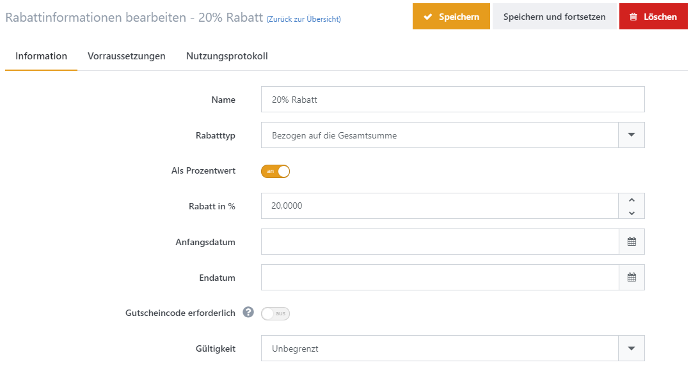
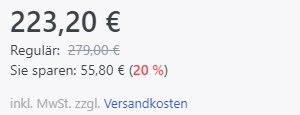
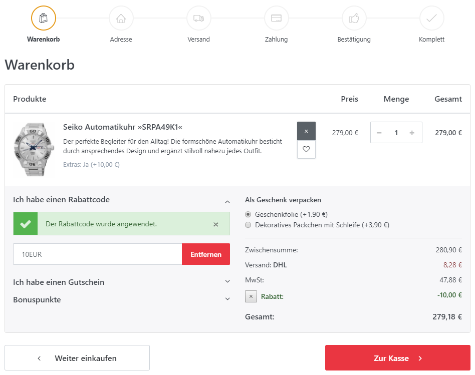
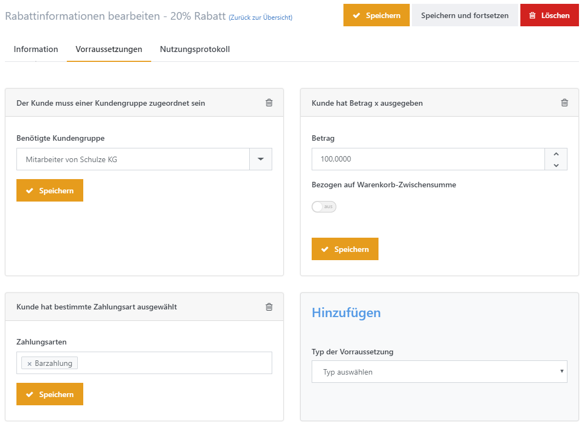

# Rabatte verwalten

Rabatte sind ein wirksames Marketingwerkzeug, das Sie zu unterschiedlichen Zwecken einsetzen können. Mit Rabatten können Sie Kaufanreize für Ihre Shopbesucher schaffen und somit Ihren Umsatz steigern. Sie können beispielsweise jahreszeitabhängige Schlussverkäufe anbieten oder schlecht verkäufliche Produkte besonders hervorheben. Für weitere Ideen, wie man Rabatte einsetzen kann, lesen Sie bitte die **Beispielszenarien** weiter unten. 

  

Sie können Rabatte über **Admin > Marketing > Rabatte** verwalten. Klicken Sie auf **Neu**, um einen neuen Rabatt anzulegen. 

## Registerkarte Information 

250px|FeldBeschreibung**Name**Legt den internen Namen des Rabatts fest.**Rabatttyp**

Legt den Rabatttyp fest.

**Options**:

| 150px\|Rabatttyp | Beschreibung |
| --- | --- |
| *Produkten zugewiesen* | Der Rabatt wird auf den Preis jedes Produkts angewendet, welchem dieser der Rabatt zugeordnet ist. Wenn dieser Rabatttyp ausgewählt ist, zeigt sich eine neue Registerkarte im Produkt-Konfigurationsbereich, auf der Sie aus allen Rabatten dieses Typs auswählen und sie dem Produkt zuweisen können. Ein Link zu den zugewiesenen Produkten wird unterhalb des Rabatttyp-Felds angezeigt. In der Produktdetailansicht im Frontend erscheint der normale Preis nun durchgestrichen, und ein neuer, rabattierter Preis wird daneben hervorgehoben dargestellt.   |
| *Bezogen auf die Kategorien* | Der Rabatt wird auf den Preis jedes Produkts der Warengruppe angewendet, zu welcher dieser Rabatt zugeordnet ist. Wenn dieser Rabatttyp ausgewählt ist, zeigt sich eine neue Registerkarte im Konfigurationsbereich von Warengruppen, in der Sie aus allen Rabatten dieses Typs auswählen können und diese einer Warengruppe zuweisen können. Ein Link zu den zugewiesenen Warengruppen wird unterhalb des Rabatttyp-Felds angezeigt. In der Produktdetailansicht Ihres Shops erscheint der normale Preis nun durchgestrichen, und der neue, rabattierte Preis wird darüber in Fettschrift angezeigt.   |
| *Bezogen auf die Zwischensumme* | Der Rabatt wird auf die Zwischensumme (exklusive Versandkosten und Bezahlgebühren) angewendet und wird in der Warenkorbzusammenfassung angezeigt.   |
| *Bezogen auf die Versandkosten* | Der Rabatt wird auf alle Versandkosten angewendet welche dem Kunden angezeigt werden. |
| *Bezogen auf die Gesamtsumme* | Der Rabatt wird auf die Gesamtsumme des Auftrags angewendet und auf der Auftragsbestätigung-Seite (letzte Seite des Checkout-Prozesses) dargestellt, nachdem der Kunde die Zahlungsart und die Versandmethode ausgewählt hat (die Gesamtsumme enthält Versandkosten und Zahlartgebühren).     |

**Als Prozentwert**

Legt fest, ob der Wert prozentual oder als fester Wert angewendet wird.**Rabatt in % / Rabattbetrag**Der Prozentsatz bzw. der Rabattbetrag, welcher als Rabatt angewendet werden soll.**Anfangsdatum**Das Anfangsdatum für die Gültigkeit des Rabatts.**Enddatum**Das Enddatum für die Gültigkeit des Rabatts.**Gutscheincode erforderlich**Macht die Angabe eines Gutscheincodes durch den Kunden erforderlich, damit der Rabatt angewendet wird.**Gutscheincode**Die Gutscheinnummer. Für weitere Informationen zu Gutscheincodes lesen Sie bitte die Beschreibung unterhalb dieser Tabelle.**Gültigkeit**

Die Gültigkeit eines Rabatts ermöglicht Ihnen, eine Grenze für die Anwendung des Rabatts festzulegen. Sie können angeben, wie oft ein Gutscheincode durch Ihre Kunden benutzt werden kann, entweder global oder spezifisch (z.B. pro Kunde). Sie können auch eine unbegrenzte Nutzung der Gutscheine erlauben.

- **Unbegrenzt**: Unbegrenzte Nutzung eines Gutscheincodes
- **Nur N mal**: Der Gutscheincode darf nur **N** mal angewendet werden.
- **N mal pro Benutzer:** Der Gutscheincode darf nur **N mal** pro Kunde angewendet werden.

**N mal**Die Anzahl der erlaubten Anwendungen eines Rabatt durch Ihre Kunden.

## Gutscheincodes einsetzen

Gutscheincodes ermöglichen es Ihnen, Ihren Kunden Codes zukommen zu lassen, die diese beim Checkout-Vorgang angeben können um somit bei ihren Einkäufen sparen zu können. So können Sie attraktive Kaufanreize schaffen. Gutscheincodes können für jeden angelegten Rabatt frei eingestellt werden.

  

       

## Voraussetzungen

Sie können eine unbegrenzte Anzahl an Voraussetzungen definieren, die erfüllt sein müssen, bevor der Rabatt angewendet werden kann. 

| 250px\|Rabatt Voraussetzung | Beschreibung |
| --- | --- |
| **Der Kunde muss einer Kundengruppe zugeordnet sein** | Dieser Rabatt wird nur angewendet, wenn der Kunde der definierten Kundengruppe zugeordnet ist. Wenn diese *Voraussetzung* aktiviert wurde, erscheint eine Dropdown-Liste unterhalb der *Voraussetzung*, aus der Sie die zugehörige Kundengruppe auswählen können. Um mehrere Kundengruppen hinzuzufügen, muss man für jede Kundengruppe, für die man eine Voraussetzung für den Rabatt definieren möchte, eine *Voraussetzung* hinzufügen. |
| **Land der Rechnungsadresse ist** | Der Rabatt wird nur angewendet, wenn der Kunde das definierte Land in der Rechnungsadresse angegeben hat. Wenn diese *Voraussetzung* aktiviert wurde, erscheint eine Dropdown-Liste unterhalb der *Voraussetzung*, aus der Sie das Land der Rechnungsadresse auswählen können. Um mehrere Länder hinzuzufügen, müssen Sie für jedes der Länder eine *Voraussetzung* für den Rabatt hinzufügen. |
| **Land der Lieferadresse ist** | Der Rabatt wird nur angewendet, wenn der Kunde das definierte Land in der Lieferadresse angegeben hat. Wenn diese *Voraussetzung* aktiviert wurde, erscheint eine Dropdown-Liste unterhalb der *Voraussetzung*, aus der Sie das Land der Lieferadresse auswählen können. Um mehrere Länder hinzuzufügen, müssen Sie für jedes Land eine *Voraussetzung* für den Rabatt hinzufügen. |
| **Kunde hat eines der folgenden Produkte in seinem Warenkorb** | Der Rabatt wird nur angewendet, wenn sich eines der angegebenen Produkte im Warenkorb des Kunden befindet. Wenn diese *Voraussetzung* aktiviert wurde, spezifizieren Sie die Produkte, die zu der *Voraussetzung* gehören, indem Sie eine Liste mit Produkt-Ids, die durch Kommata getrennt sind (z. B. 77, 123, 156), in das unten auftauchende Feld eingeben . Sie können die Produktnummer auf der jeweiligen Seite zur Bearbeitung des Produkts finden. Sie können die durch Kommata getrennte Liste von Produktnummern mit Mengen versehen ({Produktnummer}:{Menge}, z.B. 77:1, 123:2, 156:3). Außerdem ist es möglich, eine Spanne anzugeben ({Produktnummer}:{Mindestmenge}-{Maximalmenge}, z. B. 77:1-3, 123:2-5, 156:3-8). |
| **Kunde hat folgende Produkte in seinem Warenkorb** | Der Rabatt wird nur angewendet, wenn der Kunde alle der angegebenen Produkte im Warenkorb hat. Wenn diese *Voraussetzung* aktiviert wurde, spezifizieren Sie die Produkte, die zu der *Voraussetzung* gehören, indem Sie eine Liste mit Produktnummern, die durch Kommata getrennt sind (z. B. 77, 123, 156), in das unten auftauchende Feld eingeben . Sie können die Produktnummer auf der jeweiligen Seite zur Bearbeitung des Produkts finden. Sie können die durch Kommata getrennte Liste von Produktnummern mit Mengen versehen ({Produktnummer}:{Menge}, z.B. 77:1, 123:2, 156:3). Außerdem ist es möglich, eine Spanne anzugeben ({Produktnummer}:{Mindestmenge}-{Maximalmenge}, z. B. 77:1-3, 123:2-5, 156:3-8). |
| **Kunde hat Betrag x ausgegeben** | Der Rabatt wird angewendet, wenn der Kunde den angegebenen Betrag ausgegeben hat. |
| **Auf bestimmten Shop begrenzt** | Der Rabatt wird nur angewendet, wenn der Kunde Produkte aus dem angegebenen Shop erwirbt. Wenn diese *Voraussetzung* ausgewählt wurde, erscheint eine Dropdown-Liste unterhalb der *Voraussetzung*, aus der Sie den jeweiligen Shop auswählen können. Wenn Sie mehrere Shops hinzufügen möchten, müssen Sie eine *Voraussetzung* für jeden der Shops anlegen, für den der Rabatt gelten soll. |
| **Kunde hat bestimmte Zahlungsart ausgewählt** | Der Rabatt wird nur angewendet, wenn der Kunde die angegebene Zahlungsart wählt. Wenn diese *Voraussetzung* ausgewählt wurde, erscheint eine Dropdown-Liste unterhalb der *Voraussetzung*, aus der Sie die jeweilige Zahlungsart auswählen können. |
| **Kunde hat bestimmte Versandart ausgewählt** | Der Rabatt wird nur angewendet, wenn der Kunde die angegebene Versandart wählt. Wenn diese *Voraussetzung* ausgewählt wurde, erscheint eine Dropdown-Liste unterhalb der *Voraussetzung*, aus der Sie die jeweilige Versandart auswählen können. |
| **Der Kunde hat bereits eines der folgenden Produkte gekauft** | Der Rabatt wird nur angewendet, wenn der Kunde zuvor bereits eines der angegebenen Produkte gekauft hat. Wenn diese *Voraussetzung* ausgewählt wurde, geben Sie unterhalb der *Voraussetzung* eine durch Kommata getrennte Liste der Produktnummern ein (z. B. 77, 123, 156). Sie finden die Produktnummern auf der Bearbeitungsseite für das jeweilige Produkt. |
| **Kunde hat bereits folgende Produkte gekauft** | Der Rabatt wird nur angewendet, wenn der Kunde zuvor bereits alle der folgenden Produkte gekauft hat. Wenn diese *Voraussetzung* ausgewählt wurde, geben Sie unterhalb der *Voraussetzung* eine durch Kommata getrennte Liste der Produktnummern ein (z. B. 77, 123, 15). Sie finden die Produktnummern auf der Bearbeitungsseite für das jeweilige Produkt. |

## Nutzungsprotokoll

In der Registerkarte Nutzungsprotokoll können Sie eine Liste der Aufträge sehen, bei welchen der Rabatt angewendet wurde.

## Beispielszenarien

### Allgemeine Rabatte für Produkte & Warengruppen für unterschiedliche Kundengruppen

Möglicherweise haben Sie Kundengruppen wie Reseller und möchten diesen einen Sonderrabatt auf bestimmte Produkte oder ganze Produktkategorien einräumen. In einem solchen Fall legen Sie den **Rabatttyp** *Produkten zugewiesen* oder  **Bezogen auf die Kategorien**  an, spezifizieren Sie die Produkte und Warengruppen, für die der Rabatt gilt, und fügen Sie die  **Voraussetzung**  *Der Kunde muss einer Kundengruppe zugeordnet sein* hinzu.

### Spezielle Rabatte für Kunden, die eine bestimmte Auftragssumme erreicht haben

Sie können Ihre Kunden dazu motivieren, so viel wie möglich zu kaufen, wenn Sie einen Rabatt ab einer bestimmten Bestellsumme anbieten. Der **Rabatttyp**, den Sie dafür anlegen, heißt *Bezogen auf die Gesamtsumme* oder *Bezogen auf die Zwischensumme*, und die entsprechende **Voraussetzung** wäre *Kunde hat Betrag X ausgegeben* (Euro? Währung sollte hier angegeben werden). 

### Zeitlich befristete Rabatte für spezielle Werbeaktionen (z. B. Schlussverkäufe oder Lagerräumungen)

Nehmen wir an, dass Sie einen Sommerschlussverkauf oder eine Weihnachtsaktion planen, bei der Sie Ihren Kunden einen zeitlich befristeten Rabatt einräumen möchten. Dazu stellen Sie den  **Rabatttyp**  *Bezogen auf die Gesamtsumme* oder *Bezogen auf die Zwischensumme ein* und spezifizieren ein **Anfangsdatum** und ein **Enddatum**. 

### 100% Rabatt für spezielle Werbeaktionen: "Kaufe eins, erhalte ein zweites umsonst"

Stellen Sie sich vor, Sie wollen Ihre Kunden davon überzeugen, ein bestimmtes Produkt zu kaufen, indem Sie ein anderes kostenlos dazugeben. Für diesen Zweck legen Sie den **Rabatttyp** *Produkten zugewiesen* an. Nun wählen Sie die Option **Als Prozentwert** und setzen Sie **Rabatt in Prozent** auf 100%. Setzen Sie als nächstes **Typ der Voraussetzung** unter **Voraussetzungen** auf  *Kunde hat eines der folgenden Produkte in seinem Warenkorb,* und geben Sie die Produktnummer des Produkts ein, das gekauft werden muss. Schließlich weisen Sie den Rabatt dem Produkt zu, das der Bestellung kostenlos zugefügt wird, indem Sie zu dem Produkt navigieren und den Rabatt in der Registerkarte Rabatte der Produktdetailansicht [Produktdetailansicht](../../benutzer-handbuch/katalog/produkte-verwalten/produkte-erstellen-und-bearbeiten.md) im Administrationsbereich aktivieren. 

### Einmaliger Rabatt, wenn ein Produkt, das vergriffen war, wieder erhältlich ist  

Stellen Sie sich vor, dass ein Kunde informiert werden möchte, falls ein vergriffenes Produkt wieder lieferbar wird. Um ihn davon zu überzeugen, das Produkt sofort zu kaufen wenn es wieder vorrätig ist, können Sie Ihrem Kunden einen Anreiz bieten, indem Sie ihm einen Gutscheincode per E-Mail zusenden, der über die erneute Lieferbarkeit des Produkts informiert ( *Customer.BackInStock*\-Nachrichtenvorlage). 

### Direktrabatt für bestimmte Zahlungsarten

Möglicherweise bevorzugen Sie bestimmte Zahlungsart (z. B. Vorkasse). Dann können Sie Ihre Kunden dazu ermuntern, diese Zahlungsart zu wählen, indem Sie einen Rabatt des **Rabatttyps** *Bezogen auf die Gesamtsumme* oder *Bezogen auf die Zwischensumme* und als **Voraussetzung** *Kunde hat bestimmte Zahlungsart ausgewählt* einrichten*,* für welchen Sie dann die bevorzugte Zahlungsart angeben.

### Einmaliger Rabatt für die Eintragung in die Newsletterliste

Newsletter-Kampagnen sind ein guter Weg, um Ihren Kundenstamm regelmäßig zu erreichen. Sie wollen daher so viele Abonnenten wie möglich gewinnen.  Um so viele Kunden wie möglich davon zu überzeugen, Ihren Newsletter zu abonnieren, könnten Sie ihnen einen bestimmten Rabatttyp auf eine der nächsten Bestellungen anbieten. Der Rabatt, der für diesen Zweck erstellt werden muss, ist **Rabatttyp** *Bezogen auf die Gesamtsumme* oder *Bezogen auf die Zwischensumme.* Darüber hinaus sollten Sie die Option **Gutscheincode erforderlich** aktivieren und den Gutscheincode angeben, den Sie in das [Message Template](../../benutzer-handbuch/content-management/nachrichtenvorlagen-anpassen.md) *NewsLetterSubscription.ActivationMessage* übertragen.