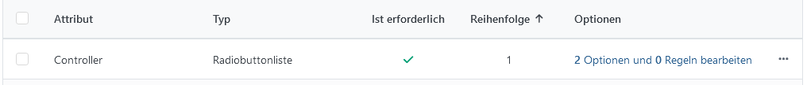
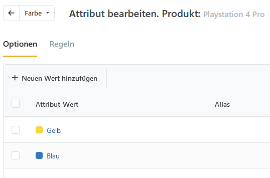
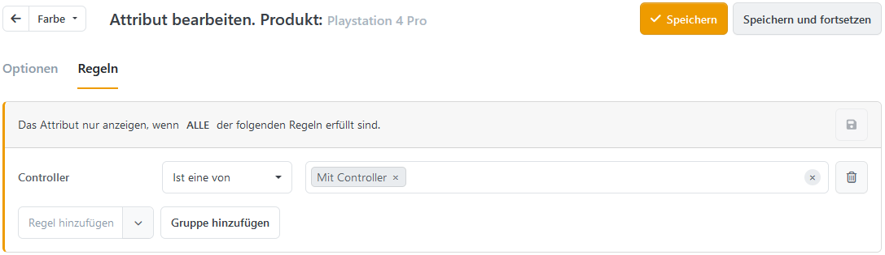

# AttributeRules (Regeln für Produktattribute)

# Regeln

Attribute können in Abhängigkeit von anderen Attributen dynamisch ein- oder ausgeblendet werden. Dies erhöht die Übersichtlichkeit und Flexibilität bei der Konfiguration von Produkten erheblich.

## Alt gegen Neu

Früher war der Prozess wesentlich aufwändiger. Ein Beispiel ist [das Josef-Hoffmann-Sofa (3-Sitzer, Cubus 1910)](https://core.smartstore.com/backend/josef-hoffmann-sofa-3-sitzer-cubus-1910/):

- Der alte Ansatz erforderte die Erstellung zahlreicher Varianten, was zu einer unüberschaubaren Anzahl von Konfigurationsmöglichkeiten führte.

- Die Preise mussten für jede Variante manuell eingegeben werden, was zeitaufwändig und fehleranfällig war.

Der neue Ansatz vereinfacht diesen Prozess erheblich. Am Beispiel des [gleichen Produkts](https://52a.smartstore.com/-josef-hoffmann-sofa-3-sitzer-cubus-1910-/) werden jetzt nur noch drei Qualitäten und zehn Farben definiert. Die Preise werden auf der Ebene der Qualitäten eingegeben, was den Verwaltungsaufwand reduziert und die Variantenlogik übersichtlicher macht.

Diese Verbesserung ermöglicht eine effizientere und benutzerfreundlichere Handhabung von Attributen und Preisen.

## Beispiel

Nehmen wir als Beispiel die [Playstation 4 Pro](https://52a.smartstore.com/playstation-4-pro/) und den Wunsch *"Farbwahl nur bei Kauf mit Controller"*:

Dieses Produkt hat das Attribut Controller mit zwei Optionen: mit Controller und ohne Controller.

Mit den neuen Regeln ist es möglich, das Produkt so zu konfigurieren, dass eine Farbe angeboten wird, wenn ein Controller ausgewählt wird. Dazu wird ein neues Attribut **Farbe** mit zwei Optionen (**Gelb** und **Blau**) angelegt.

In der Editieransicht des Farbattributs wechselt man auf die Registerkarte **Regeln** und fügt die Gruppe **Controller** hinzu. Damit wird die Abhängigkeit des Attributs definiert. Nun wählt man die Bedingung **ist eine von** und die Option **mit Controller**.

Nach dem Speichern wird nun auf der Produktdetailseite bei Auswahl der Option **mit Controller** auch das Farbattribut angeboten.

## Weitere Anwendungsmöglichkeiten

### Gravur

Ein Beispiel ist die optionale Gravur für eine Uhr. Der Benutzer wird zunächst gefragt, ob er eine Gravur wünscht. Lautet die Antwort "Nein", sind keine weiteren Eingaben erforderlich. Entscheidet sich der Benutzer jedoch für "Ja", wird ein Aufpreis von 10 EUR berechnet und weitere Eingabemöglichkeiten werden freigeschaltet. Der Benutzer kann dann Text für die Gravur auf der Vorder- und Rückseite der Uhr in entsprechende Textfelder eingeben. Zusätzlich kann über eine Auswahlbox die Schriftart ausgewählt werden.

1. Attribut Gravur gewünscht
  1. Nein
  2. Ja (+10 EUR)
    1. Textfeld Gravur vorne
    2. Textfeld Gravur hinten
    3. Schriftart (Combobox)

### Aufdruck

Ein weiteres Beispiel ist ein T-Shirt mit der Möglichkeit eines Aufdrucks. Der Benutzer wird gefragt, ob er einen Aufdruck wünscht. Wenn die Antwort "Nein" lautet, sind keine weiteren Eingaben erforderlich. Wählt der Benutzer jedoch "Ja", wird ein Aufpreis von 20 EUR berechnet und ein zusätzliches Attribut wird sichtbar. In diesem Fall muss der Benutzer eine Datei für den Aufdruck hochladen. Das Hochladen der Datei ist zwingend erforderlich, um den Bestellvorgang abzuschließen.

1. Attribut Mit Aufdruck
  1. Nein
  2. Ja (+20 EUR)
    1. Dateiupload (erforderlich)

### Betriebssystem

Ein anderes Beispiel ist die Auswahl eines Betriebssystems. Der Benutzer wählt zunächst das Attribut "OS" aus. Bei der Auswahl von "Linux" sind keine weiteren Eingaben erforderlich. Bei der Auswahl von "Windows" werden weitere Optionen angezeigt. Der Benutzer kann nun zwischen verschiedenen Windows-Versionen wählen, die jeweils mit unterschiedlichen Aufpreisen verbunden sind. Zur Auswahl stehen Windows Home (+50 EUR), Windows Server (+200 EUR) und Windows Pro (+100 EUR).

1. Attribut OS
  1. Linux
  2. Windows
    1. Windows Betriebssysteme
      1. Windows Home (+50 EUR)
      2. Windows Server (+200 EUR)
      3. Windows Pro (+100 EUR)

### Bundle

Ein komplexes Beispiel ist ein Bundle-Angebot, beispielsweise das Samsung Galaxy S23 mit einer Galaxy Watch. Der Nutzer wird zunächst gefragt, ob er das Smartphone im Bundle mit einer Galaxy Watch kaufen möchte. Lautet die Antwort "Nein", sind keine weiteren Eingaben erforderlich. Bei "Ja" wird ein Aufpreis von 200 EUR berechnet und es werden zusätzliche Attribute zur Konfiguration der Galaxy Watch angezeigt.

Der Benutzer kann zunächst die Größe der Galaxy Watch wählen: entweder 40 mm oder 44 mm. Bei Auswahl der 44 mm Variante wird ein Aufpreis von 100 EUR berechnet und ein weiteres Attribut angezeigt, mit dem der Nutzer entscheiden kann, ob die Galaxy Watch mit einer Displayschutzfolie geliefert werden soll. Bei Auswahl von "Ja" wird ein Aufpreis von 5 EUR für die Displayschutzfolie berechnet.

Zusätzlich kann der Nutzer die Art der Konnektivität für die Galaxy Watch auswählen, wobei zwischen Bluetooth und LTE gewählt werden kann. Für LTE wird ein Aufpreis von 100 EUR berechnet. Schließlich kann die Farbe der Galaxy Watch zwischen rot, schwarz und grün gewählt werden.

1. Attribut Im Bundle mit Galaxy Watch
  1. Nein
  2. Ja (+ 200 EUR)
    1. Galaxy Watch Größe
      1. 40mm
      2. 44mm (+100 EUR)
        1. Mit Displayschutzfolie
          1. Nein
          2. Ja (+5 EUR)
    2. Galaxy Watch Connectivity
      1. Bluetooth
      2. LTE (+100 EUR)
    3. Galaxy Watch Farben
      1. Rot
      2. Black
      3. Grün

# Elemente übernehmen

Attribute, Regeln und Optionen können effizient von einem anderen Produkt übernommen werden, was eine erhebliche Zeitersparnis bedeutet.

Der Prozess läuft wie folgt ab: Der Benutzer wählt im Admin-Bereich das zu bearbeitende Produkt aus und navigiert zum Reiter **Attribute**.

Ein Klick auf den Button **Attribute übernehmen...** öffnet ein Popup, in dem das Produkt ausgewählt werden kann, dessen Attribute, Optionen und Regeln übernommen werden sollen.

Nach der Auswahl werden die entsprechenden Werte des Produkts im Popup angezeigt. Mit einem Klick auf **Übernehmen** werden die Werte endgültig in das aktuelle Produkt eingetragen.

Diese Vorgehensweise erleichtert die Administration und spart Zeit bei der Produktkonfiguration.