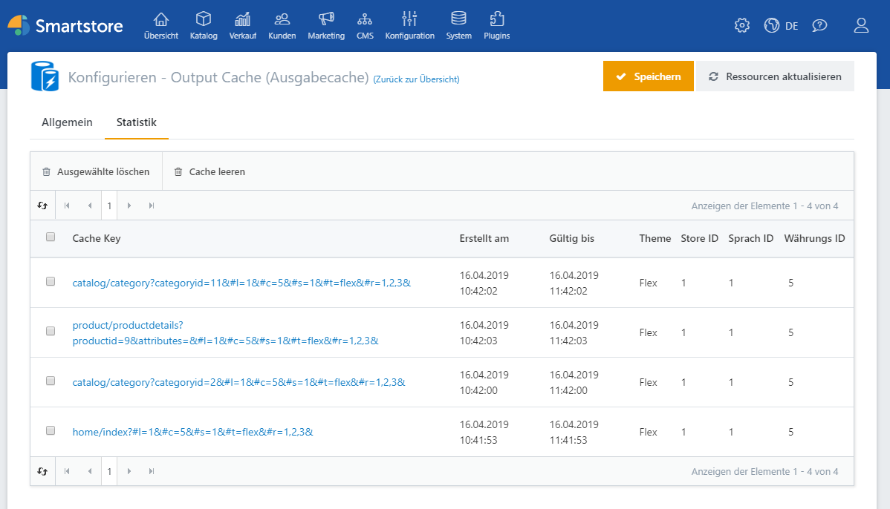

# Output Cache (Ausgabecache)

Der Output Cache erlaubt die Zwischenspeicherung ganzer Shop-Seiten und trägt so zu einer erheblichen Performance-Steigerung bei.  

## Allgemein

| **Eingabefeld / Option** | **Beschreibung** |
| --- | --- |
| Ist aktiv | Legt fest, ob Ausgabespeicherung aktiv ist. |
| Aktiver Speicheranbieter    | Bestimmt den aktiven Speicheranbieter. 'Lokaler Speicher' ist am schnellsten, aber nicht geeignet für Webfarmen. Wählen Sie 'Datenbank' oder einen anderen verteilten Speichermechanismus - z.B. 'Redis' -, wenn Sie eine Webfarm betreiben. |
| Standarddauer der Zwischenspeicherung    | Legt die Dauer in Sekunden fest, die Seiten standardmäßig auf dem Server zwischengespeichert werden sollen. |
| Seiten automatisch aktualisieren | Legt fest, ob zwischengespeicherte Seiten automatisch aktualisiert werden sollen, wenn mind. eine Abhängigkeit geändert wurde (Abhängigkeiten sind Entitäten wie Produkt, Warengruppe, Blog-Eintrag etc.). |
| Authentifizierte Requests ebenfalls verarbeiten | Legt fest, ob das Caching auch dann aktiv ist, wenn der Kunde eingeloggt ist. Beachten Sie jedoch, dass lediglich nach Kundengruppen variiert wird, nicht nach einzelnen Kunden. Deaktivieren Sie diese Option, wenn ihr Shop kundenspezifischen Content generiert. |
| 'no-cache' Header ignorieren | Legt fest, ob Seiten trotz 'Content-cache: no-cache' Header aus dem Zwischenspeicher geladen werden sollen. Empfohlen zum Testen. |
| Debug-Modus | Gibt allgemeine Informationen im Response Header aus ((X-SmartStore-Cached-On, X-SmartStore-Cached-Until)) |

> [!INFO]
> ### Achtung
> Die Optionen Routen und Invalidierung sollten nur von erfahrenen Anwendern genutzt / geändert werden.

## Statistik

Unter dem Reiter Statistik werden die im Cache gespeicherten Seiten angezeigt und können dort auch aus dem Cache gelöscht werden. 

