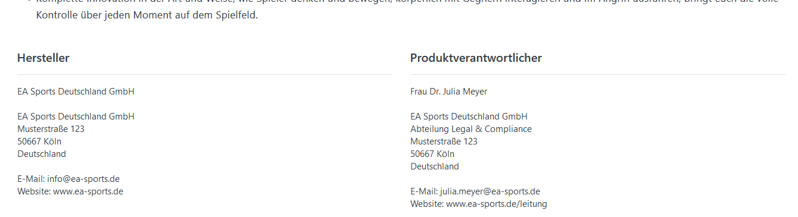
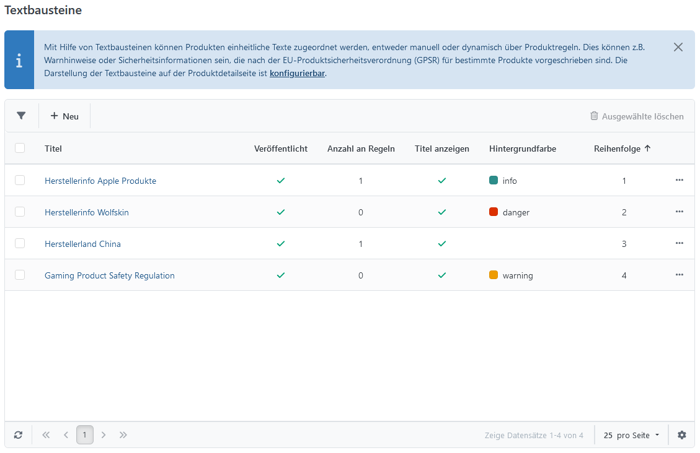
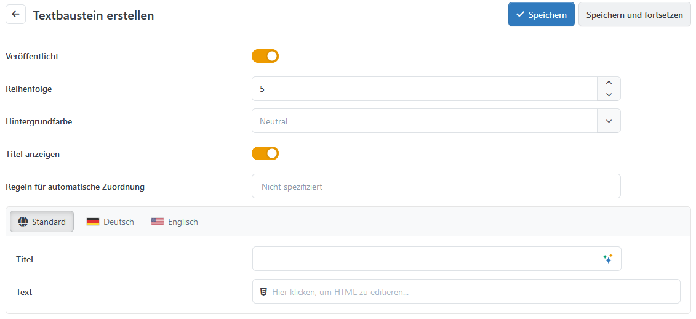
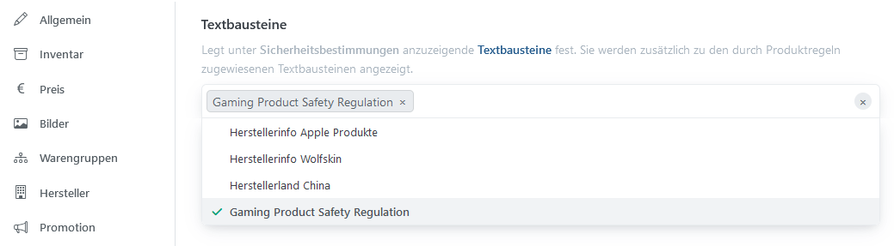
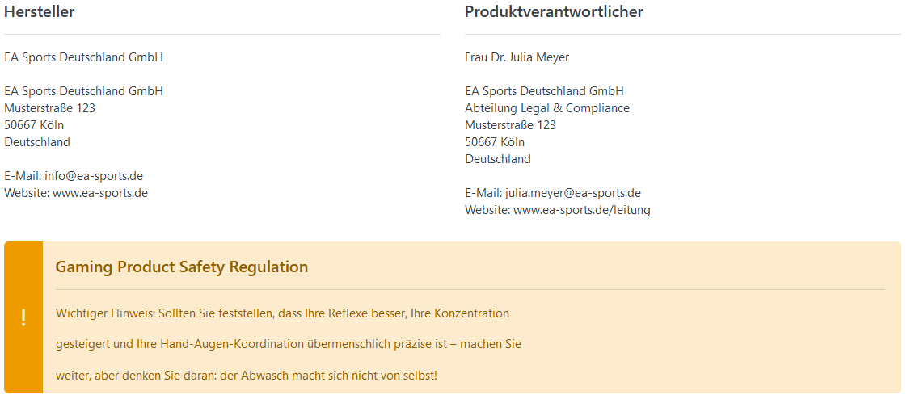

# Produktsicherheitsverordnung (GPSR)

Seit der Smartstore Version 6 erfüllt Smartstore die Anforderungen [der GPSR](https://www.bmas.de/DE/Service/Gesetze-und-Gesetzesvorhaben/aenderung-produktsicherheitsgesetz.html).

Mit dem GPSR-Plugin können erweiterte Produktinformationen angegeben werden, die für GPSR-Produkte Pflicht sind:

- Angaben zum Hersteller
- Produkthinweise
- Sicherheitshinweise

## Konfiguration des GPSR Plugins

| Option | Beschreibung |
| --- | --- |
| Aktiv |     |
| Informationen in Tabs anzeigen | Legt fest, ob die GPSR-Informationen auf der Produktdetailseite in Tabs angezeigt werden. Falls deaktiviert, werden sie in Blöcken unter dem Langtext angezeigt. |
| Produkt-Tabs | Legt die Tabs auf der Produktdetailseite fest, in denen die Informationen zur Produktsicherheit angezeigt werden. |
| Vor Tab x einfügen | Legt den Namen des Tabs fest, vor den die GPSR-Tabs eingefügt werden sollen. Leer lassen, um sie anzuhängen. |
| Hersteller vor Textbausteinen anzeigen |     |
| Hintergrundfarbe Herstellerinformationen | Legt die Hintergrundfarbe der Hinweis-Box fest, in der die Herstellerinformationen angezeigt werden. Leer lassen, wenn der Hersteller nicht in einer Hinweis-Box angezeigt werden soll. |
| Nur den ersten Hersteller berücksichtigen | Legt fest, ob nur die Informationen des ersten dem Produkt zugeordneten Herstellers angezeigt werden sollen. Wenn deaktiviert, werden die Informationen aller zugeordneten Hersteller angezeigt. |

> [!INFO]
> Die in diesem Artikel angeführten Beispiele sind weder rechtsverbindlich noch rechtskonform. Sie dienen lediglich der Erläuterung und Anwendung.

## Herstellerdaten anzeigen

Bei dem Hersteller müssen Daten hinterlegt werden, die dann in den Produktdetails angezeigt werden. Dazu navigieren Sie im Backend auf **Katalog** → **Hersteller** und wechseln dann zum Tab **GPSR**.

| **Option** | **Beschreibung** | **Beispiel** |
| --- | --- | --- |
| Angaben zum Hersteller | - Hersteller- bzw. Markenname - Postanschrift - Elektronische Adresse (E-Mail / Website) | EA Sports Deutschland GmbH  EA Sports Deutschland GmbH   Musterstraße 123   50667 Köln   Deutschland  E-Mail: [info@ea-sports.de](mailto:info@ea-sports.de)   Website: [http://www.ea-sports.de](http://www.ea-sports.de) |
| Produktverantwortlicher | - Nur wenn es keine Niederlassung innerhalb der EU gibt - Name - Postanschrift - Elektronische Adresse (E-Mail / Website) | Frau Dr. Julia Meyer  EA Sports Deutschland GmbH   Abteilung Legal & Compliance   Musterstraße 123   50667 Köln   Deutschland  E-Mail: [julia.meyer@ea-sports.de](mailto:julia.meyer@ea-sports.de)   Website: [www.ea-sports.de/leitung](http://www.ea-sports.de/leitung) |

Für alle Produkte, die dem Hersteller zugeordnet sind, werden die hinterlegten Daten automatisch in den Produktdetails angezeigt.

## Textbausteine hinzufügen

Warnungs- und Sicherheitshinweise können als Textbausteine manuell, oder automatisch per Regeln hinzugefügt werden. Navigieren Sie dazu im Backend auf **CMS** → **Textbausteine.**

Über **Neu** können weitere Textbausteine hinzugefügt werden.

| **Option** | **Beschreibung** | **Beispiel** |
| --- | --- | --- |
| Veröffentlicht |     | An  |
| Reihenfolge | Legt die Anzeige-Priorität fest. 1 steht bspw. für das erste Element in der Liste. |     |
| Hintergrundfarbe | Legt die Hintergrundfarbe der Hinweis-Box fest. Leer lassen, wenn der Text nicht in einer Hinweis-Box angezeigt werden soll. | warning |
| Titel anzeigen |     | An  |
| Regeln für automatische Zuordnung | Der Textbaustein wird automatisch Produkten zugeordnet, wenn diese eine der gewählten Regeln erfüllen und die Regel aktiv ist. |     |
| Titel |     | Gaming Product Safety Regulation |
| Text |     | Wichtiger Hinweis: Sollten Sie feststellen, dass Ihre Reflexe besser, Ihre Konzentration gesteigert und Ihre Hand-Augen-Koordination übermenschlich präzise ist – machen Sie weiter, aber denken Sie daran: der Abwasch macht sich nicht von selbst! |

> [!INFO]
> Auch Medien, wie Bilder und PDFs lassen sich problemlos über Textbausteine per Link in HTML einbinden.

## Textbausteine zuweisen

Um einem Produkt ein oder mehrere Textbausteine zuzuweisen, navigieren Sie zum gewünschten Produkt und wählen Sie den GPSR-Tab aus.

Wählen Sie die gewünschten Textbausteine aus der Liste aus, um sie auf der Produktdetailseite anzuzeigen.

Die Darstellung der Herstellerdaten und Textbausteine kann in [der Konfiguration](https://smartstore.atlassian.net/wiki/spaces/SDDE60/pages/2520809488/Produktsicherheitsverordnung+GPSR#Konfiguration-des-GPSR-Plugins) geändert werden.