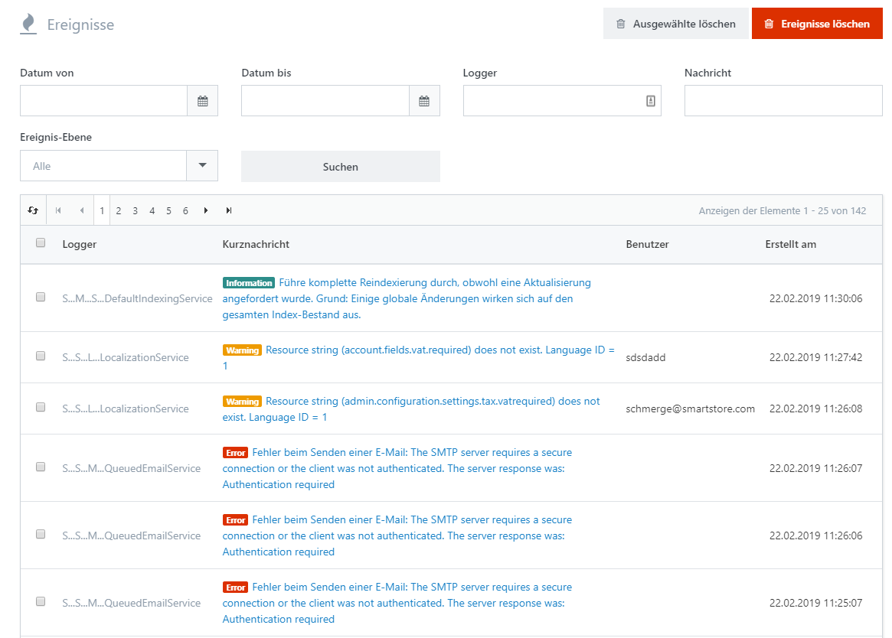

# Den Log der Ereignisse analysieren

Im Log für Ereignisse finden Sie alle Fehler, die beim Betrieb von Smartstore aufgetreten sind. Wenn Ihnen Fehler auffallen oder Ihre Kunden Ihnen eine Fehlfunktion Ihres Shops melden, können Sie das Problem mit Hilfe des Ereignis-Logs analysieren. Suchen Sie einfach nach dem aufgetretenen Fehler, und öffnen Sie die Detailansicht, um sich die Ereigniseinträge anzusehen.

## Detailansicht eines Ereigniseintrags

| **Information** | **Beschreibung** |
| --- | --- |
| Ereignis-Ebene | Eine Klassifikation des Ereignistyps. Es gibt fünf unterschiedliche Typen: **Debuggen, Information, Warnung, Fehler, Schwerwiegend**. |
| Kurznachricht | Kurze Beschreibung des Ereignisses. |
| IP-Adresse | IP-Adresse des Geräts, das das Ereignis verursacht hat. |
| Benutzer | Name des Benutzers, der das Ereignis verursacht hat. |
| Seiten-URL | Die ursprüngliche Seite auf der das Ereignis aufgetreten ist. |
| Bezugs-URL | Bezugs-URL. |
| Erstellt am | Datum/Zeit, wann der Ereigniseintrag erstellt wurde. |
| Komplette Nachricht | Die Details des Ereigniseintrags. In diesem Feld wird die gesamte Beschreibung des Ereignisses gespeichert. |