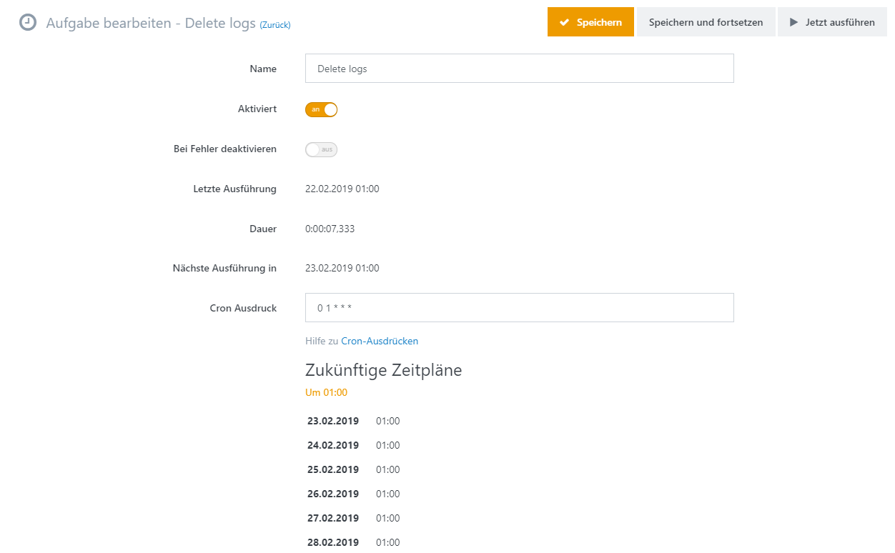

# Geplante Aufgaben verwalten

In Smartstore ist es häufig nötig, Aufgaben regelmäßig zu bestimmten Zeiten auszuführen, um unterschiedliche Aktivitäten zu verwalten. Im Bereich Geplante Aufgaben können Sie Aufgaben festlegen, die automatisch zu festgelegten Zeiten durchgeführt werden. Zu den Aufgaben, die auf diese Weise im Vorfeld geplant werden können, gehören:

- Gespeicherte E-Mails versenden
- Obsolet gewordene oder temporäre Dateien aus der Datenbank entfernen
- Temporäre Dateien aus dem Datenordner entfernen
- Cache verwalten
- Wechselkurse aktualisieren
- Feed- oder Exportdateien erstellen

Neben den Aufgaben, die Teil des Anwendungskerns sind, können Plugins von Drittherstellern ebenfalls eigene Aufgaben installieren, dazu gehört z. B. (externe) Daten regelmäßig abzufragen oder zu synchronisieren.

  

  

> [!NOTE]
> - [Die Liste der geplanten Aufgaben aufrufen](#die-liste-der-geplanten-aufgaben-aufrufen)
> - [Eine Aufgabe manuell ausführen](#eine-aufgabe-manuell-ausführen)
> - [Eine Aufgabe bearbeiten](#eine-aufgabe-bearbeiten)
> - [Aufgabenarten](#aufgabenarten)
> - [Cron Ausdruck](#cron-ausdruck)

  

## Die Liste der geplanten Aufgaben aufrufen

Geplante Aufgaben können eingesehen und verwaltet werden, indem Sie auf **System -> Geplante Aufgaben** gehen. 

Alle Aufgaben werden mit Informationen mit folgenden Überschriften angezeigt: 

- **Aktiviert** \- Zeigt an, ob eine Aufgabe geplant ist oder deaktiviert wurde
- **Cron Ausdruck** \- der Cron Ausdruck legt die Häufigkeit fest, in der eine Aufgabe durchgeführt wird
- **Letzte Ausführung** \- Gibt an, wann die Aufgabe zuletzt durchgeführt wurde (Datum und Zeit, Dauer und mögliche Fehler)
- **Nächste Ausführung in** \- Datum und Zeit, wann die Aufgabe das nächste Mal ausgeführt werden soll. Dieses Feld ist leer, wenn die Aufgabe deaktiviert wurde. Wenn die Aufgabe zur Zeit ausgeführt wird, wird stattdessen eine animierte Fortschrittsanzeige angezeigt. 
- **Aktionen** \- Bietet Optionen, die Aufgabe zu bearbeiten, manuell auszuführen oder abzubrechen (wenn sie bereits läuft)

## Eine Aufgabe manuell ausführen

Um eine Aufgabe manuell auszuführen, gehen Sie zu **Geplante Aufgaben**, und wählen Sie unter **Aktionen** die Option  **Jetzt ausführen**.

## Eine Aufgabe bearbeiten

Um eine geplante Aufgabe zu bearbeiten, wechseln Sie in die Ansicht *Aufgabe bearbeiten*, indem Sie **Bearbeiten** unter Aktionen auswählen.

| 150px\|Feld | Beschreibung |
| --- | --- |
| Aktiviert | Aktiviert die geplante Ausführung gemäß Cron Ausdruck. Haken entfernen, um die geplante Aufgabe zu deaktivieren. Deaktivierte Aufgaben können weiterhin manuell ausgeführt werden. |
| Bei Fehler deaktivieren | Aktivieren Sie das Kästchen, wenn die Aufgabe bei Auftreten eines Fehlers während der Ausführung deaktiviert werden soll. |
| Cron Ausdruck | Ein Ausdruck, der den Zeitplan für die automatische Ausführung der Aufgabe festlegt. Lesen Sie [unten mehr](#GeplanteAufgabenverwalten-2-Cron) über Cron Ausdruck. |

  

## Aufgabenarten

| 150px\|Name der Aufgabe | Beschreibung | Standard Default Schedule |
| --- | --- | --- |
| E-Mail senden | Sendet alle E-Mails in der Warteschlange. Für weitere Informationen über die E-Mail-Warteschlange lesen Sie bitte [Analyzing the Message Queue](http://docs.smartstore.com/display/SMNET/Analyzing+the+Message+Queue).      Wenn Sie diese Aufgabe deaktivieren, werden weder Sie noch Ihre Kunden E-Mails empfangen. | Einmal pro Minute |
| E-Mail Queue bereinigen | Bereinigt die E-Mail-Warteschlange um E-Mail-Einträge, die bereits verarbeitet wurden, um Speicherplatz einzusparen. | Täglich um 02:00 AM |
| Delete Logs | Löscht Log-Einträge, die älter als 7 Tage sind, um Speicherplatz zu sparen. | Täglich um 01:00 AM |
| Suchindex aktualisieren | Die Megasearch-Indexierung manuell durchführen. | Alle 30 Minuten |
| Gastbenutzer löschen | Löscht Gastkonten, die älter als 24 Stunden sind, um Speicherplatz zu sparen. | Täglich um 01:00 AM |
| Cache bereinigen | Bereinigt den Memory Cache, um Speicherplatz freizugeben. | Alle 4 Stunden |
| Temporäre Dateien bereinigen | Löscht temporäre Anwendungsdateien aus dem Ordner  *App\_Data/\_temp*, um Festplattenplatz zu schaffen. Unterordner bleiben davon unberührt. | Täglich um 03:30 AM |
| Wechselkurse aktualisieren | Zieht aktualisierte Umtauschkurse von Web-Services und importiert sie in die Datenbank der Anwendung. | Alle 15 Minuten |
| Temporäre Uploads bereinigen | Löscht vorübergehend hochgeladene Binärdaten (ohne Zuordnung) aus der Datenbank und dem Dateisystem, um Speicherplatz einzusparen. | Täglich um 01:30 AM und 01:30 PM |

## Cron Ausdruck

Ein Cron Ausdruck ist ein String aus 5 'Zeit-Intervall' Feldern, die die Frequenz festlegen, innerhalb derer eine Aufgabe ausgeführt wird. Jedes dieser Felder kann numerische Werte oder spezielle Zeichern beinhalten, und jedes Feld wird durch ein Leerzeichen getrennt. 

Nachfolgende Darstellung zeigt, woraus ein Cron Ausdruck besteht:

\* \* \* \* \* | | | | | | | | | +---- Wochentag (range: 0-6 or SUN-SAT, 0 standing for Sunday) | | | +------ Monat (range: 1-12 or JAN-DEC) | | +-------- Tag (range: 1-31) | +---------- Stunde (range: 0-23) +------------ Minute (range: 0-59)

- Jedes der 5 Felder kann durch ein Asterix (\*) ausgefüllt werden. Das würde bedeuten, dass die gesamte Spanne möglicher Werte gilt, z. B. jede Minute, jede Stunde u.s.w.
- Jedes Feld kann eine Liste von durch Kommata getrennten Werten enthalten (z. B. 1*,3,7*) oder eine Spanne von Werten (z.B.: ein Intervall getrennt durch einen Bindestrich, z. B. 1-5).
- Nach einem Asterix ( ***\**** ) oder einer Spanne von Werten können Sie einen Schrägstrich (*/)* setzen, um anzugeben, dass Werte innerhalb eines bestimmten Intervalls immer und immer wieder wiederholt werden. Sie können zum Beispiel "*0-23/2"* in das Feld *Stunde* eingeben, um festzulegen, dass eine bestimmte Aktion alle zwei Stunden durchgeführt wird (den gleichen Effekt hat die Eingabe "*0,2,4,6,8,10,12,14,16,18,20,22"*); Wert *"\*/4"* im Feld *Minute* bedeutet, dass eine Aktion alle 4 Minuten durchgeführt werden soll. *"1-30/3"* bedeutet das Gleiche wie "*1,4,7,10,13,16,19,22,25,28"*.
- In den Feldern *Monat* und *Tag*  können Sie die Namen von Monaten und Tagen mit den ersten drei Buchstaben abkürzen ("JAN, FEB,...,DEZ" oder "MON,DIE,...,SON"), statt ihre numerischen Werte einzugeben.

### Beispiele für einen Cron Ausdruck 

Hier sind einige vollständige Beispiele:

| Ausdruck | Bedeutung |
| --- | --- |
| \*   \*   \*   \*   \* | Jede Minute |
| 5   \*   \*   \*   \* | Fünf Minuten nach jeder vollen Stunde (00:05, 01:05, 02:05 u.s.w.). |
| 0/15 \* \* \* \* | Alle 15 Minuten |
| 0 \*/2 \* \* \* | Alle 2 Stunden |
| 0 1 \* \* \* | Jeden Tag um 01:00 AM |
| \*   12   \*   \*   1 | Jede Minute von 12:00 PM an, nur am Montag |
| 59   11   \*   \*   1 , 2 , 3 , 4 , 5 | Um 11:59 AM, nur Montag, Dienstag, Mittwoch, Donnerstag und Freitag |
| 59   11   \*   \*   1 \- 5 | Dieses Muster ist equivalent zum vorhergehenden. Die Werte innerhalb der Spanne werden ausgelassen und durch den Bindestrich ersetzt |
| \*/ 15   9 \- 17   \*   \*   \* | Alle 15 Minuten zwischen 09:00 AM und 05:59 PM |
| \*   12   10 \- 16 / 2   \*   \* | Jede Minute von 12:00 PM, alle 2 Tage, zwischen dem 10. und 16. Tag des Monats |
| \*   12   1 \- 15 , 17 , 20 \- 25   \*   \* | Jede Minute von 12:00 PM an, zwischen dem 1. und dem 15., dem 20. und dem 25. und am 17. des Monats . |
|     |     |