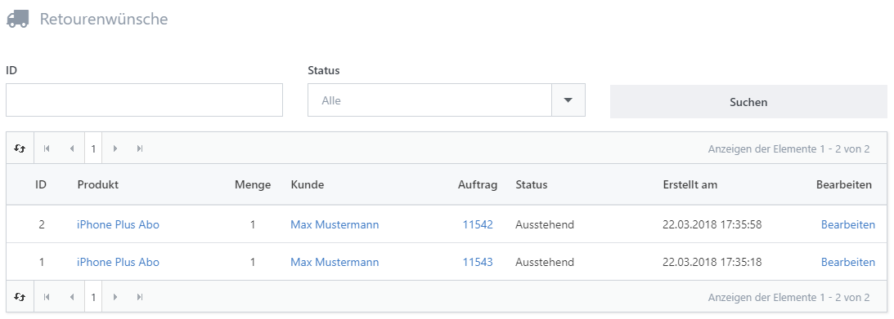
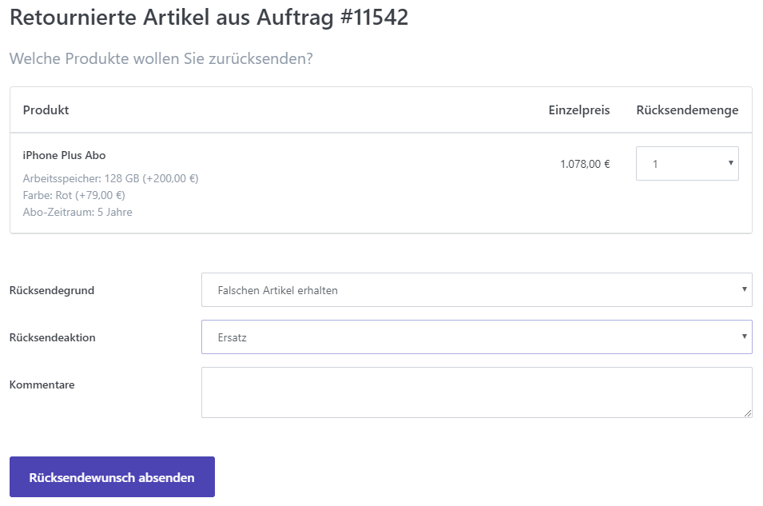
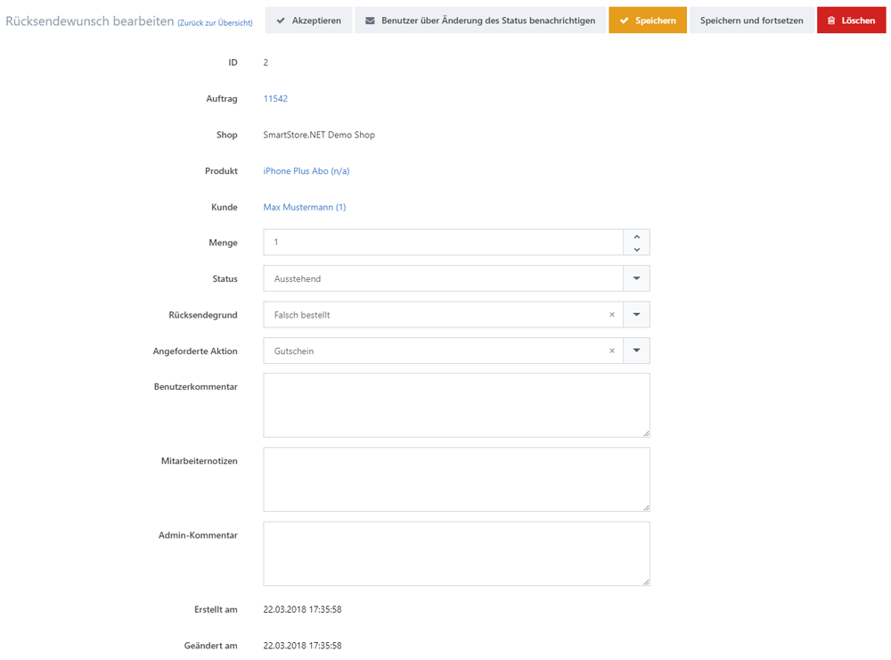

# Retourenwünsche verwalten

Wenn Sie online Produkte verkaufen, müssen Sie sich darauf einstellen, dass einige Produkte aus unterschiedlichen Gründen zurückgeschickt werden. Kunden senden einen Artikel vielleicht zurück, weil er nicht so ist, wie sie sich ihn vorgestellt haben, weil er einen Defekt aufweist oder weil sie beim Bestellvorgang ein falsches Attribut ausgewählt haben. Ihre Kunden können sich dazu in ihr Kundenkonto einloggen, einen Retourenwunsch einreichen und Ihnen das Produkt zurück senden. In Smartstore können Sie Retourenwünsche unter **Konfiguration > Einstellungen > Auftrags-Einstellungen > Retoureneinstellungen** konfigurieren. Sie können alle Retourenwünsche verwalten, indem Sie zu **Verkauf > Retourenwünsche** navigieren. 

## Die Kundendetailansicht 

Bevor Ihre Kunden Artikel zurücksenden können, muss der dazugehörige Auftrag als **Komplett** markiert sein. Wenn der Auftrag vollständig abgeschlossen ist, können Kunden Artikel in Ihrem Login-Bereich in der Auftragsübersicht auf **Artikel zurücksenden** klicken. Sie werden dann zu einem Formular weitergleitet, in dem sie die Artikel, die sie zurücksenden möchten und die Gründe für die Retour angeben können. Ihre Kunden können darüber hinaus auswählen, wie die Rücksendung behandelt werden soll (Rücksendeaktion: **Reparatur, Ersatz, Gutschein**).

## Die Administratoren-Detailansicht

In der Detailansicht eines Retourenwunsches können Sie den Rücksendewunsch **Akzeptieren**, die Details bearbeiten und den Kunden über den Status seines Rücksendewunsches informieren.

