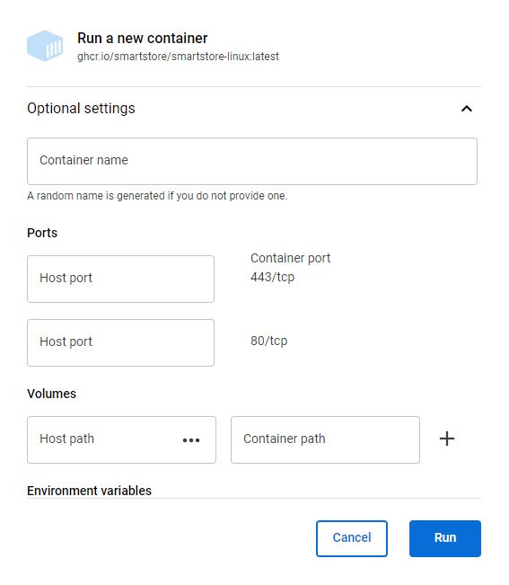

# FAQs

# Docker


Kann ich im Docker-Container etwas ändern oder hinzufügen, z. B. ein Plugin?

**Ja**, das können Sie, aber wir empfehlen Ihnen, das [Modifiziertes Docker-Image erstellen](../smartstore-6-dokumentation-startseite/loslegen/die-installation-von-smartstore/smartstore-docker-images-ausfuhren/modifiziertes-docker-image-erstellen.md).


Wie kopiert man Dateien und Ordner vom Host in den Docker-Container?

Der Befehl zum Kopieren von Dateien oder Ordner in einen Container lautet:

`docker cp <TARGET> <CONTAINER>:<SOURCE>`

**Beispiel:**  
Kopieren des Plug-in-Ordners `My.Module.DoesSomething` vom Host in den Modules-Ordner `/app/Modules` in den Container:

`docker cp My.Module.DoesSomething web:/app/Modules`

> [!INFO]
> `web` ist der Name des Containers.


Wie kopiert man Dateien und Ordner vom Docker-Container auf den Host?

`docker cp <CONTAINER>:<SOURCE> <TARGET>`

**Beispiel:**

Kopieren des Inhalts des Plug-in-Ordners `/app/Modules` aus dem Container mit dem Namen `web` in das Host-Verzeichnis `./Modules_From_Container` :

`docker cp web:/app/Modules ./Modules_From_Container`


Wie löscht man Dateien im Docker-Container?

`docker exec <CONTAINER> rm -rf <YourFile>`

**Beispiele:**

Die Datei `manifest.json` im Modules-Ordner `/My.Module.DoesSomething` löschen:

`docker exec web rm -rf /app/Modules/My.Module.DoesSomething/manifest.json`

Den Ordner `wwwroot` inm Modules-Folder `/My.Module.DoesSomething` löschen:

`docker exec web rm -rf /app/Modules/My.Module.DoesSomething/wwwroot`


Wie stelle ich eine Verbindung zu MySQL oder MS SQL her oder wie lautet der Hostname?

Wenn [Smartstore und Datenbank zusammen als Docker-Container betreiben](../smartstore-6-dokumentation-startseite/loslegen/die-installation-von-smartstore/smartstore-docker-images-ausfuhren/smartstore-und-datenbank-zusammen-als-docker-container-betreiben.md) (per `docker compose`) gestartet wird, kann einfach der **Containername** oder der **Dienstname** als Hostname verwendet werden.

**Ansonsten** können detaillierte Informationen über den Container mit dem Befehl `docker inspect <CONTAINER>` ausgelesen werden.

**Beispiel:**

Der MySQL-Container hat den Namen `mysql`.

Der Befehl

`docker inspect mysql`

gibt unter anderem die folgenden Informationen zurück:


Kann ich auch einen externen (nicht Docker) MS SQL Server oder MySQL Server verwenden?

**Ja**, geben Sie den Hostnamen des Datenbankservers in der richtigen Form an. Mögliche Beispiele sind z.B.:

Geben Sie den Instanznamen an: `<INSTANCENAME>`

Geben Sie den Hostnamen an: `<HOSTNAME>`

Geben Sie die IP-Adresse an: `<IP>`

Geben Sie die IP-Adresse und den Instanznamen an: `<IP>\<INSTANCENAME>`

Geben Sie den Hostnamen und den Instanznamen an: `<HOSTNAME>\<INSTANCENAME>`


Wo werden die Daten gespeichert?

Die Daten müssen in **Volumes** gespeichert werden. Docker-Volumes speichern Containerdaten auf dem Host.

In Docker Desktop können Volumes in den "Optionalen Einstellungen" beim Starten von Images eingerichtet werden.



Wie der Name schon sagt, befindet sich der Host-Pfad auf dem Host-Computer und der Container-Pfad im Docker-Container.

Hier ist ein Beispiel:


> [!INFO]
> Wenn nichts eingerichtet ist, werden die Daten in einer "Zwischenschicht" im Container gespeichert und gehen verloren, wenn der Container entfernt wird.


Kann ich auch mehrere Smartstore-Instanzen ausführen?

**Ja**, aber bei der Ausführung müssen Sie die **Container-Ports** (443 und 80) mit noch nicht verwendeten Ports auf dem **Host** abbilden. Z.B. anstelle von 443 und 80, 444 und 8080, etc.

Die Zuordnung wird in Docker Desktop in den "Optionalen Einstellungen" vorgenommen.

Unter Linux oder auf der **Kommandozeile** wird der Schalter `-p` verwendet.

Abbildung des TCP-Ports 80 im Container auf Port 8080 auf dem Docker-Host:

`-p 8080:80`

Hier ist der vollständige Befehlszeilenaufruf:

`sudo docker run -p 8080:80 ghcr.io/smartstore/smartstore-linux`


Wie erhalte ich die IP-Adresse des Docker-Containers?

Unter Linux oder auf der Windows-Befehlszeile wird der Befehl

`docker inspect <CONTAINER>`

unter anderem die folgenden Informationen zurück:


# Themes


Kann ich mein Theme von Version 4.2 auf Version 5 übertragen?

**Ja**, kopieren Sie den 4.2-Themenordner in den 5-Themenordner.

Im 4.2-Theme-Ordner benennen Sie den Ordner "Content" in "wwwroot" um.

Wahrscheinlich ist danach ein Neustart erforderlich. Danach können Sie das "neue" Theme im Backend aktivieren.

# Updates


Kann ich von einer beliebigen Versionsnummer auf Smartstore 5 aktualisieren?

**Nein**, für ein Update muss Smartstore zuerst auf Version 4.2 aktualisiert werden.


Ist ein betriebssystemübergreifendes Update möglich?

**Ja**, ein betriebssystemübergreifendes Update ist möglich. Ein Smartstore 4.2 mit einer MS SQL Datenbank von einem Windows Server oder Hosting kann auf einem Linux Server auf Smartstore 5 und MS SQL für Linux aktualisiert werden.


Ist ein Datenbank-Cross-Update möglich? Das heißt, ein Update von Smartstore 4.2 und MS SQL auf Smartstore 5 und MySQL?

**Nein**, dies ist nicht vorgesehen.

# PDF Export


Fehler beim PDF-Export, so dass keine PDF-Datei erstellt wird.

Das kann unter Umständen daran liegen, dass die Shop-URL nicht intern aufgerufen werden kann.

Öffnen Sie die appsettings.json-Datei im Hauptordner von Ihrer Smartstore-Installation und suchen Sie nach dem Wort “PdfEngineBaseUrl” und geben Sie dort die URL zu Ihrer Smartstore-Installation an.

Wenn Sie einen Reverse-Proxy (z.B. NGINX) unter Linux verwenden, geben Sie dort die lokal erreichbare URL inkl. Port an, z.B. `"PdfEngineBaseUrl": "http://localhost:5000/"`.

# Task Scheduler


Der Task Scheduler wird nicht ausgeführt und die Ereignisanzeige enthält eine Fehlermeldung wie "Error while calling Taskscheduler endpoint \[...\]". HTTP 404, NOT FOUND.

Öffnen Sie die appsettings.json-Datei im Hauptordner von Ihrer Smartstore-Installation und suchen Sie nach dem Wort “TaskSchedulerBaseUrl” und geben Sie dort die URL zu Ihrer Smartstore-Installation an.

Wenn Sie einen Reverse-Proxy (z.B. NGINX) unter Linux verwenden, geben Sie dort die lokal erreichbare URL inkl. Port an, z.B. `"TaskSchedulerBaseUrl": "http://localhost:5000/"`.

# Timeouts (Zeitlimits)


Wie ändere ich das Zeitlimit für den Start einer ASP.NET Core-Anwendung wie Smartstore?

Das Ändern des Wertes für startupTimeLimit in einer [http://ASP.NET](http://ASP.NET) Core-Anwendung kann in bestimmten Situationen nützlich sein, um sicherzustellen, dass die Anwendung erfolgreich gestartet wird. Hier sind einige Szenarien, in denen der Wert für startupTimeLimit angepasst werden kann:

### Hochsetzen des Werts:

**Lange Initialisierungszeit**: Wenn die [http://ASP.NET](http://ASP.NET) Core-Anwendung viel Zeit für die Initialisierung benötigt, z. B. wenn umfangreiche Vorbereitungen wie Datenbankverbindungen, Caching oder andere Dienste durchgeführt werden müssen, kann startupTimeLimit erhöht werden, um sicherzustellen, dass die Anwendung genügend Zeit hat, um erfolgreich zu starten.

### Runtersetzen des Werts:

**Schnelle Bereitstellung:** Wenn Sie sicher sind, dass Ihre [http://ASP.NET](http://ASP.NET) Core Anwendung normalerweise schnell startet und Sie eine schnellere Rückmeldung wünschen, ob der Start erfolgreich war oder nicht, können Sie das startupTimeLimit verringern. Dadurch wird die Wartezeit verkürzt, bevor eine Fehlermeldung angezeigt wird, wenn der Startvorgang zu lange dauert.

**Fehleranalyse:** Das Herabsetzen des startupTimeLimit kann hilfreich sein, um Startprobleme frühzeitig zu erkennen und zu diagnostizieren. Wenn die Anwendung aufgrund von Startproblemen fehlschlägt, erhält man schneller eine Fehlermeldung, die bei der Behebung des Problems helfen kann.

Es ist wichtig zu beachten, dass startupTimeLimit dazu dient, den Startvorgang zu überwachen und sicherzustellen, dass die Anwendung innerhalb einer angemessenen Zeit gestartet wird. Der Wert sollte sorgfältig an die spezifischen Anforderungen und Eigenschaften der Anwendung angepasst werden. In den meisten Fällen ist es jedoch nicht notwendig, diesen Parameter anzupassen, da die Standardwerte normalerweise ausreichend sind.

Konfiguration mit **IIS** als Hosting-Server - Eintrag in der Datei **web.config**:

```
<configuration>    
	<system.webServer>        
		<aspNetCore startupTimeLimit="3600"....
```

Konfiguration mit **Linux** als Hosting-Server - Eintrag in der Datei **appsettings.json**:

```
{
  "Kestrel": {
    "StartupTimeLimit": 3600,
    // Weitere Konfigurationen für Kestrel-Webserver
  },

  // Weitere Einstellungen für die Anwendung
}
```