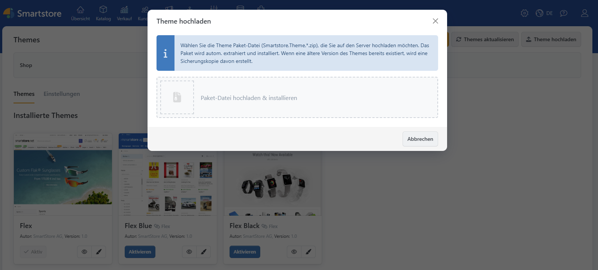
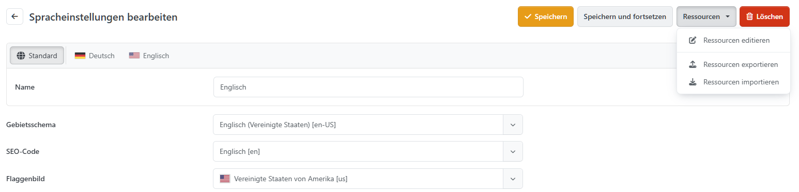

# Wie installiere ich eine Erweiterung?

Nach dem abgeschlossenen Kauf können Sie Ihre Erweiterung auf unbestimmte Zeit in dessen Detailansicht im [Smartstore Community Marketplace](http://community.smartstore.com/marketplace) herunterladen. Der Download erfolgt im Fall eines Plugins oder eines Themes als Datei mit der Erweiterung **.zip**. Im Fall von Sprachressourcen laden Sie eine Datei mit der Erweiterung **.xml** herunter. 

Wenn Sie die Erweiterung auf Ihren Rechner geladen haben, installieren Sie diese, indem Sie zunächst den Administrationsbereich Ihres Smartstore-Shops aufrufen.

### Plugins

Wählen Sie den Menüpunkt **Plugins > Plugins verwalten** und klicken Sie dann auf den Button **Plugin hochladen**. Wählen Sie nun die **.zip**\-Datei, die Sie im [Smartstore Community Marketplace](http://community.smartstore.com/marketplace) heruntergeladen haben und klicken Sie auf **Hochladen & installieren**. Das Plugin wurde nun installiert und kann in der Pluginverwaltung konfiguriert werden.

### Themes

Wählen Sie den Menüpunkt **Konfiguration > Themes** und klicken Sie dann auf den Button **Theme hochladen**. Wählen Sie nun die **.zip**\-Datei, die Sie im [Smartstore Community Marketplace](http://community.smartstore.com/marketplace) heruntergeladen haben und klicken Sie auf **Hochladen & installieren**. Das Theme wurde nun installiert und kann in der Themeverwaltung konfiguriert werden.

### Sprachresourcen

Wählen Sie den Menüpunkt **Konfiguration > Regionale Einstellungen > Sprachen**.  
Wenn noch nicht geschehen, legen Sie die zu importierende Sprache mit einem Klick auf den Button **Neu** an und wechseln dann in die Detailansicht der Sprache. Klicken Sie hier **Resourcen importieren**. Wählen Sie nun die .xml-Datei, die Sie im [Smartstore Übersetzungsportal](https://translate.smartstore.com/) heruntergeladen oder selbst erstellt haben und klicken Sie auf **Resourcen importieren**. Die Sprache lässt sich nun (sofern sie bereits aktiviert wurde) im Shop von Ihren Kunden auswählen.

