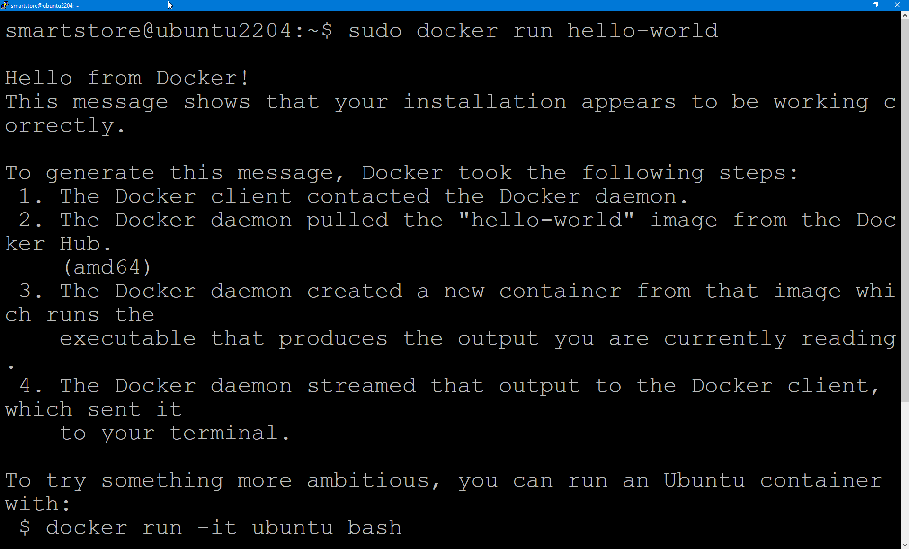

# Smartstore Docker-Images unter Linux ausführen

## Docker-Engine auf Ubuntu installieren

Bitte installieren Sie die Docker-Engine gemäß den Anweisungen auf [https://docs.docker.com/engine/install/ubuntu/](https://docs.docker.com/engine/install/ubuntu/) oder verwenden Sie den folgenden Befehl, um zu überprüfen, ob die Docker-Engine korrekt installiert ist:

`sudo docker run hello-world`

Mit dem folgenden Befehl wird das aktuelle Smartstore-Docker-Image [https://github.com/orgs/smartstore/packages](https://github.com/orgs/smartstore/packages) heruntergeladen.

`sudo docker pull ghcr.io/smartstore/smartstore-linux:latest`

Nun kann das Image wie folgt ausgeführt werden. Der Container Port 80 ist als lokaler Port 80 freigegeben.

`sudo docker run -p 80:80 ghcr.io/smartstore/smartstore-linux`

Öffnen Sie einen beliebigen Browser und geben Sie **localhost** oder die **lokale IP-Adresse** in die Adresszeile ein. Die Installationsstartseite von Smartstore öffnet sich

Jetzt können Sie Smartstore installieren. Dazu benötigen Sie aber noch eine erreichbare MS SQL Server oder eine MySQL-Instanz. Wenn Sie diese Instanz gleich direkt mit Smartstore als Docker Container ausführen möchten, gehen Sie bitte wie [hier](../smartstore-docker-images-ausfuhren/smartstore-und-datenbank-zusammen-als-docker-container-betreiben.md) vor.