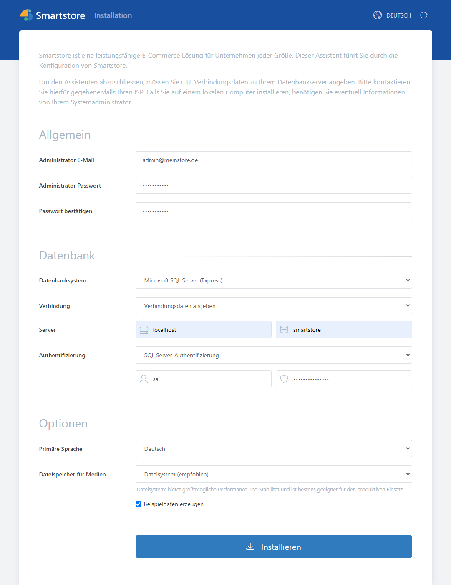

# Smartstore und Datenbank zusammen als Docker-Container betreiben

Wenn Sie eine Datenbankinstanz direkt mit Smartstore als Docker-Container ausführen möchten, gehen Sie bitte wie folgt vor.

- [Smartstore und MySQL zusammen als Docker-Container betreiben](#anchor_docker_smartstore_mysql_de)
- [Smartstore und MS SQL zusammen als Docker-Container betreiben](#anchor_docker_smartstore_mssql_de)

### Smartstore und MySQL zusammen als Docker-Container betreiben

Erstellen Sie eine neue Datei in einem Texteditor Ihrer Wahl. Fügen Sie die folgenden Zeilen in die Datei ein und speichern Sie sie als `docker-compose.yml`.

```
version: "3.4"
services:
  web:
    image: ghcr.io/smartstore/smartstore-linux
    container_name: web
    ports:
      - "80:80"
    depends_on:
      - db
    volumes:
      - "D:/mount/smtenants/mysql:/app/App_Data/Tenants"
  db:
    image: mysql
    container_name: mysql
    environment:
      #MYSQL_DATABASE: smartstore
      #MYSQL_USER: "root"
      MYSQL_PASSWORD: "Smartstore2022!"
      MYSQL_ROOT_PASSWORD: "Smartstore2022!"
    ports:
      - '3307:3306'
    expose:
      - '3306'
    volumes:
      - mysql:/var/lib/mysql

volumes:
  mysql:
```

Öffnen Sie ein Befehlsfenster und wechseln Sie zu dem Ordner, in dem die soeben erstellte Datei `docker-compose.yml` gespeichert wurde. Führen Sie die Datei mit dem folgenden Befehl aus:

`docker compose up`

Ein Smartstore und ein MySQL-Container werden gestartet. Die Verbindungsdaten zum mySQL-Server finden Sie ebenfalls am Anfang des Codes:

Datenbank-Name: `smartstore`  
MySQL-Root-Passwort: `Smartstore2022!`

Die Installation sieht dann wie folgt aus:


### Smartstore und MS SQL zusammen als Docker-Container betreiben

Erstellen Sie eine neue Datei in einem Texteditor Ihrer Wahl. Fügen Sie die folgenden Zeilen in die Datei ein und speichern Sie sie als `docker-compose.yml`.

```
services:
    web:
        image: ghcr.io/smartstore/smartstore-linux
        container_name: web
        ports:
            - "80:80"
        restart: unless-stopped
        depends_on:
            - db
        volumes:
            - "C:/mount/smtenants/mysql:/app/App_Data/Tenants"
    db:
        image: "mcr.microsoft.com/mssql/server"
        container_name: sqlserver
        environment:
            SA_PASSWORD: "Smartstore2022!"
            ACCEPT_EULA: "Y"
            MSSQL_PID: "Express"
        ports:
          - '1434:1433'
        expose:
          - '1433'
        volumes:
          - mssql_system:/var/opt/mssql/
          - mssql_user:/var/opt/sqlserver/
volumes:
  mssql_system:
  mssql_user:
```

Öffnen Sie ein Befehlsfenster und wechseln Sie zu dem Ordner, in dem die soeben erstellte Datei `docker-compose.yml` gespeichert wurde. Führen Sie die Datei mit dem folgenden Befehl aus:

`docker compose up`

Ein Smartstore und ein MS SQL Server Container werden gestartet. Die Verbindungsdaten zum MS SQL Server finden Sie ebenfalls am Anfang des Codes:

Datenbank Name: `smartstore`  
MS SQL Passwort für Benutzer sa: `Smartstore2022!`

Die Installation sieht dann wie folgt aus:



> [!INFO]
> Ändern Sie bitte unbedingt die Standardpasswörter und -benutzer auf den Produktivsystemen!